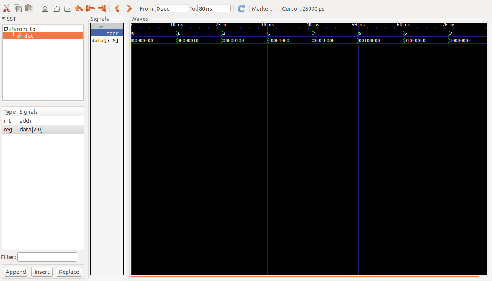

# Ejemplos Clase #

**Fecha**: 19/08/2019

## Temas ##
1. Memoria ROM

## Ejemplos ##

### Ejemplo 1 ###
Realizar la descripción de una memoria ROM con 3 bits de dirección para almacenar 8 words de información. Cada word tendrá una longitud de 8 bits.

El codigo VHDL que define la arquitectura esta en el archivo [rom.vhd](rom.vhd). Este se muestra a continuación:

```VHDL
--------------------------------------------
-- Module Name: rom
--------------------------------------------

library IEEE;
use IEEE.STD_LOGIC_1164.ALL;

-- library UNISIM;
-- use UNISIM.VComponents.all;

Entity rom Is
generic(
		bits : integer := 8;     -- # of bits per word 
		words: integer := 8    -- # of words in the memory
       );
port(
		addr: in integer range 0 to words-1;
		data: out std_logic_vector(bits-1 downto 0)
	);
end rom;

Architecture behavior of rom is
	type vector_array is array (0 to words-1) of std_logic_vector (bits-1 downto 0);

	CONSTANT memory: vector_array := ( 
		"00000000",
		"00000010",
		"00000100",
		"00001000", 
		"00010000",
		"00100000",
		"01000000",
		"10000000");	
begin
	data <= memory(addr);
end behavior;
```

Por otro lado el código para llevar a cabo el testbench se encuentra en el archivo [rom_tb.vhd](rom_tb.vhd) el cual se muestra a continuación:


```VHDL
--------------------------------------------
-- Module Name: rom_tb
--------------------------------------------

library IEEE;
use IEEE.STD_LOGIC_1164.ALL;
use IEEE.STD_LOGIC_ARITH.ALL;
use IEEE.STD_LOGIC_UNSIGNED.ALL;
use STD.textio.all; --for line
use IEEE.std_logic_textio.all; --for write
use ieee.numeric_std.all;


-- library UNISIM;
-- use UNISIM.VComponents.all;

Entity rom_tb Is
end rom_tb;

Architecture behavior of rom_tb Is

	CONSTANT WORDS     : integer := 8;
	CONSTANT DATA_SIZE : integer := 8;
	CONSTANT DELAY     : time := 10 ns;
	CONSTANT LEN       : integer := 3;
	
	Signal addr_s    : integer range 0 to WORDS -1;
	Signal data_s    : std_logic_vector(DATA_SIZE-1 downto 0);
	Signal addr_s2   : std_logic_vector(LEN-1 downto 0);
	
	
	Component rom Is
	generic(
			bits : integer := DATA_SIZE;
			words: integer := WORDS
		   );
	port(
			addr: in integer range 0 to WORDS-1;
			data: out std_logic_vector(DATA_SIZE -1 downto 0)
		);
	end Component;

	
	procedure expected_data (
		proc_addr : in integer range 0 to WORDS-1;
		proc_data : out std_logic_vector(DATA_SIZE -1 downto 0)) is

	type vector_array is array (0 to WORDS - 1) of std_logic_vector (DATA_SIZE-1 downto 0);

	CONSTANT memory: vector_array := ( 
			"00000000",
			"00000010",
			"00000100",
			"00001000", 
			"00010000",
			"00100000",
			"01000000",
			"10000000");
	begin	
		proc_data := memory(proc_addr);
	end expected_data;


begin

	DUT: rom 
	generic map ( 
	  bits => DATA_SIZE,
	  words => WORDS
	)
	port map (
	  addr => addr_s,
	  data => data_s
	);


	Estim: process
    begin
		--wait for DELAY;	
        for i in 0 to WORDS - 1 loop
            addr_s <= i;
            wait for DELAY;   
		end loop;
		wait;
	end process Estim;

	

	addr_s2 <= std_logic_vector(to_unsigned(addr_s, addr_s2'length)); -- Add for delay
	
	Verific: process(addr_s2)
	variable proc_data : std_logic_vector(DATA_SIZE -1 downto 0);
	variable s : line;
	begin
		expected_data(addr_s, proc_data);
		-- If the outputs match, then announce it to the simulator console.
		if ( data_s = proc_data) then
			write (s, string'("MEMORY DATA MATCHED")); 
			writeline (output, s);
			write (s, string'("MEMORY[")); write (s, addr_s); write (s, string'("]: "));
			write (s, string'("Expected: ")); write (s, proc_data);
            write (s, string'("; Implemented: ")); write (s, data_s); 
			writeline (output, s);
		else
		    write (s, string'("MEMORY DATA MISSMATCHED")); 
		    write (s, string'("MEMORY[")); write (s, addr_s); write (s, string'("]: "));
			write (s, string'("Expected: ")); write (s, proc_data);
            write (s, string'("; Implemented: ")); write (s, data_s); 
			writeline (output, s);
		end if;	
	end process Verific; 

end behavior;
```

Sobre el **testbench** anterior se resalta el **procedure** empleado para la verificación:

```VHDL
procedure expected_data (
	proc_addr : in integer range 0 to WORDS-1;
	proc_data : out std_logic_vector(DATA_SIZE -1 downto 0)) is

	type vector_array is array (0 to WORDS - 1) of std_logic_vector (DATA_SIZE-1 downto 0);

	CONSTANT memory: vector_array := ( 
			"00000000",
			"00000010",
			"00000100",
			"00001000", 
			"00010000",
			"00100000",
			"01000000",
			"10000000");
begin	
	proc_data := memory(proc_addr);
end expected_data;
```

Tengase en cuenta que este sigue la siguiente sintaxís:

```VHDL
procedure identifier [input/output port declarations] is
	[variable declarations]
begin
	procedure statements
end identifier
```

** Simulación empleando el ghdl**

No se preocupe, estos comandos se ejecutaron por que le computador en el que se hicieron no tenia Vivado. Por ello este proceso es sobrante y no lo tiene que llevar a cabo:


```bash
ghdl -a rom.vhd
ghdl -a --ieee=synopsys -fexplicit rom_tb.vhd
ghdl -r --ieee=synopsys -fexplicit rom_tb --vcd=rom_tb_results.vcd 
```

Tras la ejecución en consola los resultados arrojados en consola son los siguientes:

```bash
../../src/synopsys/std_logic_arith.vhdl:255:20:@0ms:(assertion warning): There is an 'U'|'X'|'W'|'Z'|'-' in an arithmetic operand, the result will be 'X'(es).
MEMORY DATA MISSMATCHEDMEMORY[0]: Expected: 00000000; Implemented: UUUUUUUU
MEMORY DATA MATCHED
MEMORY[0]: Expected: 00000000; Implemented: 00000000
MEMORY DATA MATCHED
MEMORY[1]: Expected: 00000010; Implemented: 00000010
MEMORY DATA MATCHED
MEMORY[2]: Expected: 00000100; Implemented: 00000100
MEMORY DATA MATCHED
MEMORY[3]: Expected: 00001000; Implemented: 00001000
MEMORY DATA MATCHED
MEMORY[4]: Expected: 00010000; Implemented: 00010000
MEMORY DATA MATCHED
MEMORY[5]: Expected: 00100000; Implemented: 00100000
MEMORY DATA MATCHED
MEMORY[6]: Expected: 01000000; Implemented: 01000000
MEMORY DATA MATCHED
MEMORY[7]: Expected: 10000000; Implemented: 10000000
```

Para visualizar los resulados en pantalla se emplea el siguiente comando:

```bash
gtkwave rom_tb_results.vcd 
```

Cuyos resultados son mostrados en la siguiente figura:

