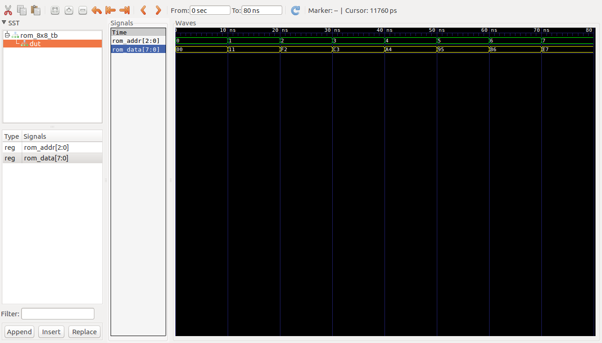

# Ejemplos Clase #

**Fecha**: 19/08/2019

## Temas ##
1. Memoria ROM

## Ejemplos ##

### Ejemplo 1 ###
Representar en VHDL una ROM de 8x8, esto es una rom con 8 direcciones de 8 bits de ancho.

El codigo VHDL que define la arquitectura esta en el archivo [ROM_8x8.vhd](ROM_8x8.vhd). Este se muestra a continuación:


```VHDL
--------------------------------------------
-- Module Name: ROM_8x8
--------------------------------------------

library IEEE;
use IEEE.STD_LOGIC_1164.ALL;
use IEEE.STD_LOGIC_ARITH.ALL;
use IEEE.STD_LOGIC_UNSIGNED.ALL;
use ieee.numeric_std.all;

entity ROM_8x8 is 
port (
	ROM_addr : in std_logic_vector(2 downto 0);
	ROM_data : out std_logic_vector(7 downto 0)
);
end entity ROM_8x8;

architecture behavioral of ROM_8x8 is
	type rom is array (0 to 2**3 - 1) of std_logic_vector (7 downto 0);
	constant MY_ROM : rom := (
		0 => X"00",
		1 => X"11",
		2 => X"F2",
		3 => X"C3",
		4 => X"A4",
		5 => X"95",
		6 => X"86",
		7 => X"E7"
);

begin
	process (ROM_addr)
	begin
		case ROM_addr is
			when "000" => ROM_data <= MY_ROM(0);
			when "001" => ROM_data <= MY_ROM(1);
			when "010" => ROM_data <= MY_ROM(2);
			when "011" => ROM_data <= MY_ROM(3);
			when "100" => ROM_data <= MY_ROM(4);
			when "101" => ROM_data <= MY_ROM(5);
			when "110" => ROM_data <= MY_ROM(6);
			when "111" => ROM_data <= MY_ROM(7);
			when others => ROM_data <= X"00";
		end case;
	end process;
end behavioral;
```

Por otro lado el código para llevar a cabo el testbench se encuentra en el archivo [ROM_8x8_tb.vhd](ROM_8x8_tb.vhd) el cual se muestra a continuación:


```VHDL
--------------------------------------------
-- Module Name: ROM_8x8_tb
--------------------------------------------

library IEEE;
use IEEE.STD_LOGIC_1164.ALL;
use IEEE.STD_LOGIC_ARITH.ALL;
use IEEE.STD_LOGIC_UNSIGNED.ALL;
use STD.textio.all; --for line
use IEEE.std_logic_textio.all; --for write
use ieee.numeric_std.all;

Entity ROM_8x8_tb Is
end ROM_8x8_tb;

Architecture behavior of ROM_8x8_tb Is


CONSTANT DELAY     : time := 10 ns;
	
	
Signal ROM_addr_signal    : std_logic_vector(2 downto 0);
Signal ROM_data_signal    : std_logic_vector(7 downto 0);
Signal ROM_addr2_signal   : std_logic_vector(2 downto 0);
	
	
Component ROM_8x8 is 
port (
	ROM_addr : in std_logic_vector(2 downto 0);
	ROM_data : out std_logic_vector(7 downto 0)
);
end Component;

procedure expected_data (
		proc_ROM_addr : in std_logic_vector(2 downto 0);
		proc_ROM_data : out std_logic_vector(7 downto 0)) is	

	type vector_array is array (0 to 7) of std_logic_vector (7 downto 0);

	CONSTANT memory: vector_array := (
		0 => X"00",
		1 => X"11",
		2 => X"F2",
		3 => X"C3",
		4 => X"A4",
		5 => X"95",
		6 => X"86",
		7 => X"E7"
	);

	begin
		case proc_ROM_addr is
			when "000" => proc_ROM_data := memory(0);
			when "001" => proc_ROM_data := memory(1);
			when "010" => proc_ROM_data := memory(2);
			when "011" => proc_ROM_data := memory(3);
			when "100" => proc_ROM_data := memory(4);
			when "101" => proc_ROM_data := memory(5);
			when "110" => proc_ROM_data := memory(6);
			when "111" => proc_ROM_data := memory(7);
			when others => proc_ROM_data := X"00";
		end case;
	end expected_data;


begin

	DUT: ROM_8x8 
	port map (
		ROM_addr => ROM_addr_signal,
		ROM_data => ROM_data_signal
	);


	Estim: process
	variable index: std_logic_vector(2 downto 0) := "000";
    begin
		--wait for DELAY;	
        for i in 0 to 7 loop
            ROM_addr_signal <= index;
			wait for DELAY; 
			index := index + '1';  
		end loop;
		wait;
	end process Estim;


	-- Asignacion necesaria para la verificacion
	ROM_addr2_signal <= ROM_addr_signal;

	Verific: process(ROM_addr2_signal)
	variable proc_ROM_data : std_logic_vector(7 downto 0);
	variable s : line;
	begin	
		expected_data(ROM_addr_signal, proc_ROM_data);
		-- If the outputs match, then announce it to the simulator console.
		if ( ROM_data_signal = proc_ROM_data) then
			write (s, string'("MEMORY DATA MATCHED")); 
			writeline (output, s);
			write (s, string'("MEMORY[")); write (s, ROM_addr_signal); write (s, string'("]: "));
			write (s, string'("Expected: ")); write (s, proc_ROM_data);
            write (s, string'("; Implemented: ")); write (s, ROM_data_signal); 
			writeline (output, s);
		else
		    write (s, string'("MEMORY DATA MISSMATCHED")); 
		    write (s, string'("MEMORY[")); write (s, ROM_addr_signal); write (s, string'("]: "));
			write (s, string'("Expected: ")); write (s, proc_ROM_data);
            write (s, string'("; Implemented: ")); write (s, ROM_data_signal); 
			writeline (output, s);
		end if;	
	end process Verific; 
end behavior;
```

**Simulación empleando el ghdl**

No se preocupe, estos comandos se ejecutaron por que le computador en el que se hicieron no tenia Vivado. Por ello este proceso es sobrante y no lo tiene que llevar a cabo:

```bash
ghdl -a --ieee=synopsys ROM_8x8.vhd
ghdl -a --ieee=synopsys -fexplicit ROM_8x8_tb.vhd
ghdl -r --ieee=synopsys -fexplicit ROM_8x8_tb --vcd=ROM_8x8_tb_results.vcd 
gtkwave ROM_8x8_tb_results.vcd 
```

Tras la ejecución de la simulación los resultados arrojados en consola son los siguientes:

```bash
../../src/synopsys/std_logic_arith.vhdl:255:20:@0ms:(assertion warning): There is an 'U'|'X'|'W'|'Z'|'-' in an arithmetic operand, the result will be 'X'(es).
MEMORY DATA MISSMATCHEDMEMORY[UUU]: Expected: 00000000; Implemented: UUUUUUUU
MEMORY DATA MATCHED
MEMORY[000]: Expected: 00000000; Implemented: 00000000
MEMORY DATA MATCHED
MEMORY[001]: Expected: 00010001; Implemented: 00010001
MEMORY DATA MATCHED
MEMORY[010]: Expected: 11110010; Implemented: 11110010
MEMORY DATA MATCHED
MEMORY[011]: Expected: 11000011; Implemented: 11000011
MEMORY DATA MATCHED
MEMORY[100]: Expected: 10100100; Implemented: 10100100
MEMORY DATA MATCHED
MEMORY[101]: Expected: 10010101; Implemented: 10010101
MEMORY DATA MATCHED
MEMORY[110]: Expected: 10000110; Implemented: 10000110
MEMORY DATA MATCHED
MEMORY[111]: Expected: 11100111; Implemented: 11100111
```

Para visualizar los resulados en pantalla se emplea el siguiente comando:

```bash
gtkwave ROM_8x8_tb_results.vcd 
```

Cuyos resultados son mostrados en la siguiente figura:


