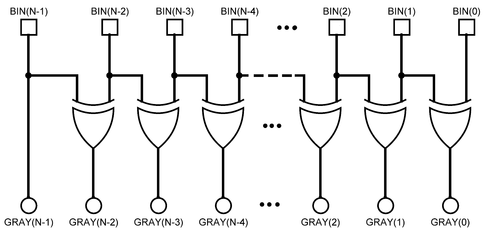
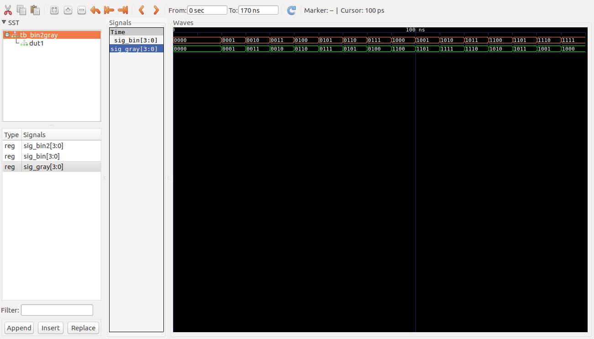

# Ejemplos Clase #

**Fecha**: 06/08/2019

## Temas ##
1. Generate


## Ejemplos ##

### Ejemplo 1 ###

Realizar la descripción de un conversor de codigo binario a codigo gray de N bits. A continuación se muestra la imagen asociada a este:




El codigo VHDL que define la arquitectura esta en el archivo [bin2gray_nbits.vhd](bin2gray_nbits.vhd). Este se muestra a continuación:

```VHDL
library IEEE;
use IEEE.STD_LOGIC_1164.ALL;

entity bin2gray_nbits is
    generic (N : Integer := 4);
    Port ( BIN : in STD_LOGIC_VECTOR (N-1 downto 0);
           GRAY : out STD_LOGIC_VECTOR (N-1 downto 0));
end bin2gray_nbits;

architecture Behavioral of bin2gray_nbits is
begin
    G1: for I in 0 to N-2 generate
    begin
        GRAY(I) <= BIN(I) xor BIN(I+1);
    end generate;
    GRAY(N-1) <= BIN(N-1);
end Behavioral;
```

Por otro lado el código para llevar a cabo el testbench se encuentra en el archivo [tb_bin2gray.vhd](tb_bin2gray.vhd) el cual se muestra a continuación:

```VHDL
library IEEE;
use IEEE.STD_LOGIC_1164.ALL;
use ieee.numeric_std.all;

use STD.textio.all; --for line
use IEEE.std_logic_textio.all; --for write

-- Uncomment the following library declaration if using
-- arithmetic functions with Signed or Unsigned values
--use IEEE.NUMERIC_STD.ALL;

-- Uncomment the following library declaration if instantiating
-- any Xilinx leaf cells in this code.
--library UNISIM;
--use UNISIM.VComponents.all;

entity tb_bin2gray is
  generic(
  tb_type : string := "Behavioral"
);
--  Port ( );
end tb_bin2gray;

architecture Behavioral of tb_bin2gray is

CONSTANT BIN2GRAY_WIDTH : integer := 4;
CONSTANT DELAY : time := 10 ns;

component bin2gray_nbits is
    Generic (N : Integer := BIN2GRAY_WIDTH);
    Port ( BIN : in STD_LOGIC_VECTOR (N-1 downto 0);
           GRAY : out STD_LOGIC_VECTOR (N-1 downto 0));
end component;

procedure expected_Gray (
		proc_BIN : in std_logic_vector(BIN2GRAY_WIDTH-1 downto 0);
		proc_GRAY : out std_logic_vector(BIN2GRAY_WIDTH-1 downto 0)) is
	begin	
	  for i in 0 to BIN2GRAY_WIDTH-2 loop
           proc_GRAY(i):= proc_BIN(i) xor proc_BIN(i+1);
      end loop;
      proc_GRAY(BIN2GRAY_WIDTH-1) := proc_BIN(BIN2GRAY_WIDTH-1);
end expected_Gray;	    
	
signal sig_BIN, sig_GRAY : STD_LOGIC_VECTOR (BIN2GRAY_WIDTH-1 downto 0):=(others=>'0');
signal sig_BIN2 : STD_LOGIC_VECTOR(BIN2GRAY_WIDTH-1 downto 0);
           
begin


Estim: process
    begin
        wait for DELAY;
        for i in 0 to (2**BIN2GRAY_WIDTH)-1 loop
            sig_BIN <= std_logic_vector(to_unsigned(i, sig_BIN'length));
            wait for DELAY;   
        end loop;
end process;

DUT1: bin2gray_nbits
     generic map (N => BIN2GRAY_WIDTH)
     port map (
        BIN => sig_BIN,
        GRAY => sig_GRAY
     );
     
sig_BIN2 <= sig_BIN; 
     
Verific: process(sig_BIN2)
    variable proc_out : STD_LOGIC_VECTOR(BIN2GRAY_WIDTH-1 downto 0);
    variable s : line;
    begin
        expected_GRAY(sig_BIN, proc_out);
        -- If the outputs match, then announce it to the simulator console.
        if ( proc_out = sig_GRAY) then
            write (s, string'("+++GRAY output MATCHED at ")); write (s, sig_BIN); 
            write (s, string'(". Expected: ")); write (s, proc_out); 
            write (s, string'(" Implemented: ")); write (s, sig_GRAY); 
            writeline (output, s);
        else
            write (s, string'("***GRAY output mis-matched at ")); write (s, sig_BIN); 
            write (s, string'(". Expected: ")); write (s, proc_out); 
            write (s, string'(" Implemented: ")); write (s, sig_GRAY); 
            writeline (output, s);
        end if;
end process;   

end Behavioral;
```

** Simulación empleando el ghdl**

No se preocupe, estos comandos se ejecutaron por que le computador en el que se hicieron no tenia Vivado. Por ello este proceso es sobrante y no lo tiene que llevar a cabo:

```
ghdl -a bin2gray_nbits.vhd
ghdl -a --ieee=synopsys tb_bin2gray.vhd
ghdl -r --ieee=synopsys tb_bin2gray --vcd=tb_bin2gray_results.vcd --stop-time=170ns
gtkwave tb_bin2gray_results.vcd 
```

#### Resultados de la simulación ####

**Salida en consola**

La salida en consola fue la siguiente:

```
***GRAY output mis-matched at 0000. Expected: 0000 Implemented: UUUU
+++GRAY output MATCHED at 0000. Expected: 0000 Implemented: 0000
+++GRAY output MATCHED at 0001. Expected: 0001 Implemented: 0001
+++GRAY output MATCHED at 0010. Expected: 0011 Implemented: 0011
+++GRAY output MATCHED at 0011. Expected: 0010 Implemented: 0010
+++GRAY output MATCHED at 0100. Expected: 0110 Implemented: 0110
+++GRAY output MATCHED at 0101. Expected: 0111 Implemented: 0111
+++GRAY output MATCHED at 0110. Expected: 0101 Implemented: 0101
+++GRAY output MATCHED at 0111. Expected: 0100 Implemented: 0100
+++GRAY output MATCHED at 1000. Expected: 1100 Implemented: 1100
+++GRAY output MATCHED at 1001. Expected: 1101 Implemented: 1101
+++GRAY output MATCHED at 1010. Expected: 1111 Implemented: 1111
+++GRAY output MATCHED at 1011. Expected: 1110 Implemented: 1110
+++GRAY output MATCHED at 1100. Expected: 1010 Implemented: 1010
+++GRAY output MATCHED at 1101. Expected: 1011 Implemented: 1011
+++GRAY output MATCHED at 1110. Expected: 1001 Implemented: 1001
+++GRAY output MATCHED at 1111. Expected: 1000 Implemented: 1000
ghdl:info: simulation stopped by --stop-time @170ns
```
**Salida grafica**

A continuación se muestra el resultado de la grafica:





