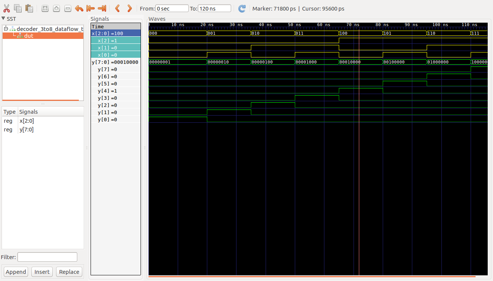

# Ejemplos Clase #

**Fecha**: 19/08/2019

## Temas ##
1. Decodificador 3 a 8

## Ejemplos ##

### Ejemplo 1 ###
Relizar la descripción VHDL de un decodificador 3 a 8.

El codigo VHDL que define la arquitectura esta en el archivo [decoder_3to8_dataflow.vhd](decoder_3to8_dataflow.vhd). Este se muestra a continuación:

```VHDL
--------------------------------------------
-- Module Name: decoder_3to8_dataflow
--------------------------------------------

library IEEE;
use IEEE.STD_LOGIC_1164.ALL;

-- library UNISIM;
-- use UNISIM.VComponents.all;

Entity decoder_3to8_dataflow Is
port(
		x 	: in STD_LOGIC_VECTOR(2 downto 0);
		y	: out STD_LOGIC_VECTOR(7 downto 0)
	);
end decoder_3to8_dataflow;

Architecture behavior of decoder_3to8_dataflow Is
	
begin

	y(0) <= not(x(2) or x(1) or x(0));	 
	y(1) <= (not(x(2)) and not(x(1)) and x(0));
	y(2) <= (not(x(2)) and x(1) and not(x(0)));
	y(3) <= (not(x(2)) and x(1) and x(0));
	y(4) <= (x(2) and not(x(1)) and not(x(0)));
	y(5) <= (x(2) and not(x(1)) and x(0));
	y(6) <= (x(2) and x(1) and not(x(0)));
	y(7) <= (x(2) and x(1) and x(0));
	
end behavior;
```

Por otro lado el código para llevar a cabo el testbench se encuentra en el archivo [decoder_3to8_dataflow_tb.vhd](decoder_3to8_dataflow_tb.vhd) el cual se muestra a continuación:

```VHDL
--------------------------------------------
-- Module Name: decoder_3to8_dataflow_tb
--------------------------------------------

library IEEE;
use IEEE.STD_LOGIC_1164.ALL;
use IEEE.STD_LOGIC_ARITH.ALL;
use IEEE.STD_LOGIC_UNSIGNED.ALL;

-- library UNISIM;
-- use UNISIM.VComponents.all;

Entity decoder_3to8_dataflow_tb Is
end decoder_3to8_dataflow_tb;

Architecture behavior of decoder_3to8_dataflow_tb Is
	Component decoder_3to8_dataflow
	port (
		x 		: in STD_LOGIC_VECTOR (2 downto 0);
		y 		: out STD_LOGIC_VECTOR (7 downto 0)
	);	
	End Component;
	
	Signal x 	 : STD_LOGIC_VECTOR (2 downto 0) := "000";
	Signal y 	 : STD_LOGIC_VECTOR (7 downto 0) := "00000000";
	Signal count : STD_LOGIC_VECTOR (2 downto 0) := "000";

begin
	DUT:  decoder_3to8_dataflow PORT MAP (
			x => x,
			y => y
		 );
		 
	process
		variable k : integer := 0;

	begin
		
        for k in 0 to 7 loop   
		  wait for 5 ns;
		  x <= count;	  
		  wait for 10 ns;	  
          count <= count + '1';  		  
        end loop;			
		wait;
	end process;
end behavior;
```

** Simulación empleando el ghdl**

No se preocupe, estos comandos se ejecutaron por que le computador en el que se hicieron no tenia Vivado. Por ello este proceso es sobrante y no lo tiene que llevar a cabo:


```bash
ghdl -a decoder_3to8_dataflow.vhd
ghdl -a --ieee=synopsys decoder_3to8_dataflow_tb.vhd
ghdl -r --ieee=synopsys decoder_3to8_dataflow_tb --vcd=decoder_3to8_dataflow_tb_results.vcd
gtkwave decoder_3to8_dataflow_tb_results.vcd 
```


Cuyos resultados son mostrados en la siguiente figura:


