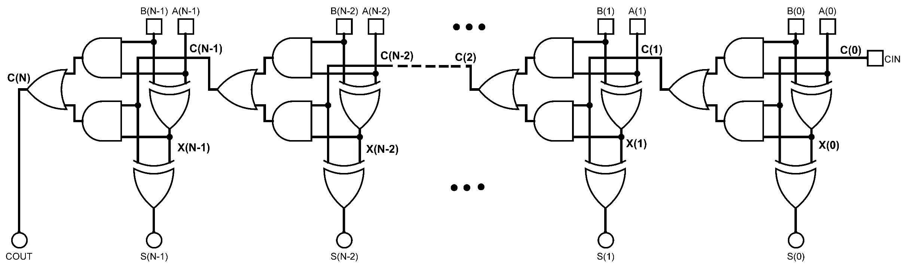
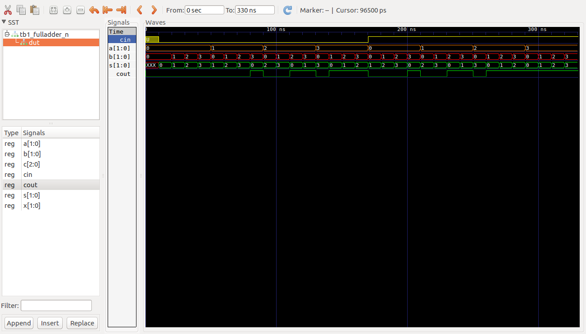

# Ejemplos Clase #

**Fecha**: 06/08/2019

## Temas ##
1. Generate


## Ejemplo 2 ##

Realizar la descripción de un sumador completo de N bits, para tal fin debera usar la instrucción ``` generate```. A continuación se muestra la imagen asociada a este:



### Arquitectura del sumador completo de N bits ### 

El codigo VHDL que define la arquitectura esta en el archivo [fulladder_N.vhd](fulladder_N.vhd). Este se muestra a continuación:

```VHDL

library IEEE;
use IEEE.STD_LOGIC_1164.ALL;
use ieee.numeric_std.all;

entity AdderNbits is
  generic(N : integer := 8);
  Port ( 
      A, B: in std_logic_vector(N-1 downto 0);
      Cin: in std_logic;
      S: out std_logic_vector(N-1 downto 0);
      Cout: out std_logic
  );
end AdderNbits;

architecture Behavioral of AdderNbits is
signal C: std_logic_vector(N downto 0);
signal X: std_logic_vector(N-1 downto 0);
begin
  C(0) <= Cin;
  ADD: for I in 0 to N - 1 generate
  begin
    X(I) <= A(I) xor B(I);
    S(I) <= C(I) xor x(I);
    C(I+1) <= (A(I) and B(I)) or (X(I) and C(I));
  end generate;
  Cout <= C(N);
end Behavioral;
```

### Simulación del sumador completo de N bits ### 

#### Simulación simple ####

Por otro lado el código para llevar a cabo el testbench se encuentra en el archivo [tb1_fulladder_N.vhd](tb1_fulladder_N.vhd) el cual se muestra a continuación:

```VHDL
library IEEE;
use IEEE.STD_LOGIC_1164.ALL;
use ieee.numeric_std.all;

use STD.textio.all; --for line
use IEEE.std_logic_textio.all; --for write

entity tb1_fulladder_N is
  generic(
  tb_type : string := "Behavioral"
);
--  Port ( );
end tb1_fulladder_N;

architecture Behavioral of tb1_fulladder_N is

CONSTANT FULLADDER_WIDTH : integer := 2;
CONSTANT DELAY : time := 10 ns;

component AdderNbits is
    generic(N : integer := FULLADDER_WIDTH);
    Port ( 
        A, B: in std_logic_vector(N-1 downto 0);
        Cin: in std_logic;
        S: out std_logic_vector(N-1 downto 0);
        Cout: out std_logic
    );
end component;

-- Señales para el estimulo
signal sig_A, sig_B, sig_S: STD_LOGIC_VECTOR (FULLADDER_WIDTH-1 downto 0):=(others=>'0');
signal sig_Cin, sig_Cout:  std_logic;
           
begin

Estim: process
    begin
        wait for DELAY;
        for i in 0 to 1 loop
            if (i = 0) then
                sig_Cin <= '0';
            else
                sig_Cin <= '1';
            end if;
            for j in 0 to (2**FULLADDER_WIDTH)-1 loop
                sig_A <= std_logic_vector(to_unsigned(j, sig_A'length));
                for k in 0 to (2**FULLADDER_WIDTH)-1 loop
                    sig_B <= std_logic_vector(to_unsigned(k, sig_B'length));
                    wait for DELAY;
                end loop;
            end loop;
        end loop;
end process;

DUT: AdderNbits
     generic map (N => FULLADDER_WIDTH)
     port map (
        A => sig_A,
        B => sig_B,
        Cin => sig_Cin,
        S => sig_S,
        Cout => sig_Cout
     );

end Behavioral;
```

**Simulación empleando el ghdl**

No se preocupe, estos comandos se ejecutaron por que le computador en el que se hicieron no tenia Vivado. Por ello este proceso es sobrante y no lo tiene que llevar a cabo:

```
ghdl -a fulladder_N.vhd
ghdl -a --ieee=synopsys tb1_fulladder_N.vhd
ghdl -r --ieee=synopsys tb1_fulladder_N --vcd=tb1_fulladder_N_results.vcd --stop-time=1000ms
gtkwave tb1_fulladder_N_results.vcd 
```

#### Resultados de la simulación ####

**Salida grafica**

A continuación se muestra el resultado de la grafica:




#### Simulación mejorada ####

Continuara...