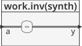
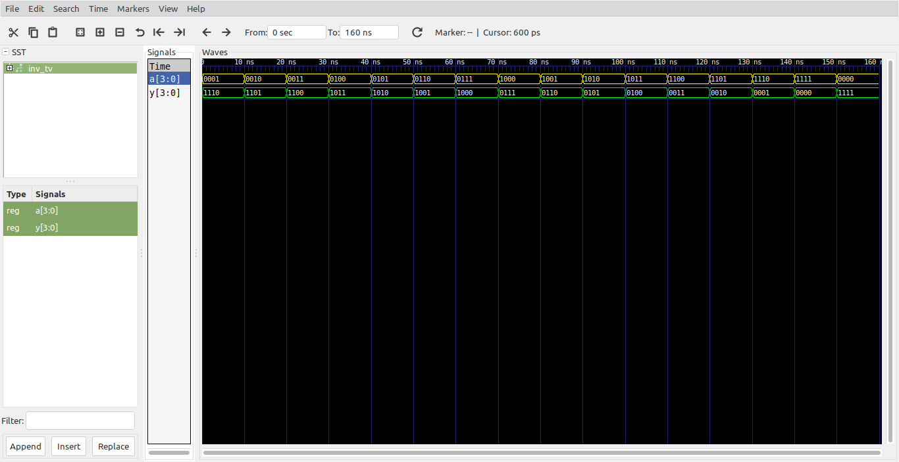

# Logica combinacional - Bitwise Operators #

Estos operadores sobre señales digitales las cuales pueden ser single-bit (señales de un solo bit) o multi-bit (señales de multiples bits o buses). En este caso se muestra como ejemplo el uso del operador ```not``` cuya entrada y salida es un bus.

## Ejemplo - Implementación de una compuerta inversora ##

**Módulo**: [inv.vhd](inv.vhd)

```vhdl
library ieee;
use ieee.std_logic_1164.all;
use ieee.numeric_std.all;

entity inv is
	port(
		a : in std_logic_vector(3 downto 0);
		y : out std_logic_vector(3 downto 0)
	);
end entity inv;

architecture synth of inv is
	
begin
	y <= not a;
end architecture synth;
```

La descripción general del modulo se muestra en la siguiente grafica:



**Test bench**: [inv_tb.vhd](inv_tb.vhd)

```vhdl
library ieee;
use ieee.std_logic_1164.all;
use ieee.numeric_std.all;
use ieee.std_logic_arith.all; -- @suppress "Deprecated package"
use ieee.std_logic_unsigned.all; -- @suppress "Deprecated package"

entity inv_tv is
end entity inv_tv;

architecture RTL of inv_tv is

	component inv is
		port(
			a : in  std_logic_vector(3 downto 0);
			y : out std_logic_vector(3 downto 0)
		);
	end component;
	
	signal a: std_logic_vector(3 downto 0) := "0000";
	signal y: std_logic_vector(3 downto 0);
	
	constant T : time := 10 ns;
	
begin
	DUT:inv
		port map(
			a => a,
			y => y
		);
	
	stimulus : process is
	begin
		for i in 0 to 15 loop
			a <= a + 1;
			wait for T;			
		end loop;
		wait;		
	end process stimulus;
end architecture RTL;
```

El esquema del test bench se muestra a continuación:


**Simulación**: El resultado de la simulación se muestra en la siguiente figura:



**Comandos ghdl**: Los comandos ghdl para llevar a cabo la simulación se muestran a continuación:

``` 
ghdl -a --ieee=synopsys inv.vhd inv_tv.vhd
ghdl -r --ieee=synopsys inv_tv --vcd=inv_wf.vcd
gtkwave inv_wf.vcd
```