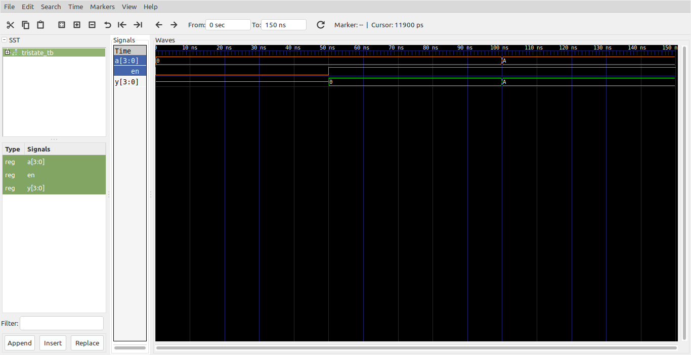
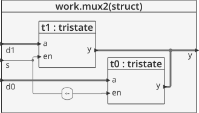

# Structural modeling - Building a mux 2:1 from a pair of tristate buffer #

En el siguiente ejemplo, empleando el diseño estructural se construye un mux2:1 a partir de 2 tristate.

## Ejemplo - mux2:1##

**Módulos**: Como el modelamiento es estructural, hay varios módulos implicados, estos son:

**Mux 2:1**: [tristate.vhd](tristate.vhd)

```vhdl
library IEEE; use IEEE.STD_LOGIC_1164.all;

entity tristate is
  port(a: in STD_LOGIC_VECTOR(3 downto 0);
       en: in STD_LOGIC;
       y: out STD_LOGIC_VECTOR(3 downto 0));
end;

architecture synth of tristate is
begin
  y <= a when en = '1' else 
       "ZZZZ";
end;
```

Dandole una mirada al modulo por dentro tenemos:


**Test bench**: El código de test para el componente anterior se muestra en el siguiente codigo ([tristate_tb.vhd](tristate_tb.vhd)):

```vhdl
library ieee;
use ieee.std_logic_1164.all;
use ieee.numeric_std.all;

entity tristate_tb is
end entity tristate_tb;

architecture RTL of tristate_tb is
	component tristate
		port(
			a  : in  STD_LOGIC_VECTOR(3 downto 0);
			en : in  STD_LOGIC;
			y  : out STD_LOGIC_VECTOR(3 downto 0)
		);
	end component tristate;

	signal a   : std_logic_vector(3 downto 0) := "0000";
	signal en  : std_logic                    := '0';
	signal y   : std_logic_vector(3 downto 0);
	constant T : time                         := 50 ns;
begin
	DUT : tristate
		port map(
			a  => a,
			en => en,
			y  => y
		);

	stimulus : process is
	begin
		wait for T;
		en <= '1';
		wait for T;
		a  <= "1010";
        wait for T;
		wait;
	end process stimulus;

end architecture RTL;
```

El esquema del test bench se muestra a continuación:


**Simulación**: El resultado de la simulación se muestra en la siguiente figura:



**Comandos ghdl**: Los comandos ghdl para llevar a cabo la simulación del mux2:1 se muestran a continuación:

``` 
ghdl -a --ieee=synopsys tristate.vhd tristate_tb.vhd
ghdl -r --ieee=synopsys tristate_tb --vcd=tristate_wf.vcd
gtkwave tristate_wf.vcd
```

Notese que si los resultados esta bien, ya tenemos la certeza de que este modulo se encuentra bien y por ende podemos pasar a construir el modulo del **mux2:1** a partir de instancias del módulo anteriormente construido (**tristate.vhd**).

**Mux 2:1**: [mux2.vhd](mux2.vhd)

```vhdl
library IEEE; 
use IEEE.STD_LOGIC_1164.all;

entity mux2 is
port(d0, d1: in STD_LOGIC_VECTOR(3 downto 0);
     s: in STD_LOGIC;
     y: out STD_LOGIC_VECTOR(3 downto 0));
end;

architecture struct of mux2 is
  component tristate
    port(a: in STD_LOGIC_VECTOR(3 downto 0);
         en: in STD_LOGIC;
         y: out STD_LOGIC_VECTOR(3 downto 0));
  end component;
  signal sbar: STD_LOGIC;
begin
  sbar <= not s;
  t0: tristate port map(a => d0, en => sbar, y => y);
  t1: tristate port map(a => d1, en  => s, y => y);
end;
```

La forma general de modulo anterior se muestra a continuación:


Dandole una mirada al modulo por dentro tenemos:



Como se puede ver en la figura anterior, el modulo **mux2** esta compuesto por 2 instancias (**t1** y **t2**) del  modulo **tristate**.

**Test bench**:  Luego solo resta hacer el test bench para el modulo top (**mux2**). En el codigo mostrado a continuación ([mux2_tb.vhd](mux2_tb.vhd)):

```vhdl
library ieee;
use ieee.std_logic_1164.all;
use ieee.numeric_std.all;

entity tristate_tb is
end entity tristate_tb;

architecture RTL of tristate_tb is
	component tristate
		port(
			a  : in  STD_LOGIC_VECTOR(3 downto 0);
			en : in  STD_LOGIC;
			y  : out STD_LOGIC_VECTOR(3 downto 0)
		);
	end component tristate;

	signal a   : std_logic_vector(3 downto 0) := "0000";
	signal en  : std_logic                    := '0';
	signal y   : std_logic_vector(3 downto 0);
	constant T : time                         := 50 ns;
begin
	DUT : tristate
		port map(
			a  => a,
			en => en,
			y  => y
		);

	stimulus : process is
	begin
		wait for T;
		en <= '1';
		wait for T;
		a  <= "1010";
        wait for T;
		wait;
	end process stimulus;

end architecture RTL;
```

El esquema de la simulación se encuentra descrito en la siguiente figura:


Finalmente, la forma de onda resultante de la simulación se muestra a continuación: 

![mux2_wf][mux2_wf.png]

Los comandos en ghdl usados para hacer las pruebas fueron:

```
ghdl -a --ieee=synopsys mux2.vhd mux2_tb.vhd
ghdl -r --ieee=synopsys mux2_tb --vcd=mux2_wf.vcd
gtkwave mux2_wf.vcd
```

## En resumen ##
Cuando trabaje de manera estructural es util realizar las siguientes tareas.
1. Defina los modulos interiores primero.
2. Pruebe el correcto funcionamiento de cada uno de los modulos interiores definidos, si todo esta bien continue con el paso 3; sino, haga los cambios necesarios en estos módulos hasta que el funcionamiento este bien.
3. Defina el módulo (o los módulos) superior conectando los modulos interiores.
4. Pruebe el modulo anteriormente definido, si esta bien culmino y ya esta listo para ser sintetizado e implementado en la FPGA, sino, haga las correcciones necesarias hasta que las simulaciones arrojen los resultados esperados.

Todos los pasos anteriores que se definieron en todo el ejemplo se muestran a continuación empleando la herramienta **ghdl**.

```
ghdl -a --ieee=synopsys tristate.vhd tristate_tb.vhd
ghdl -r --ieee=synopsys tristate_tb --vcd=tristate_wf.vcd
gtkwave tristate_wf.vcd
ghdl -a --ieee=synopsys mux2.vhd mux2_tb.vhd
ghdl -r --ieee=synopsys mux2_tb --vcd=mux2_wf.vcd
gtkwave mux2_wf.vcd
```

