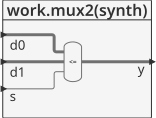

# Structural modeling -  #

Existen casos en los cuales hay modulos que pueden acceder a parte de un bus. A continuación se muestra uno de ellos en el cual, se define un **mux2:1** de 8 bits construido a partir de dos **mux2:1** de 4 bits donde cada uno de estos operan en los diferentes nibbles (1 nibble = medio byte = 4 bits) del byte.

En general, los **sistemas complejos** son diseñados jerarquicamente de modo que el sistema completo es descrito estructuralmente instanciando  sus mayores comoponentes, los cuales a su vez pueden estar estructuralmente con sus propios bloques (instancias) y asi sucesivamente hasta que se llegan a las piezas mas simples en la cuales el comportamiento es descrito de manera estructural. 


**Tip**: Es buena practica evitar (o al menos minimizar) mezclar descripciones estructural y comportamental dentro de un unico modulo.

A continuación se muestra el código del ejemplo:

## Ejemplo - mux2:1 de 8 bits##

**Módulos**: Como el modelamiento es estructural, hay varios módulos implicados, estos son:

**Mux 2:1 de 4 bits**: [mux2.vhd](mux2.vhd)

```vhdl
library IEEE; use IEEE.STD_LOGIC_1164.all;

entity mux2 is
  port(d0, d1: in STD_LOGIC_VECTOR(3 downto 0);
       s: in STD_LOGIC;
       y: out STD_LOGIC_VECTOR(3 downto 0));
end;

architecture synth of mux2 is
begin
  y <= d1 when s = '1' else d0;
end;
```

Dandole una mirada al modulo por dentro tenemos:




**Test bench**: Despues de que se crea un modulo que no sera el principal si no que será usado como un componente; es importante, hacer un test bench para verificar que este funcione correctamente. Para el caso del **mux2:1 de 4 bits** aqui descrito se tiene el siguiente codigo ([mux2_tb.vhd](mux2_tb.vhd)) asociado al testbench:

```vhdl
library ieee;
use ieee.std_logic_1164.all;
use ieee.numeric_std.all;

entity mux2_tb is
end entity mux2_tb;

architecture RTL of mux2_tb is
	component mux2
		port(
			d0, d1 : in  STD_LOGIC_VECTOR(3 downto 0);
			s      : in  STD_LOGIC;
			y      : out STD_LOGIC_VECTOR(3 downto 0)
		);
	end component mux2;
	
	signal d0, d1 : std_logic_vector(3 downto 0);
	signal s : std_logic;	
	signal y : std_logic_vector(3 downto 0);
	
	constant T : time := 20 ns;
	
begin
	
	DTU: mux2
		port map(
			d0 => d0,
			d1 => d1,
			s  => s,
			y  => y
		);
		
	stimulus : process is
	begin
		wait for T;
		d0 <= "0010"; d1 <= "1000"; s <= '0';
		wait for T;
		s <= '1';
		wait for T;
		wait;		
	end process stimulus;
	
end architecture RTL;
```

El esquema del test bench se muestra a continuación:


**Simulación**: El resultado de la simulación se muestra en la siguiente figura:


**Comandos ghdl**: Los comandos ghdl para llevar a cabo la simulación del mux2:1 se muestran a continuación:

``` 
ghdl -a --ieee=synopsys mux2.vhd mux2_tb.vhd
ghdl -r --ieee=synopsys mux2_tb --vcd=mux2_wf.vcd
gtkwave mux2_wf.vcd
```

Notese que si los resultados esta bien, ya tenemos la certeza de que este modulo se encuentra bien y por ende podemos pasar a construir el modulo del **mux2:1 de 8 bits** el cual se encuentra compuesto de varias instancias del modulo asociado al **mux2:1 de 4 bits**.

**Mux 2:1 de 8 bits**: [mux2_8.vhd](mux2_8.vhd)

```vhdl
library IEEE; use IEEE.STD_LOGIC_1164.all;

entity mux2_8 is
  port(d0, d1: in STD_LOGIC_VECTOR(7 downto 0);
       s: in STD_LOGIC;
       y: out STD_LOGIC_VECTOR(7 downto 0));
end;

architecture struct of mux2_8 is
  component mux2
    port(d0, d1: in STD_LOGIC_VECTOR(3 downto 0);
    s: in STD_LOGIC;
    y: out STD_LOGIC_VECTOR(3 downto 0));
  end component;
begin
  lsbmux: mux2
    port map(d0 => d0(3 downto 0), 
    	     d1 => d1(3 downto 0),
             s => s, 
             y => y(3 downto 0));
  msbmux: mux2
    port map(d0 => d0(7 downto 4), 
    	     d1 => d1(7 downto 4),
             s => s, 
             y => y(7 downto 4));
end;
```

La forma general de modulo anterior se muestra a continuación:


Dandole una mirada al modulo por dentro tenemos:


Como se puede ver en la figura anterior, el modulo **mux2_8** esta compuesto por 2 instancias (**lsbmux** y **msbmux**) del  modulos de **mux2**.

**Test bench**:  Luego solo resta hacer el test bench para el modulo top (**mux2_8**). En el codigo mostrado a continuación ([mux_2_8_tb](mux_2_8_tb)):

```vhdl
library ieee;
use ieee.std_logic_1164.all;
use ieee.std_logic_arith.all;

library ieee;
use ieee.std_logic_1164.all;
use ieee.numeric_std.all;

entity mux_2_8_tb is
end entity mux_2_8_tb;

architecture RTL of mux_2_8_tb is
	component mux2_8
		port(
			d0, d1 : in  STD_LOGIC_VECTOR(7 downto 0);
			s      : in  STD_LOGIC;
			y      : out STD_LOGIC_VECTOR(7 downto 0)
		);
	end component mux2_8;
	
	signal d0,d1 : std_logic_vector(7 downto 0) := "00000000";
	signal s : std_logic := '0';
	signal y : std_logic_vector(7 downto 0);
	
	constant T : time := 20 ns;
	
begin
	
	DUT: mux2_8
		port map(
			d0 => d0,
			d1 => d1,
			s  => s,
			y  => y
		);
		
	stimulus : process is
	begin
		wait for T;
		d1 <= "11100111";
		wait for T;
		s <= '1';
		wait for T;
		s <= '0';
		wait for T;
		d0 <= "00111111";
		wait for T;
		wait;
	end process stimulus;
	
end architecture RTL;
```

El esquema de la simulación se encuentra descrito en la siguiente figura:


Finalmente, la forma de onda resultante de la simulación se muestra a continuación: 


Los comandos en ghdl usados para hacer las pruebas fueron:

```
ghdl -a --ieee=synopsys mux_2_8.vhd mux_2_8_tb.vhd
ghdl -r --ieee=synopsys mux_2_8_tb --vcd=mux_2_8_wf.vcd
gtkwave mux_2_8_wf.vcd
```

## En resumen ##
Cuando trabaje de manera estructural es util realizar las siguientes tareas.
1. Defina los modulos interiores primero.
2. Pruebe el correcto funcionamiento de cada uno de los modulos interiores definidos, si todo esta bien continue con el paso 3; sino, haga los cambios necesarios en estos módulos hasta que el funcionamiento este bien.
3. Defina el módulo (o los módulos) superior conectando los modulos interiores.
4. Pruebe el modulo anteriormente definido, si esta bien culmino y ya esta listo para ser sintetizado e implementado en la FPGA, sino, haga las correcciones necesarias hasta que las simulaciones arrojen los resultados esperados.

Todos los pasos anteriores que se definieron en todo el ejemplo se muestran a continuación empleando la herramienta **ghdl**.

```
ghdl -a --ieee=synopsys mux2.vhd mux2_tb.vhd
ghdl -r --ieee=synopsys mux2_tb --vcd=mux2_wf.vcd
gtkwave mux2_wf.vcd
ghdl -a --ieee=synopsys mux_2_8.vhd mux_2_8_tb.vhd
ghdl -r --ieee=synopsys mux_2_8_tb --vcd=mux_2_8_wf.vcd
gtkwave mux_2_8_wf.vcd
```

