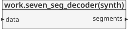
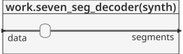
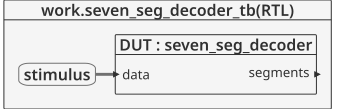
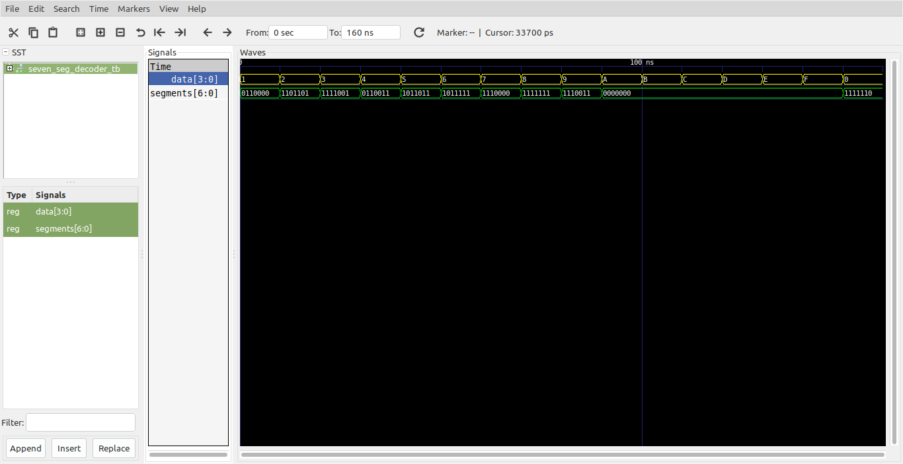

# Logica combinacional - estrutura case #

La estructura **case** es propia de los **process** y su funcionamiento es simular a las ya vistas cuando se manejo concurrencia, el uso del case es util cuando se describe un modulo a partir de la **tabla de verdad**. Para ver su funcionamiento de crea un modulo que implementa un decodificador de un display de 7 segmentos. 

## Ejemplo - Decodificador a 7 segmentos ##

**Módulo**: [seven_seg_decoder.vhd](seven_seg_decoder.vhd)

```vhdl
library IEEE; 
use IEEE.STD_LOGIC_1164.all;

entity seven_seg_decoder is
  port(data: in STD_LOGIC_VECTOR(3 downto 0);
       segments: out STD_LOGIC_VECTOR(6 downto 0));
end;

architecture synth of seven_seg_decoder is
begin
  process(all) begin
case data is
  --                        abcdefg
  when X"0" => segments <= "1111110";
  when X"1" => segments <= "0110000";
  when X"2" => segments <= "1101101";
  when X"3" => segments <= "1111001";
  when X"4" => segments <= "0110011";
  when X"5" => segments <= "1011011";
  when X"6" => segments <= "1011111";
  when X"7" => segments <= "1110000";
  when X"8" => segments <= "1111111";
  when X"9" => segments <= "1110011";
  when others => segments <= "0000000";
end case;
end process;
end;
```

La descripción general del modulo se muestra en la siguiente grafica:



Dandole una mirada al modulo por dentro tenemos:




**Test bench**: [seven_seg_decoder_tb.vhd](seven_seg_decoder_tb.vhd)

```vhdl
library ieee;
use ieee.std_logic_1164.all;
use ieee.numeric_std.all;
use ieee.numeric_std_unsigned.all;

entity seven_seg_decoder_tb is
end entity seven_seg_decoder_tb;

architecture RTL of seven_seg_decoder_tb is
	component seven_seg_decoder
		port(
			data     : in  STD_LOGIC_VECTOR(3 downto 0);
			segments : out STD_LOGIC_VECTOR(6 downto 0)
		);
	end component seven_seg_decoder;
	
	signal data : std_logic_vector(3 downto 0) := "0000";
	signal segments : std_logic_vector(6 downto 0);
	
	constant T : time := 10 ns;
	
begin
	
	DUT: seven_seg_decoder
		port map(
			data     => data,
			segments => segments
		);
		
	stimulus : process is
	begin
		for i in 0 to 15 loop
			data <= data + '1';
            wait for T;
		end loop;
		wait;
	end process stimulus;
	
end architecture RTL;
```

El esquema del test bench se muestra a continuación:



**Simulación**: El resultado de la simulación se muestra en la siguiente figura:



**Comandos ghdl**: Los comandos ghdl para llevar a cabo la simulación se muestran a continuación:

``` 
ghdl -a --ieee=synopsys seven_seg_decoder.vhd seven_seg_decoder_tb.vhd
ghdl -r --ieee=synopsys seven_seg_decoder_tb --vcd=seven_seg_decoder_wf.vcd
gtkwave seven_seg_decoder_wf.vcd
```

