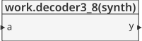
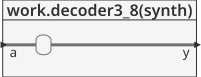
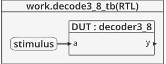
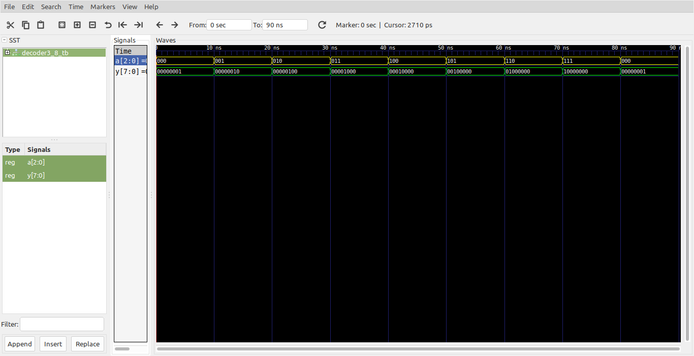

# Logica combinacional - Usan don't cares #

La clausula **others** de la estructura **case** (propia de los **process**) no es estrictamente necesaria para la sintesis de la logica por que todas las combinaciones de entrada estan definidas, pero es prudente para simulación en caso de que una de las entradas sea **x**, **z**, or **u**.

## Ejemplo - Decodificador de 3 a 8 segmentos ##

**Módulo**: [decoder3_8.vhd](decoder3_8.vhd)

```vhdl
library IEEE; 
use IEEE.STD_LOGIC_1164.all;

entity decoder3_8 is
  port(a: in STD_LOGIC_VECTOR(2 downto 0);
  y: out STD_LOGIC_VECTOR(7 downto 0));
end;

architecture synth of decoder3_8 is
begin
  process(all) 
  begin
    case a is
      when "000" => y <= "00000001";
      when "001" => y <= "00000010";
      when "010" => y <= "00000100";
      when "011" => y <= "00001000";
      when "100" => y <= "00010000";
      when "101" => y <= "00100000";
      when "110" => y <= "01000000";
      when "111" => y <= "10000000";
      when others => y <= "XXXXXXXX";
    end case;
  end process;
end;
```

La descripción general del modulo se muestra en la siguiente grafica:



Dandole una mirada al modulo por dentro tenemos:



**Test bench**: [decoder3_8_tb.vhd](decoder3_8_tb.vhd)

```vhdl
library ieee;
use ieee.std_logic_1164.all;
use ieee.numeric_std.all;
use ieee.numeric_std_unsigned.all;

entity decoder3_8_tb is
end entity decoder3_8_tb;

architecture RTL of decoder3_8_tb is
	component decoder3_8
		port(
			a : in  STD_LOGIC_VECTOR(2 downto 0);
			y : out STD_LOGIC_VECTOR(7 downto 0)
		);
	end component decoder3_8;
	
	signal a : std_logic_vector(2 downto 0) := "000";
	signal y : std_logic_vector(7 downto 0);
	
	constant T : time := 10 ns;
	
begin
	
	DUT: decoder3_8
		port map(
			a => a,
			y => y
		);
		
	stimulus : process is
	begin
		wait for T;
		for i in 0 to 7 loop
			a <= a + "001";
			wait for T;
		end loop;
		wait;
		
	end process stimulus;
	
end architecture RTL;
```

El esquema del test bench se muestra a continuación:



**Simulación**: El resultado de la simulación se muestra en la siguiente figura:



**Comandos ghdl**: Los comandos ghdl para llevar a cabo la simulación se muestran a continuación:

``` 
ghdl -a --ieee=synopsys decoder3_8.vhd decoder3_8_tb.vhd
ghdl -r --ieee=synopsys decoder3_8_tb --vcd=decoder3_8_wf.vcd
gtkwave decoder3_8_wf.vcd
```

