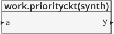
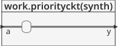
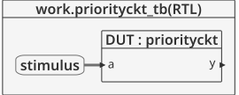
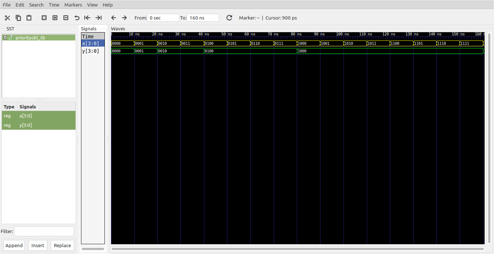

# Logica combinacional - estructura if #

Dentro de los bloques **process** tambien se puede hacer uso de la estructura **if**. Esta estructura permite diferentes combinaciones de entrada cuando se combina con el **else**. En el siguiente ejemplo se muestra el uso de **if** para describir un circuito decodificador de prioridad.

## Ejemplo - Decodificador de prioridad ##

**Módulo**: [priorityckt.vhd](priorityckt.vhd)

```vhdl
library IEEE;
use IEEE.STD_LOGIC_1164.all;

entity priorityckt is
	port(a : in  STD_LOGIC_VECTOR(3 downto 0);
	     y : out STD_LOGIC_VECTOR(3 downto 0));
end;

architecture synth of priorityckt is
begin
	process(all)
	begin
		if a(3) = '1' then
			y <= "1000";
		elsif a(2) = '1' then
			y <= "0100";
		elsif a(1) = '1' then
			y <= "0010";
		elsif a(0) = '1' then
			y <= "0001";
		else
			y <= "0000";
		end if;
	end process;
end;
```

La descripción general del modulo se muestra en la siguiente grafica:



Dandole una mirada al modulo por dentro tenemos:



**Test bench**: [priorityckt_tb.vhd](priorityckt_tb.vhd)

```vhdl
library ieee;
use ieee.std_logic_1164.all;
use ieee.numeric_std.all;
use ieee.numeric_std_unsigned.all;

entity priorityckt_tb is
end entity priorityckt_tb;

architecture RTL of priorityckt_tb is
	component priorityckt
		port(
			a : in  STD_LOGIC_VECTOR(3 downto 0);
			y : out STD_LOGIC_VECTOR(3 downto 0)
		);
	end component priorityckt;
	
	signal a : std_logic_vector(3 downto 0) := "0000";
	signal y : std_logic_vector(3 downto 0);
	constant T : time := 10 ns;
	
begin
	
	DUT: priorityckt
		port map(
			a => a,
			y => y
		);
		
	stimulus : process is
	begin
		for i in 0 to 15 loop
			wait for T;
			a <= a + '1';
		end loop;
		wait;
	end process stimulus;
	

end architecture RTL;
```

El esquema del test bench se muestra a continuación:



**Simulación**: El resultado de la simulación se muestra en la siguiente figura:



**Comandos ghdl**: Los comandos ghdl para llevar a cabo la simulación se muestran a continuación:

``` 
ghdl -a --ieee=synopsys priorityckt.vhd priorityckt_tb.vhd
ghdl -r --ieee=synopsys priorityckt_tb --vcd=priorityckt_wf.vcd
gtkwave priorityckt_wf.vcd
```

