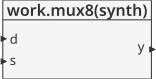
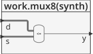
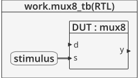
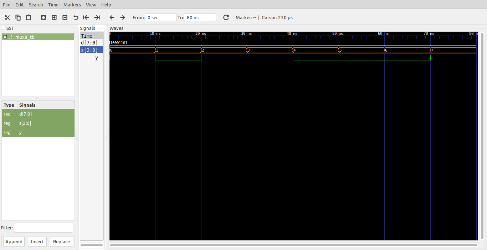

# Logica combinacional - tipos de datos #

## Objetos de datos ## 
En VHDL cada **objeto** de datos definido tiene un **tipo** y una **clase**. El **tipo** esta relacionado con el tipo de datos asociados al objeto; la **clase** indica el caracter del objeto de datos. A continuación se muestra de manera resumida algunos tipos y algunas clases:
* Clases:
  * Constant
  * Variable
  * Signal
  * File
* Tipos:
  * std_logic
  * std_ulogic
  * integer
  * boolean
  * bit
  * std_logic_vector
  * unsigned...  

## Tipos de datos basicos##

### Tipos VHDL definidos en el paquete STANDARD ###

#### Tipo bit ####

Puede tomar dos posibles valores logicos ('0','1'). Ejemplos:

1. Single bit:

```vhdl
SIGNAL a_temp : BIT;
```

2. Array de bits:

```vhdl
SIGNAL temp : BIT_VECTOR (3 DOWNTO 0);
SIGNAL temp : BIT_VECTOR (0 TO 3);
```

#### Tipo BOOLEAN ####
Puede tomar dos posibless valores (False, true)

#### Tipo INTEGER ####
Define valores positivos y negativos en decimal:.

```vhdl
SIGNAL int_tmp : INTEGER; -- 32-bit number
SIGNAL int_tmp1 : INTEGER RANGE 0 TO 255; --8 bit number
```

#### Otros tipos definidos en el paquete estandar ####

1. **Type NATURAL**: Entero dentro del rango 0 to 2^32
2. **Type POSITIVE**: Integer dentro del rango 1 to 23^2
3. **Type CHARACTER**: caracteres ASCII 
4. **Type STRING**: Array de caracteres
5. **Type TIME**: Valores en unidades de tiempo (e.g. ps, us, ns, ms, sec, min, hr)
6. **Type REAL**: Numeros de punto flotante (Double-precision)

### Tipos de datos definidos en el paquete STD_LOGIC_1164 Package ###

#### Tipo STD_LOGIC ####

Sistema con 9 posibles valores ('U', 'X', '0', '1', 'Z', 'W', 'L', 'H', '-') donde:
* '1': Logic high
* '0': Logic low
* 'X': Unknown
* 'Z': (not 'z') Tri-state
* '-': Don’t Care
* 'U': Undefined
* 'H': Weak logic high
* 'L': Weak logic low
* 'W': Weak unknown

#### Tipo STD_ULOGIC ####
Los mismos 9 valores definidos en STD_LOGIC


### Tipos definidos por el usuario ###

Ademas de los tipos de tatos propios de VHDL para modelar hardware (e.g. BIT, BOOLEAN, STD_LOGIC), est posible tambien crear una nueva calse de tipos al declaraar objetos.
* Subtype
* Enumerate
* Array

#### Subtype ####

Es un tipo de dato constante que es empleado para hacer codigo mas claro y flexible.

```vhdl
ARCHITECTURE logic OF subtype_test IS
  SUBTYPE word IS std_logic_vector (31 DOWNTO 0);
  SIGNAL mem_read, mem_write : word;
  SUBTYPE dec_count IS INTEGER RANGE 0 TO 9;
  SIGNAL ones, tens : dec_count;
BEGIN
```

#### Enumerate ####

Permite que el usuario cree datos tipo **nombre** - **valor**. Es comunmente empleado para hacer codigo mas claro y para el desarrollo de maquinas de estado finitas. La sintaxis se muestra a continuación:

```vhdl
TYPE <your_data_type> IS
  (data type items or values separated by commas);
```

Un caso tipico se muestra a continuación:

```vhdl
TYPE enum IS (idle, fill, heat_w, wash, drain);
SIGNAL fsm_st : enum;
  ...
drain_led <= '1' WHEN fsm_st = drain ELSE '0';
```

#### Array ####

Permite la creacion de datos multidimensionales para almacenar valores. Es comunmente usado para crear memorias y almacenar vectores de simulación. La declaración típica de un Array se muestra a continuación:

```vhdl
TYPE <array_type_name> IS ARRAY (<integer_range>) OF
     <data_type>;
```

A continuación se muestra un ejemplo en el cual se declara una memoria:

```vhdl
ARCHITECTURE logic OF my_memory IS
  -- Creates new array data type named mem which has 64
  -- address locations each 8 bits wide
  TYPE mem IS ARRAY (0 to 63) OF std_logic_vector (7 DOWNTO 0);
  -- Creates 2 - 64x8-bit array to use in design
  SIGNAL mem_64x8_a, mem_64x8_b : mem;
BEGIN
  ...
  mem_64x8_a(12) <= x“AF”;
  mem_64x8_b(50) <= “11110000”;
  ...
  END ARCHITECTURE logic;
```

## Ejemplo - Mux8:1 ##

**Módulo**: [mux8.vhd](mux8.vhd)

```vhdl
library IEEE;
use IEEE.STD_LOGIC_1164.all;
use IEEE.NUMERIC_STD_UNSIGNED.all;

entity mux8 is
	port(d : in  STD_LOGIC_VECTOR(7 downto 0);
	     s : in  STD_LOGIC_VECTOR(2 downto 0);
	     y : out STD_LOGIC);
end;

architecture synth of mux8 is
begin
	y <= d(TO_INTEGER(s));
end;
```

La descripción general del modulo se muestra en la siguiente grafica:



Dandole una mirada al modulo por dentro tenemos:



**Test bench**: [mux8_tb.vhd](mux8_tb.vhd)

```vhdl
library ieee;
use ieee.std_logic_1164.all;
use ieee.numeric_std.all;
use ieee.numeric_std_unsigned.all;


entity mux8_tb is
end entity mux8_tb;

architecture RTL of mux8_tb is
	component mux8
		port(
			d : in  STD_LOGIC_VECTOR(7 downto 0);
			s : in  STD_LOGIC_VECTOR(2 downto 0);
			y : out STD_LOGIC
		);
	end component mux8;
	
	signal d : std_logic_vector(7 downto 0) := "10001101";
	signal s : std_logic_vector(2 downto 0) := "000";
	signal y : std_logic;
	
	constant T : time := 10 ns;
	
	
begin
	DUT:mux8
		port map(
			d => d,
			s => s,
			y => y
		);
		
	stimulus : process is
	begin
		for i in 0 to 7 loop
			s <= std_logic_vector(to_unsigned(i,s'length));
			wait for T;			
		end loop;
		wait;		
	end process stimulus;
	
end architecture RTL;
```

El esquema del test bench se muestra a continuación:



**Simulación**: El resultado de la simulación se muestra en la siguiente figura:



**Comandos ghdl**: Los comandos ghdl para llevar a cabo la simulación se muestran a continuación:

``` 
ghdl -a --std=08 --ieee=synopsys mux8.vhd mux8_tb.vhd
ghdl -r --std=08 --ieee=synopsys mux8_tb --vcd=mux8_wf.vcd
gtkwave mux8_wf.vcd
```

