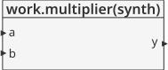
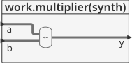
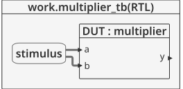
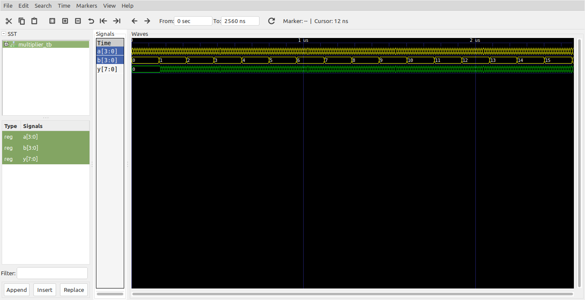
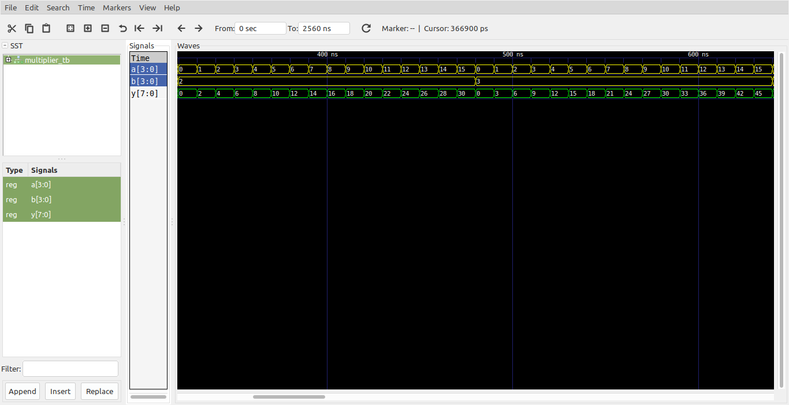

# Logica combinacional - multiplicador #

## Ejemplo - Multiplicador de  ##

**Módulo**: [multiplier.vhd](multiplier.vhd)

```vhdl
-- 4.33(a): unsigned multiplier
library IEEE;
use IEEE.STD_LOGIC_1164.all;
use IEEE.NUMERIC_STD_UNSIGNED.all;

entity multiplier is
	port(a, b : in  STD_LOGIC_VECTOR(3 downto 0);
	     y    : out STD_LOGIC_VECTOR(7 downto 0));
end;

architecture synth of multiplier is
begin
	y <= a * b;
end;
```

La descripción general del modulo se muestra en la siguiente grafica:



Dandole una mirada al modulo por dentro tenemos:



**Test bench**: [multiplier_tb.vhd](multiplier_tb.vhd)

```vhdl
library ieee;
use ieee.std_logic_1164.all;
use ieee.numeric_std.all;
use ieee.numeric_std_unsigned.all;

entity multiplier_tb is
end entity multiplier_tb;

architecture RTL of multiplier_tb is
	component multiplier
		port(
			a, b : in  STD_LOGIC_VECTOR(3 downto 0);
			y    : out STD_LOGIC_VECTOR(7 downto 0)
		);
	end component multiplier;

	signal a, b : std_logic_vector(3 downto 0) := "0000";
	signal y    : std_logic_vector(7 downto 0);

	constant T : time := 10 ns;
begin
	DUT : multiplier
		port map(
			a => a,
			b => b,
			y => y
		);

	stimulus : process is
	begin
		for i in 0 to 15 loop
			for j in 0 to 15 loop				
				wait for T;
				a <= a + '1';
			end loop;
			b <= b + '1';
			a <= "0000";
		end loop;
		wait;
	end process stimulus;

end architecture RTL;
```

El esquema del test bench se muestra a continuación:



**Simulación**: El resultado de la simulación se muestra en la siguiente figura:



Como no se pueden apreciar muy bien los valores se hace un zoom de la simulación:



**Comandos ghdl**: Los comandos ghdl para llevar a cabo la simulación se muestran a continuación:

``` 
ghdl -a --std=08 --ieee=synopsys multiplier.vhd multiplier_tb.vhd
ghdl -r --std=08 --ieee=synopsys multiplier_tb --vcd=multiplier_wf.vcd
gtkwave multiplier_wf.vcd
```

