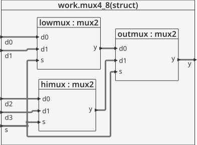
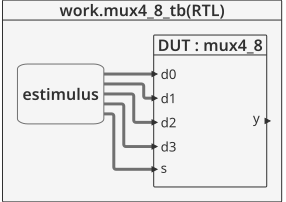
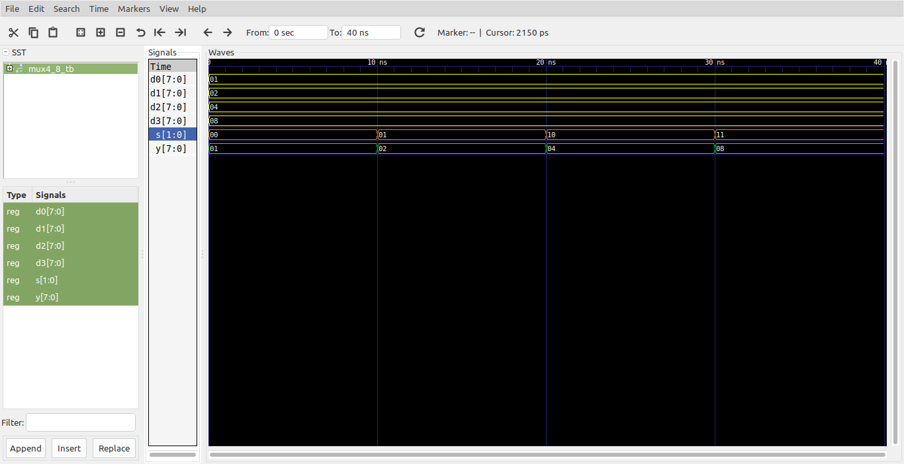

# Logica combinacional - mux #

A continuación se hace uso de modulos **mux2:1** con un numero generico de entradas para crear 

...


## Ejemplo - mux ##

**Módulo**: [mux2.vhd](mux2.vhd)

```vhdl
library IEEE;
use IEEE.STD_LOGIC_1164.all;

entity mux2 is
	generic(width : integer := 8);
	port(d0, d1 : in  STD_LOGIC_VECTOR(width - 1 downto 0);
	     s      : in  STD_LOGIC;
	     y      : out STD_LOGIC_VECTOR(width - 1 downto 0));
end;

architecture synth of mux2 is
begin
	y <= d1 when s = '1' else d0;
end;
```

La descripción general del modulo se muestra en la siguiente grafica:


**Módulo**: [mux4_8.vhd](mux4_8.vhd)


```vhdl
library IEEE;
use IEEE.STD_LOGIC_1164.all;
entity mux4_8 is
	port(d0, d1, d2, d3 : in  STD_LOGIC_VECTOR(7 downto 0);
	     s              : in  STD_LOGIC_VECTOR(1 downto 0);
	     y              : out STD_LOGIC_VECTOR(7 downto 0));
end;
architecture struct of mux4_8 is
	component mux2
		generic(width : integer := 8);
		port(d0, d1 : in  STD_LOGIC_VECTOR(width - 1 downto 0);
		     s      : in  STD_LOGIC;
		     y      : out STD_LOGIC_VECTOR(width - 1 downto 0));
	end component;
	signal low, hi : STD_LOGIC_VECTOR(7 downto 0);
begin
	lowmux : mux2
		port map(d0 => d0,
		         d1 => d1,
		         s  => s(0),
		         y  => low
		        );
	himux : mux2
		port map(d0 => d2,
		         d1 => d3,
		         s  => s(0),
		         y  => hi
		        );
	outmux : mux2
		port map(d0 => low,
		         d1 => hi,
		         s  => s(1),
		         y  => y
		        );
end;
```

La siguiente figura muestra el módulo anterior:




**Test bench**: [mux4_8_tb.vhd](mux4_8_tb.vhd)

```vhdl
library ieee;
use ieee.std_logic_1164.all;
use ieee.numeric_std.all;

entity mux4_8_tb is
end entity mux4_8_tb;

architecture RTL of mux4_8_tb is
	component mux4_8
		port(
			d0, d1, d2, d3 : in  STD_LOGIC_VECTOR(7 downto 0);
			s              : in  STD_LOGIC_VECTOR(1 downto 0);
			y              : out STD_LOGIC_VECTOR(7 downto 0)
		);
	end component mux4_8;
	
	signal d0, d1, d2, d3 : std_logic_vector(7 downto 0);
	signal s : std_logic_vector(1 downto 0);	
	signal y : std_logic_vector(7 downto 0);
	
	constant T : time := 10 ns;
	
begin
	
	DUT : mux4_8
		port map(
			d0 => d0,
			d1 => d1,
			d2 => d2,
			d3 => d3,
			s  => s,
			y  => y
		);
		
		estimulus : process is
		begin
			d0 <= X"01";
			d1 <= X"02";
			d2 <= X"04";
			d3 <= X"08";
			s <= "00";
			for i in 0 to 3 loop
				s <= std_logic_vector(to_unsigned(i, s'length));
				wait for T;
			end loop;
			wait;			
		end process estimulus;
		
end architecture RTL;
```

El esquema del test bench se muestra a continuación:



**Simulación**: El resultado de la simulación se muestra en la siguiente figura:



**Comandos ghdl**: Los comandos ghdl para llevar a cabo la simulación se muestran a continuación:

``` 
ghdl -a --std=08 --ieee=synopsys mux2.vhd mux4_8.vhd mux4_8_tb.vhd
ghdl -r --std=08 --ieee=synopsys mux4_8_tb --vcd=mux4_8_wf.vcd
gtkwave mux4_8_wf.vcd
```

