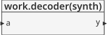
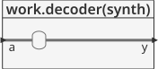
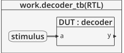
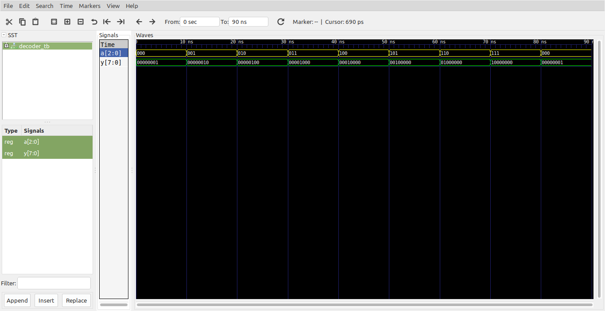

# Logica combinacional - Generic example #

A continuación se crea un decodificador N:2^N usando generic

## Ejemplo - mux ##

**Módulo**: [decoder.vhd](decoder.vhd)

```vhdl
library IEEE;
use IEEE.STD_LOGIC_1164.all;
use IEEE.NUMERIC_STD_UNSIGNED.all;

entity decoder is
	generic(N : integer := 3);
	port(a : in  STD_LOGIC_VECTOR(N - 1 downto 0);
	     y : out STD_LOGIC_VECTOR(2**N - 1 downto 0));
end;
architecture synth of decoder is
begin
	process(all)
	begin
		y                <= (OTHERS => '0');
		y(TO_INTEGER(a)) <= '1';
	end process;
end;
```

La estructura externa del modulo se muestra a continuación:



La estructura interna del modulo se muestra en la siguiente grafica:




**Test bench**: [decoder_tb.vhd](decoder_tb.vhd)

```vhdl
library ieee;
use ieee.std_logic_1164.all;
use ieee.numeric_std.all;
use IEEE.NUMERIC_STD_UNSIGNED.all;

entity decoder_tb is
end entity decoder_tb;

architecture RTL of decoder_tb is

	constant WIDTH : integer := 3;
	constant T     : time    := 10 ns;

	component decoder
		generic(N : integer);
		port(
			a : in  STD_LOGIC_VECTOR(N - 1 downto 0);
			y : out STD_LOGIC_VECTOR(2**N - 1 downto 0)
		);
	end component decoder;

	signal a : std_logic_vector(WIDTH - 1 downto 0) := (others => '0');
	signal y : std_logic_vector(2**WIDTH - 1 downto 0);

begin

	DUT : decoder
		generic map(
			N => WIDTH
		)
		port map(
			a => a,
			y => y
		);

	stimulus : process is
	begin
		for i in 0 to 2**WIDTH - 1 loop
			wait for T;
			a <= a + '1';
		end loop;
		wait for T;
		wait;
	end process stimulus;

end architecture RTL;
```

El esquema del test bench se muestra a continuación:



**Simulación**: El resultado de la simulación se muestra en la siguiente figura:



**Comandos ghdl**: Los comandos ghdl para llevar a cabo la simulación se muestran a continuación:

``` 
ghdl -a --std=08 --ieee=synopsys decoder.vhd decoder_tb.vhd
ghdl -r --std=08 --ieee=synopsys decoder_tb --vcd=decoder_wf.vcd
gtkwave decoder_wf.vcd
```

