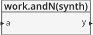
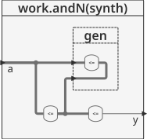
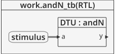
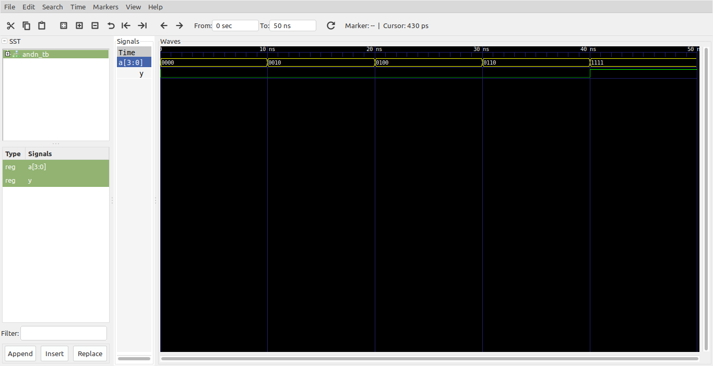

# Logica combinacional - Generate Statements #

### for-generate ###
En este caso las instrucciones concurrentes son repetidas un determinado numero de veces.

```vhdl
G_LABEL: FOR <identifier> IN <discrete_range> GENERATE
            [block_declarative_part]
            [begin]
               concurrent_statements;
         END GENERATE [G_LABEL];
```

### if-generate ###
Permite de acuerdo a la condición que los las instrucciones concurrentes sean elaboradas o no. Otro de los usos de utilidad de esta sentencia es incluir u omitir parte de un diseño que usualmente es dependiente de la constante generica:


```vhdl
G_LABEL: IF <condition> GENERATE
         [begin]
            concurrent_statements;
         END GENERATE [G_LABEL];
```
Por ejemplo:

```vhdl
entity my_system is
      generic ( debug: boolean := true)
      port (
      ...
      );
end entity my_system;

architecture rtl of my_system is
...
begin
   ...
   debug_comp: if debug generate
      ...
   end generate debug_comp;
   ...
end architecture;
```

A continuación se muestra un ejemplo en el cual se crea una compuerta and de 8 entradas a partir de operaciones and de 2 entradas.

## Ejemplo - and de N entradas ##

**Módulo**: [andN.vhd](andN.vhd)

```vhdl
library IEEE;
use IEEE.STD_LOGIC_1164.all;

entity andN is
	generic(width : integer := 8);
	port(a : in  STD_LOGIC_VECTOR(width - 1 downto 0);
	     y : out STD_LOGIC);
end;

architecture synth of andN is
	signal x : STD_LOGIC_VECTOR(width - 1 downto 0);
begin
	x(0) <= a(0);
	gen : for i in 1 to width - 1 generate
		x(i) <= a(i) and x(i - 1);
	end generate;
	y    <= x(width - 1);
end;
```

Las entradas y salidas del modulo muestra en la siguiente grafica:



El diagrama interno se muestra a continuación:




**Test bench**: [andN_tb.vhd](andN_tb.vhd)

```vhdl
library ieee;
use ieee.std_logic_1164.all;
use ieee.numeric_std.all;

entity andN_tb is
end entity andN_tb;

architecture RTL of andN_tb is
	component andN
		generic(width : integer);
		port(
			a : in  STD_LOGIC_VECTOR(width - 1 downto 0);
			y : out STD_LOGIC
		);
	end component andN;
	
	constant N : integer := 4;
	constant T : time := 10 ns;
	
	
	signal a : std_logic_vector(N - 1 downto 0) := (others => '0');
	signal y : std_logic;
		
begin
	
	DTU: andN
		generic map(
			width => N
		)
		port map(
			a => a,
			y => y
		);
		
	stimulus : process is
	begin
		for i in 0 to N - 1 loop
			a <= std_logic_vector(to_unsigned(2*i,a'length));
			wait for T;			
		end loop;
        a <= (others => '1');
        wait for T;
		wait;		
	end process stimulus;
	
end architecture RTL;
```

El esquema del test bench se muestra a continuación:



**Simulación**: El resultado de la simulación se muestra en la siguiente figura:



**Comandos ghdl**: Los comandos ghdl para llevar a cabo la simulación se muestran a continuación:

``` 
ghdl -a --std=08 --ieee=synopsys andN.vhd andN_tb.vhd
ghdl -r --std=08 --ieee=synopsys andN_tb --vcd=andN_wf.vcd
gtkwave andN_wf.vcd
```

