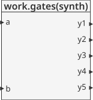
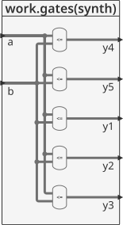
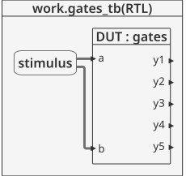
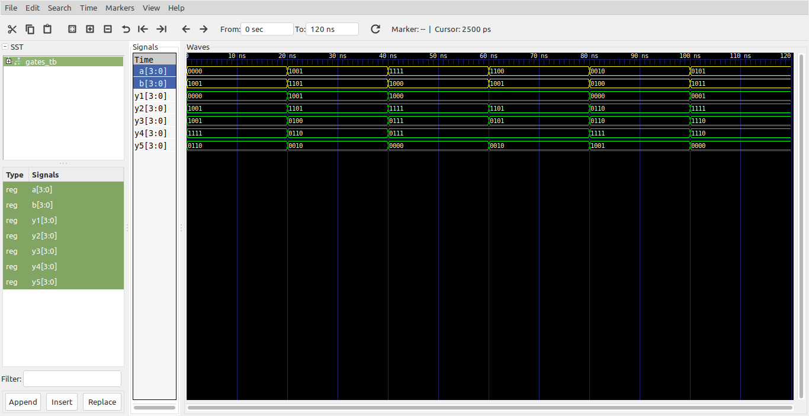

# Logica combinacional - Bitwise Operators #

Hay varios operadores sobre bits como ```and```, ```or```, ```not```, ```xor```, etc.    
En este caso se muestra como ejemplo el uso de diferentes operadores teniendo en cuenta el caso en que las entradas son single-bit.

## Ejemplo - Implementación de una compuerta inversora ##

**Módulo**: [gates.vhd](gates.vhd)

```vhdl
library ieee;
use ieee.std_logic_1164.all;
use ieee.numeric_std.all;

entity gates is
	port(
		a, b: in STD_LOGIC_VECTOR(3 downto 0);
		y1, y2, y3, y4, y5: out STD_LOGIC_VECTOR(3 downto 0)
	);
end entity gates;

architecture synth of gates is
	
begin
  --five different two-input logic gates
  --acting on 4-bit busses
  y1 <= a and b;
  y2 <= a or b;
  y3 <= a xor b;
  y4 <= a nand b;
  y5 <= a nor b;
end architecture synth;
```

La descripción general del modulo se muestra en la siguiente grafica:



Dandole una mirada al modulo por dentro tenemos:




**Test bench**: [inv_tb.vhd](inv_tb.vhd)

```vhdl
library ieee;
use ieee.std_logic_1164.all;
use ieee.numeric_std.all;
use ieee.std_logic_signed.all; 
use ieee.std_logic_arith.all; 


entity gates_tb is
end entity gates_tb;

architecture RTL of gates_tb is
	-- Component
	component gates is
		port(
			a, b               : in  STD_LOGIC_VECTOR(3 downto 0);
			y1, y2, y3, y4, y5 : out STD_LOGIC_VECTOR(3 downto 0)
		);
	end component;

	-- internal signals
	signal a                  : std_logic_vector(3 downto 0);
	signal b                  : std_logic_vector(3 downto 0);
	signal y1, y2, y3, y4, y5 : std_logic_vector(3 downto 0);

	-- input vector
	type vector is array (natural range <>) of std_logic_vector(3 downto 0);
	constant vector_a_signals : vector := ("0000",
	                                       "1001",
	                                       "1111",
	                                       "1100",
	                                       "0010",
	                                       "0101"
	                                      );
	constant vector_b_signals : vector := ("1001",
	                                       "1101",
	                                       "1000",
	                                       "1001",
	                                       "0100",
	                                       "1011"
	                                      );
	                                      
	constant T : time := 20 ns;
	

begin
	-- Component instanciation
	DUT : gates
		port map(
			a  => a,
			b  => b,
			y1 => y1,
			y2 => y2,
			y3 => y3,
			y4 => y4,
			y5 => y5
		);

	-- Stimulus
	stimulus : process is
	begin
		for i in 0 to 5 loop
			a <= vector_a_signals(i);
			b <= vector_b_signals(i);
			wait for T;			
		end loop;
		wait;		
	end process stimulus;
end architecture RTL;
```

El esquema del test bench se muestra a continuación:



**Simulación**: El resultado de la simulación se muestra en la siguiente figura:



**Comandos ghdl**: Los comandos ghdl para llevar a cabo la simulación se muestran a continuación:

``` 
ghdl -a --ieee=synopsys gates.vhd gates_tb.vhd
ghdl -r --ieee=synopsys gates_tb --vcd=gates_wf.vcd
gtkwave gates_wf.vcd
```