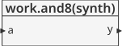
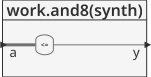

# Reduction operators - Operadores de reducción #

Los operadores de reducción permiten que una compuerta con multiples entrada actue sobre un unico bus. Esto es lo que hace posible la asignación de un bus como alternativa a la asignación it a bit la cual, para el caso, puede ser muy engorrosa.

## Ejemplo - Implementación de una compuerta inversora ##

**Módulo**: [and8.vhd](and8.vhd)

```vhdl
library IEEE; use IEEE.STD_LOGIC_1164.all;

entity and8 is
  port(a: in STD_LOGIC_VECTOR(7 downto 0);
       y: out STD_LOGIC);
end;

architecture synth of and8 is
begin
  y <= and a;
  -- and a is much easier to write than
  -- y <= a(7) and a(6) and a(5) and a(4) and
  -- a(3) and a(2) and a(1) and a(0);
end;
```

La descripción general del modulo se muestra en la siguiente grafica:



Dandole una mirada al modulo por dentro tenemos:


