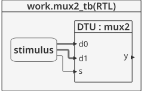

# Logica combinacional - Conditional assignments #

Las asignaciones condicionales seleccionan la salida de varias alternativas basadas en una entrada llamada **contición** la cual es una expresión booleana. La sintaxis general es la siguiente:

```vhdl
signal_name <= expression_1 when condition_1 else
               expression_2 when condition_2 else
               expression_3 ;
```

Un caso tipico se muestra a continuación:

```vhdl
Z <= A when X > 5 else
     B when X < 5 else
     C;
```

## Ejemplo - Implementación de un mux 2 a 1 ##

**Módulo**: [mux2.vhd](mux2.vhd)

```vhdl
library IEEE; use IEEE.STD_LOGIC_1164.all;

entity mux2 is
  port(
  	d0, d1: in STD_LOGIC_VECTOR(3 downto 0);
    s: in STD_LOGIC;
    y: out STD_LOGIC_VECTOR(3 downto 0)
    );
end;

architecture synth of mux2 is
begin
  y <= d1 when s = '1' else 
       d0;
end;
```

La descripción general del modulo se muestra en la siguiente grafica:


Dandole una mirada al modulo por dentro tenemos:


**Test bench**: [mux2_tb.vhd](mux2_tb.vhd)

```vhdl
library ieee;
use ieee.std_logic_1164.all;
use ieee.numeric_std.all;

entity mux2_tb is
end entity mux2_tb;

architecture RTL of mux2_tb is
	component mux2
		port(
			d0, d1 : in  STD_LOGIC_VECTOR(3 downto 0);
			s      : in  STD_LOGIC;
			y      : out STD_LOGIC_VECTOR(3 downto 0)
		);
	end component mux2;
	
	signal d0, d1 : std_logic_vector(3 downto 0);
	signal s : std_logic;	
	signal y : std_logic_vector(3 downto 0);
	
	constant T : time := 20 ns;
	
begin
	
	DTU: mux2
		port map(
			d0 => d0,
			d1 => d1,
			s  => s,
			y  => y
		);
		
	stimulus : process is
	begin
		wait for T;
		d0 <= "0010"; d1 <= "1000"; s <= '0';
		wait for T;
		s <= '1';
        wait for T;
		wait;		
	end process stimulus;
	
end architecture RTL;
```

El esquema del test bench se muestra a continuación:



**Simulación**: El resultado de la simulación se muestra en la siguiente figura:


**Comandos ghdl**: Los comandos ghdl para llevar a cabo la simulación se muestran a continuación:

``` 
ghdl -a --ieee=synopsys mux2.vhd mux2_tb.vhd
ghdl -r --ieee=synopsys mux2_tb --vcd=mux2_wf.vcd
gtkwave mux2_wf.vcd
```

## Referencias ##
1. [Conditional Signal Assignment](https://www.ics.uci.edu/~jmoorkan/vhdlref/cond_s_a.html)