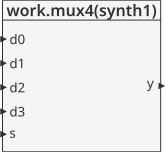
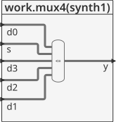
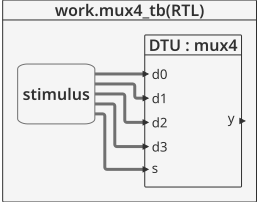
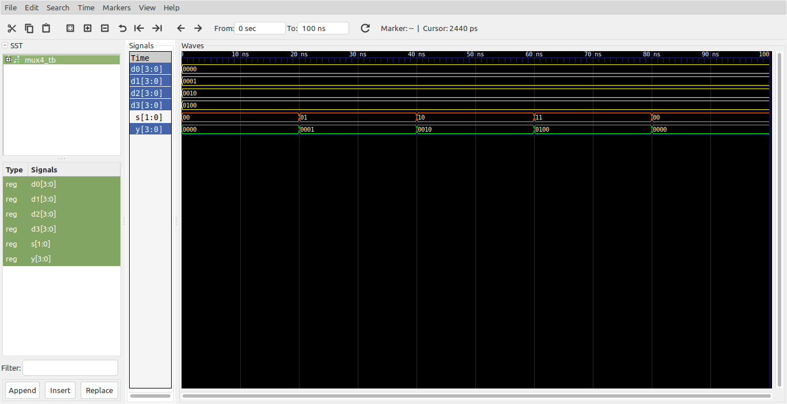

# Logica combinacional - Conditional assignments #

Otra de asignación condicional es empleando la forma **with/select** :

```vhdl
signal_name <= expression_1 when condition_1 else
               expression_2 when condition_2 else
               expression_3 ;

with signal1_name select
     signal2_name <= expression_1 when signal1_condition_1, 
                     expression_2 when signal1_condition_2,
                     ...
                    expression_N when others;
```

Un caso tipico se muestra a continuación:

```vhdl
with estado select
    semaforo <= "rojo"     when "01",
                "verde"    when "10",
                "amarillo" when "11",
                "malo"     when others;
```

## Ejemplo - Implementación de un mux 4 a 1 ##

**Módulo**: [mux4.vhd](mux4.vhd)

```vhdl
library IEEE; use IEEE.STD_LOGIC_1164.all;

entity mux4 is
  port(d0, d1,
       d2, d3: in STD_LOGIC_VECTOR(3 downto 0);
       s: in STD_LOGIC_VECTOR(1 downto 0);
       y: out STD_LOGIC_VECTOR(3 downto 0));
end;

architecture synth1 of mux4 is
begin
  y <= d0 when s = "00" else
       d1 when s = "01" else
       d2 when s = "10" else
       d3;
end;
```

Para el caso dado, aunque no se empleó la forma **with/select** en el modulo, la forma equivalente de la asignación condicional anteriormente hecha con **when/else** empleando **with/select** sería:

```
with s select y <=
  d0 when "00",
  d1 when "01",
  d2 when "10",
  d3 when others;
```

La descripción general del modulo se muestra en la siguiente grafica:



Dandole una mirada al modulo por dentro tenemos:




**Test bench**: [mux4_tb.vhd](mux4_tb.vhd)

```vhdl
library ieee;
use ieee.std_logic_1164.all;
use ieee.numeric_std.all;
use ieee.std_logic_arith.all;
use ieee.std_logic_unsigned.all;

entity mux4_tb is
end entity mux4_tb;

architecture RTL of mux4_tb is
	component mux4
		port(
			d0, d1, d2, d3 : in  STD_LOGIC_VECTOR(3 downto 0);
			s              : in  STD_LOGIC_VECTOR(1 downto 0);
			y              : out STD_LOGIC_VECTOR(3 downto 0)
		);
	end component mux4;
	
	signal d0, d1, d2, d3 : std_logic_vector(3 downto 0);
	signal s : std_logic_vector(1 downto 0);
	signal y : std_logic_vector(3 downto 0);
	
	constant T : time := 20 ns;
	
begin
	
	DTU: mux4
		port map(
			d0 => d0,
			d1 => d1,
			d2 => d2,
			d3 => d3,
			s  => s,
			y  => y
		);
		
	stimulus : process is
	begin
		d0 <= "0000"; 
		d1 <= "0001"; 
		d2 <= "0010"; 
		d3 <= "0100";
        s <= "00";
        wait for T;		
		for i in 0 to 3 loop
			s <= s + '1';	
			wait for T;		
		end loop;		
		wait;
	end process stimulus;
	

end architecture RTL;
```

El esquema del test bench se muestra a continuación:



**Simulación**: El resultado de la simulación se muestra en la siguiente figura:



**Comandos ghdl**: Los comandos ghdl para llevar a cabo la simulación se muestran a continuación:

``` 
ghdl -a --ieee=synopsys mux4.vhd mux4_tb.vhd
ghdl -r --ieee=synopsys mux4_tb --vcd=mux4_wf.vcd
gtkwave mux4_wf.vcd
```

## Referencias ##
1. [Signal Assignments in VHDL: with/select, when/else and case](https://insights.sigasi.com/tech/signal-assignments-vhdl-withselect-whenelse-and-case/)
2. [Programación en VHDL/Arquitectura](https://es.wikibooks.org/wiki/Programaci%C3%B3n_en_VHDL/Arquitectura)