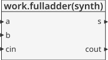
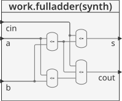
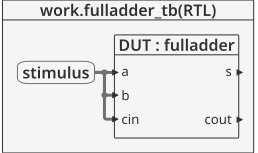
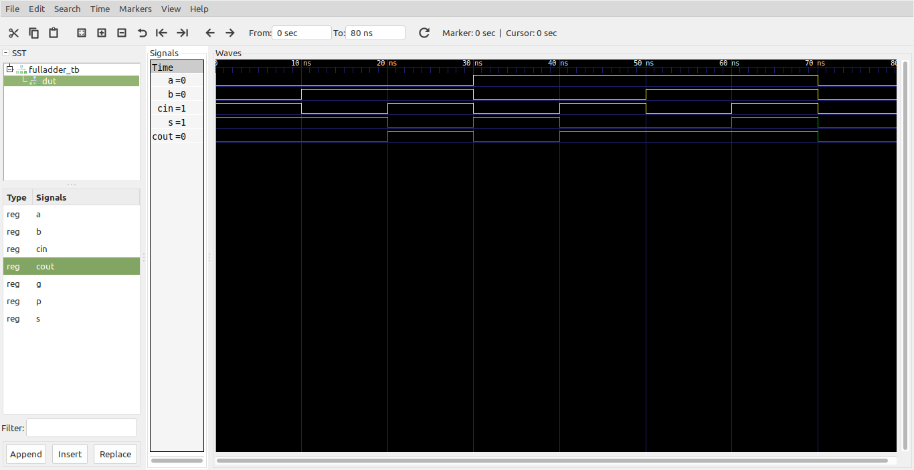

# Logica combinacional - Internal signals #

Las señales internas permiten función compleja en pasos intermedios. Estas se caracterizan por no ser entradas ni salidas ya que son usadas solo de manera interna en el modulo, haciendo la analogia con los lenguajes de programación, son equivalentes a variables locales. 

En lo que respecta a la asignación de señales se emplea el simbolo **<=**, el cual opera de manera concurrente.

## Ejemplo - Implementación de un mux 4 a 1 ##

**Módulo**: [fulladder.vhd](fulladder.vhd)

```vhdl
library IEEE;
use IEEE.STD_LOGIC_1164.all;

entity fulladder is
	port(a, b, cin : in  STD_LOGIC;
	     s, cout   : out STD_LOGIC);
end;

architecture synth of fulladder is
	signal p, g : STD_LOGIC;
begin
	p    <= a xor b;
	g    <= a and b;
	s    <= p xor cin;
	cout <= g or (p and cin);
end;
```

En el ejemplo anterior, las variabless **p** y **g** serian las señales internas.

La descripción general del modulo se muestra en la siguiente grafica:



Dandole una mirada al modulo por dentro tenemos:




**Test bench**: [fulladder_tb.vhd](fulladder_tb.vhd)

```vhdl
library ieee;
use ieee.std_logic_1164.all;
use ieee.numeric_std.all;
use ieee.std_logic_arith.all;
use ieee.std_logic_unsigned.all;

entity fulladder_tb is
end entity fulladder_tb;

architecture RTL of fulladder_tb is
	component fulladder
		port(
			a, b, cin : in  STD_LOGIC;
			s, cout   : out STD_LOGIC
		);
	end component fulladder;

	signal vector_inputs : std_logic_vector(2 downto 0) := "000";
	signal cout          : std_logic;
	signal s             : std_logic;

	constant T : time := 10 ns;

begin

	DUT : fulladder
		port map(
			a    => vector_inputs(2),
			b    => vector_inputs(1),
			cin  => vector_inputs(0),
			s    => s,
			cout => cout
		);

	stimulus : process is
	begin
		for i in 0 to 7 loop
			vector_inputs <= vector_inputs + '1';
            wait for T;
		end loop;
        wait;
	end process stimulus;

end architecture RTL;
```

El esquema del test bench se muestra a continuación:



**Simulación**: El resultado de la simulación se muestra en la siguiente figura:



**Comandos ghdl**: Los comandos ghdl para llevar a cabo la simulación se muestran a continuación:

``` 
ghdl -a --ieee=synopsys fulladder.vhd fulladder_tb.vhd
ghdl -r --ieee=synopsys fulladder_tb --vcd=fulladder_wf.vcd
gtkwave fulladder_wf.vcd
```

