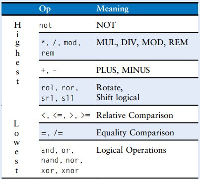
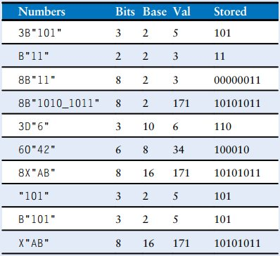
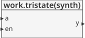
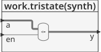
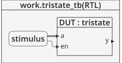
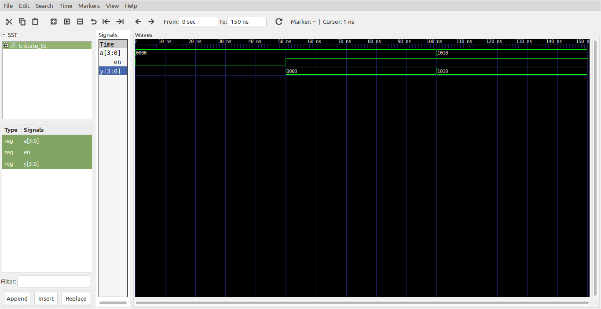

# Logica combinacional - Presedence, Numbers, Z’s and X’s #

## Predencia ##

En la siguiente tabla se muestran las reglas de presedencia para los operadores en VHDL:



## Representación numérica ##

En lo que respecta a los números se tiene:
* **Representación**: binaria, octal, decimal y hexadecimal.
* **Tamaño**: El tamaño (número de bits) puede ser opcionalmente dado. Los bits sobrantes de llenan con zeros.
* Los underscore (**_**) en los numeros son ignorados y pueden ser utiles para romper numeros largos en trozos mas legibles.
* En lo que respecta a los numeros STD_LOGIC manejados en VHDL se tiene:
  * Los numeros STD_LOGIC encerrados en comilla simple (**'0'** o **'1'**) indican logica **0** y **1**.
  * El formato para declarar constantes STD_LOGIC_VECTOR es de la forma **NB"value"** donde **N** es el tamaño en bits y **B** la base.
  * VHDL 2008 soporta: **B** para binario, **O** para octal, **D** para decimal y **X** para hexadecimal. Si una base es omitida la representación por defecto es la binaria. 

La siguiente figura muestra algunas representaciones numericas en VHDL:



## Z’s y X’s ##
Los lenguajes de descripción de hardware (HDL) usan **'z'** para indicar valores flotantes (alta impedancia), estos son particularmente utiles para describir un buffer tristate, cuya salida es flotante (esta en un estado abierto) cuando la entrada **enable** es **'0'**. En VHDL, las señales STD_LOGIC  son **'0'**, **'1'**, **'z'**, **'x'**, and **'u'**. En el caso de  entraadas no inicializadas suele aparecer **'u'** como valor. 

La siguiente implementación de un tristate muestra todo lo descrito con anterioridad.

## Ejemplo - Implementación tristate ##

**Módulo**: [fulladder.vhd](fulladder.vhd)

```vhdl
library IEEE; use IEEE.STD_LOGIC_1164.all;

entity tristate is
  port(a: in STD_LOGIC_VECTOR(3 downto 0);
       en: in STD_LOGIC;
       y: out STD_LOGIC_VECTOR(3 downto 0));
end;

architecture synth of tristate is
begin
  y <= a when en = '1' else "ZZZZ";
end;
```

La descripción general del modulo se muestra en la siguiente grafica:



Dandole una mirada al modulo por dentro tenemos:




**Test bench**: [tristate_tb.vhd](tristate_tb.vhd)

```vhdl
library ieee;
use ieee.std_logic_1164.all;
use ieee.numeric_std.all;

entity tristate_tb is
end entity tristate_tb;

architecture RTL of tristate_tb is
	component tristate
		port(
			a  : in  STD_LOGIC_VECTOR(3 downto 0);
			en : in  STD_LOGIC;
			y  : out STD_LOGIC_VECTOR(3 downto 0)
		);
	end component tristate;

	signal a   : std_logic_vector(3 downto 0) := "0000";
	signal en  : std_logic                    := '0';
	signal y   : std_logic_vector(3 downto 0);
	constant T : time                         := 50 ns;
begin
	DUT : tristate
		port map(
			a  => a,
			en => en,
			y  => y
		);

	stimulus : process is
	begin
		wait for T;
		en <= '1';
		wait for T;
		a  <= "1010";
        wait for T;
		wait;
	end process stimulus;

end architecture RTL;
```

El esquema del test bench se muestra a continuación:



**Simulación**: El resultado de la simulación se muestra en la siguiente figura:



**Comandos ghdl**: Los comandos ghdl para llevar a cabo la simulación se muestran a continuación:

``` 
ghdl -a --ieee=synopsys fulladder.vhd fulladder_tb.vhd
ghdl -r --ieee=synopsys fulladder_tb --vcd=fulladder_wf.vcd
gtkwave fulladder_wf.vcd
```

