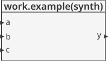
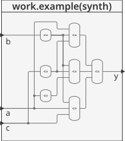
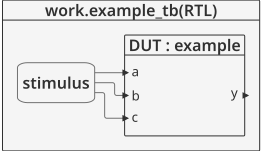
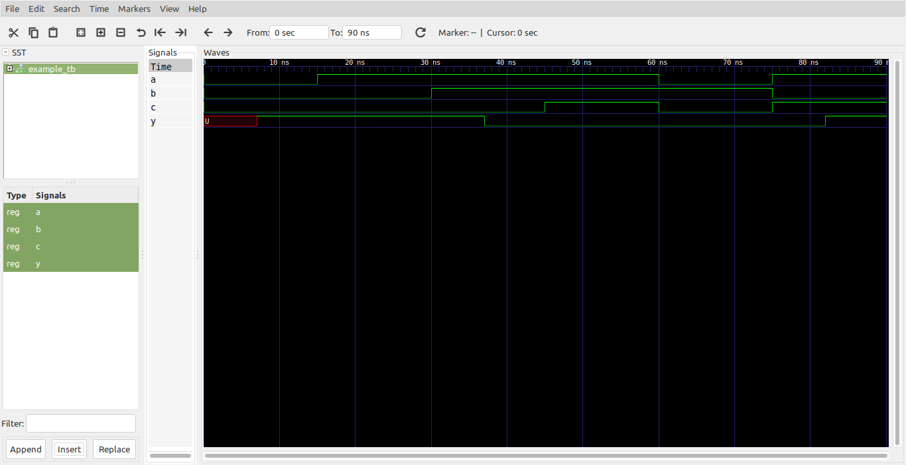

# Logica combinacional - Bit Swizzling, delays #

## Bit Swizzling ##

A menudo es necesario operar sobre un subconjunto de un bus o concatenar (unir todas) las señales en forma de buses. Estas operaciones se conocen como bit swizzling. A continuación se muestra un ejemplo típico de esta operación donde se uso el operador agregate **()**, para concatenar buses:

```vhdl
y <=(c(2 downto 1), d(0), d(0), d(0), c(0), 3B"101");
```

Otro ejemplo puede ser el siguiente. Si se quisiera inicializar el valor de z con ```10010110``` empleando la concatenación, una forma alterna puede ser la siguiente:

```vhdl
z <= ("10", 4 => '1', 2 downto 1 =>'1', others =>'0');
```

## Delays ##

Las sentencias HDL pueden  ser asociadas con delays especificados en unidades arbitrarrias. Estos son utiles durante la simulación para predecir que tan rapido un circuito trabajara (si uste especifica retardos significativos) y tambien para debugging con el proposito de comprender causa y efecto. Estos retardos son ignorados durante la sintesis; el delay de unaa compuerta producido por el sinterizador depende de sus especificaciones tpd y tcd, no de numeros en codigo HDL.

## Ejemplo - Circuito con retraso ##
El siguiente ejemplo agregar retardos a la función de vhdl:  y = a'b'c' + ab'c' + ab'c. Para el caso, asume que los inversores tiene un delay de 1ns, las and de 3 entradas tiene un delay de 2 ns, y las or de tres entradas tienen un delay de 4 ns.


**Módulo**: [example.vhd](example.vhd)

```vhdl
library IEEE;
use IEEE.STD_LOGIC_1164.all;

entity example is
	port(a, b, c : in  STD_LOGIC;
	     y       : out STD_LOGIC);
end;

architecture synth of example is
	signal ab, bb, cb, n1, n2, n3 : STD_LOGIC;
begin
	ab <= not a after 1 ns;
	bb <= not b after 1 ns;
	cb <= not c after 1 ns;
	n1 <= ab and bb and cb after 2 ns;
	n2 <= a and bb and cb after 2 ns;
	n3 <= a and bb and c after 2 ns;
	y  <= n1 or n2 or n3 after 4 ns;
end;
```

La descripción general del modulo se muestra en la siguiente grafica:



Dandole una mirada al modulo por dentro tenemos:




**Test bench**: [example_tb.vhd](example_tb.vhd)

```vhdl
library ieee;
use ieee.std_logic_1164.all;
use ieee.numeric_std.all;

entity example_tb is
end entity example_tb;

architecture RTL of example_tb is
	component example
		port(
			a, b, c : in  STD_LOGIC;
			y       : out STD_LOGIC
		);
	end component example;
	
	signal a, b, c : std_logic := '0';
	signal y : std_logic;
	
	constant T : time := 15 ns;
begin
	DUT:example
		port map(
			a => a,
			b => b,
			c => c,
			y => y
		);
		
	stimulus : process is
	begin
		wait for T;
		a <= '1';
		wait for T;
		b <= '1';		
		wait for T;
		c <= '1';
		wait for T;
		a <= '0';
		c <= '0';		
		wait for T;
		a <= '1';
		b <= '0';
		c <= '1';
		wait for T;
		wait;		
	end process stimulus;
end architecture RTL;
```

El esquema del test bench se muestra a continuación:



**Simulación**: El resultado de la simulación se muestra en la siguiente figura:



**Comandos ghdl**: Los comandos ghdl para llevar a cabo la simulación se muestran a continuación:

``` 
ghdl -a --ieee=synopsys example.vhd example_tb.vhd
ghdl -r --ieee=synopsys example_tb --vcd=example_wf.vcd
gtkwave example_wf.vcd
```

