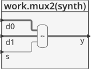
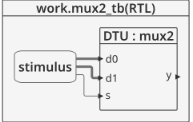
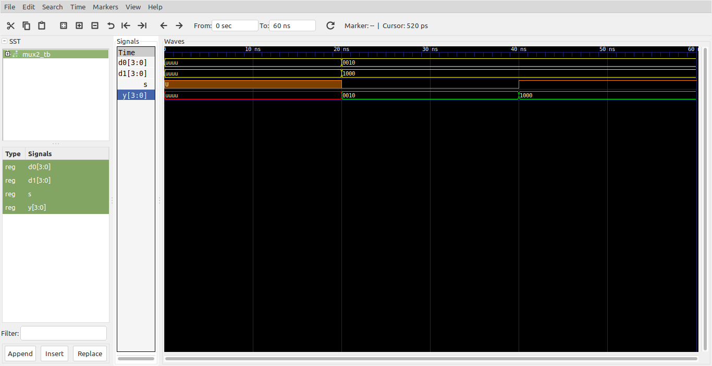
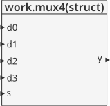
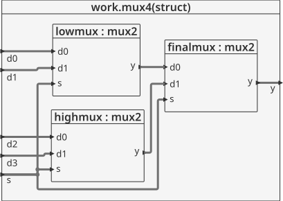
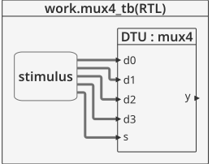

# Structural modeling - Bit Swizzling, delays #

El modelado estructural se caracteriza por que lo que se hace aqui es describir un modulo en terminos de modulos mas simples que se encuentran conectados entre sí. Esto es, un modulo principal (Top) puede estar compuesto de otros modulos, un ejemmplo de esto se muestra en que es posible construir un mux4:1 a partir de tres mux2:1 apropiadamente conectados. Cada copia de un mux2:1 es conocida como **instance** (instance). Cuando se instancia un módulo, se usan labels para distingirlos de otros; asi para el ejemplo, cada instancia de los módulos mux2:1 tendrán distintos nombres: **lowmux**, **highmux**, and **finalmux**. El siguiente código resalta esto:

## Ejemplo - mux4:1##

**Módulos**: Como el modelamiento es estructural, hay varios módulos implicados, estos son:

**Mux 2:1**: [mux2.vhd](mux2.vhd)

```vhdl
library IEEE; 
use IEEE.STD_LOGIC_1164.all;

entity mux2 is
  port(d0, d1: in STD_LOGIC_VECTOR(3 downto 0);
       s: in STD_LOGIC;
       y: out STD_LOGIC_VECTOR(3 downto 0)
       );
end;

architecture synth of mux2 is
begin
  y <= d1 when s = '1' else d0;
end;
```

Dandole una mirada al modulo por dentro tenemos:




**Test bench**: Despues de que se crea un modulo que no sera el principal si no que será usado como un componente; es importante, hacer un test bench para verificar que este funcione correctamente. Para el caso del **mux2:1** aqui descrito se tiene el siguiente codigo ([mux2_tb.vhd](mux2_tb.vhd)) asociado al testbench:

```vhdl
library ieee;
use ieee.std_logic_1164.all;
use ieee.numeric_std.all;

entity mux2_tb is
end entity mux2_tb;

architecture RTL of mux2_tb is
	component mux2
		port(
			d0, d1 : in  STD_LOGIC_VECTOR(3 downto 0);
			s      : in  STD_LOGIC;
			y      : out STD_LOGIC_VECTOR(3 downto 0)
		);
	end component mux2;
	
	signal d0, d1 : std_logic_vector(3 downto 0);
	signal s : std_logic;	
	signal y : std_logic_vector(3 downto 0);
	
	constant T : time := 20 ns;
	
begin
	
	DTU: mux2
		port map(
			d0 => d0,
			d1 => d1,
			s  => s,
			y  => y
		);
		
	stimulus : process is
	begin
		wait for T;
		d0 <= "0010"; d1 <= "1000"; s <= '0';
		wait for T;
		s <= '1';
		wait for T;
		wait;		
	end process stimulus;
	
end architecture RTL;
```

El esquema del test bench se muestra a continuación:



**Simulación**: El resultado de la simulación se muestra en la siguiente figura:



**Comandos ghdl**: Los comandos ghdl para llevar a cabo la simulación del mux2:1 se muestran a continuación:

``` 
ghdl -a --ieee=synopsys mux2.vhd mux2_tb.vhd
ghdl -r --ieee=synopsys mux2_tb --vcd=mux2_wf.vcd
gtkwave mux2_wf.vcd
```

Notese que si los resultados esta bien, ya tenemos la certeza de que este modulo se encuentra bien y por ende podemos pasar a construir el modulo del **mux4:1** el cual se encuentra compuesto de varias instancias del modulo asociado al **mux2:1**.

**Mux 2:1**: [mux4.vhd](mux4.vhd)

```vhdl
library IEEE; 
use IEEE.STD_LOGIC_1164.all;

entity mux4 is
port(
	  d0, d1, d2, d3: in STD_LOGIC_VECTOR(3 downto 0);
      s: in STD_LOGIC_VECTOR(1 downto 0);
      y: out STD_LOGIC_VECTOR(3 downto 0)
    );
end;

architecture struct of mux4 is
  component mux2
  port(d0,
       d1: in STD_LOGIC_VECTOR(3 downto 0);
       s: in STD_LOGIC;
       y: out STD_LOGIC_VECTOR(3 downto 0));
  end component;
  signal low, high: STD_LOGIC_VECTOR(3 downto 0);

begin
  lowmux: mux2 port map(d0, d1, s(0), low);
  highmux: mux2 port map(d2, d3, s(0), high);
  finalmux: mux2 port map(low, high, s(1), y);
end;
```

La forma general de modulo anterior se muestra a continuación:



Dandole una mirada al modulo por dentro tenemos:



Como se puede ver en la figura anterior, el modulo **mux4** esta compuesto por 3 instancias del  modulos **mux2** **lowmux**,**highmux** y **finalmux**.

**Test bench**:  Luego solo resta hacer el test bench para el modulo top (**mux4**). En el codigo mostrado a continuación ([mux4_tb.vhd](mux4_tb.vhd)):

```vhdl
library ieee;
use ieee.std_logic_1164.all;
use ieee.numeric_std.all;
use ieee.std_logic_arith.all;
use ieee.std_logic_unsigned.all;

entity mux4_tb is
end entity mux4_tb;

architecture RTL of mux4_tb is
	component mux4
		port(
			d0, d1, d2, d3 : in  STD_LOGIC_VECTOR(3 downto 0);
			s              : in  STD_LOGIC_VECTOR(1 downto 0);
			y              : out STD_LOGIC_VECTOR(3 downto 0)
		);
	end component mux4;
	
	signal d0, d1, d2, d3 : std_logic_vector(3 downto 0);
	signal s : std_logic_vector(1 downto 0);
	signal y : std_logic_vector(3 downto 0);
	
	constant T : time := 20 ns;
	
begin
	
	DTU: mux4
		port map(
			d0 => d0,
			d1 => d1,
			d2 => d2,
			d3 => d3,
			s  => s,
			y  => y
		);
		
	stimulus : process is
	begin
		d0 <= "0000"; 
		d1 <= "0001"; 
		d2 <= "0010"; 
		d3 <= "0100";
		s <= "00";
		wait for T;	
		for i in 0 to 3 loop
			s <= s + i;	
			wait for T;		
		end loop;		
		wait;
	end process stimulus;
	

end architecture RTL;
```

El esquema de la simulación se encuentra descrito en la siguiente figura:



Finalmente, la forma de onda resultante de la simulación se muestra a continuación: 

![mux4_wf][mux4_wf.png]

Los comandos en ghdl usados para hacer las pruebas fueron:

```
ghdl -a --ieee=synopsys mux4.vhd mux4_tb.vhd
ghdl -r --ieee=synopsys mux4_tb --vcd=mux4_wf.vcd
gtkwave mux4_wf.vcd
```

## En resumen ##
Cuando trabaje de manera estructural es util realizar las siguientes tareas.
1. Defina los modulos interiores primero.
2. Pruebe el correcto funcionamiento de cada uno de los modulos interiores definidos, si todo esta bien continue con el paso 3; sino, haga los cambios necesarios en estos módulos hasta que el funcionamiento este bien.
3. Defina el módulo (o los módulos) superior conectando los modulos interiores.
4. Pruebe el modulo anteriormente definido, si esta bien culmino y ya esta listo para ser sintetizado e implementado en la FPGA, sino, haga las correcciones necesarias hasta que las simulaciones arrojen los resultados esperados.

Todos los pasos anteriores que se definieron en todo el ejemplo se muestran a continuación empleando la herramienta **ghdl**.

```
ghdl -a --ieee=synopsys mux2.vhd mux2_tb.vhd
ghdl -r --ieee=synopsys mux2_tb --vcd=mux2_wf.vcd
gtkwave mux2_wf.vcd
ghdl -a --ieee=synopsys mux4.vhd mux4_tb.vhd
ghdl -r --ieee=synopsys mux4_tb --vcd=mux4_wf.vcd
gtkwave mux4_wf.vcd
```

