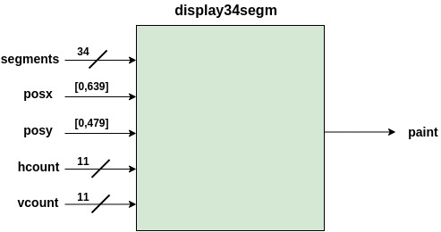
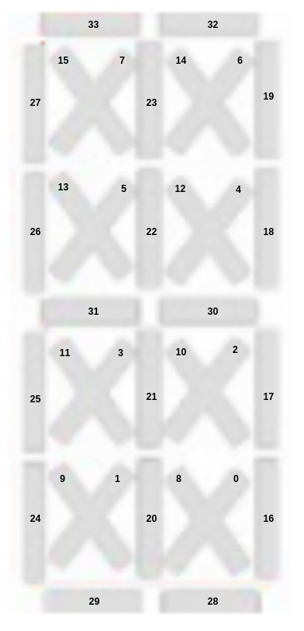
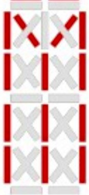
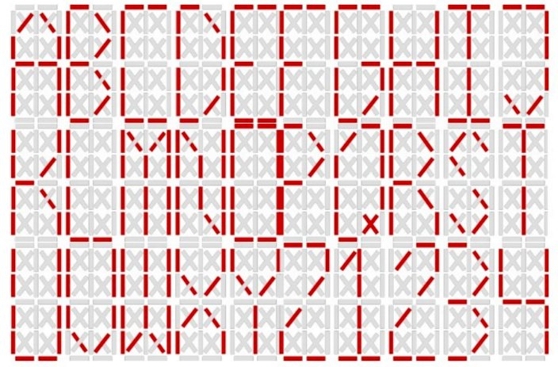
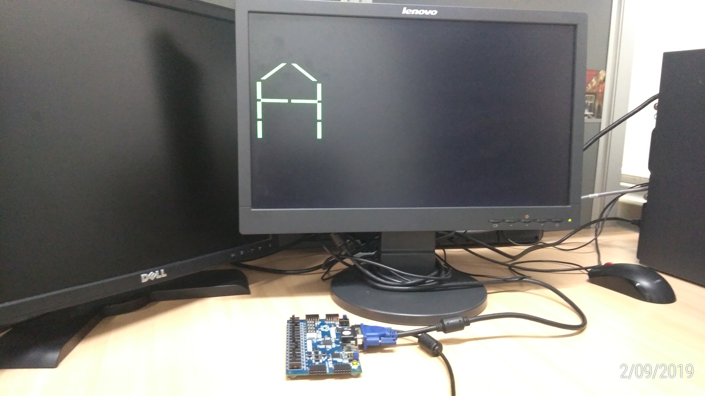
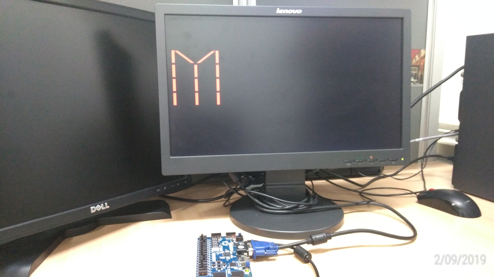

# DEMO2

## Codigos ##

1. [display34segm.vhd](display34segm.vhd)
2. [test_34seg_disp.vhd](test_34seg_disp.vhd)
3. [vga_ctrl_640x480_60Hz.vhd](vga_ctrl_640x480_60Hz.vhd)
4. [Basys3_Master_VGA-34segDisp.xdc](Basys3_Master_VGA-34segDisp.xdc)

## display34segm ##

### Descripción de la entidad 

```vhdl
entity display34segm is
       generic(SG_WD : integer range 0 to 31 := 5; --Segment width
               DL    : integer range 0 to 511 := 100 --DYSPLAY_LENGTH
               --DW:  --TODO: Display width
        );  
        port(segments : in STD_LOGIC_VECTOR (33 downto 0);
             posx :     in integer range 0 to 639;   --disp_posx 
             posy :     in integer range 0 to 479;   --disp_posy
             hcount :   in  STD_LOGIC_VECTOR (10 downto 0);
             vcount :   in  STD_LOGIC_VECTOR (10 downto 0);
             paint :    out  STD_LOGIC
        );
end display34segm;
```

### Arquitectura asociada a la entidad



**Código VHDL**: [display34segm.vhd](display34segm.vhd)

### Sobre la señal *segments* 

Sirve para definir cada uno de los segmentos (muy similar al decodificador de 7 segmentos), para el caso el mapa de segmentos asociados con cada bit de la señal *segments* se muestra a continuación:



La definición de la letra en cuestión dependera de prender y apagar los respectivos leds mediante la señal sements de acuerdo a la letra. Veamos:

* **Letra A**: La siguiente letra muestra la letra A.


Teniendo en cuenta lo anterior entonces:

```vhdl
segment = "0011000111000001110100000010000000"
```

* **Letra M**: La siguiente letra muestra la letra A.

```vhdl
segment = "0000001111011111111000000001000000"
```



Teniendo en cuenta lo anterior entonces:

```vhdl
segment = "0000000000000000000000000000000000"
```

El mapa de caracteres se muestra en la siguiente figura:



## Actividades ##

1. Dibuje la entidad mas grande (sin mostrar los bloques internos) pero si resaltando las conexiones entre esta con los elementos de la basys3. (**Nota**: No olvide observar el archivo xdc proporsionado para esto).
2. Pruebe el programa de acuerdo a los archivos facilitados:

Si todo esta bien para cada caso se deben mostrar las siguientes salidas:

**Caso 1**: Despliegue de la A.



**Caso 2**: Despliegue de la M.



2. Dibuje el diagrama de bloques del código suministrado
3. Haga las modificaciones en el programa de acuerdo a las indicaciones dadas. Esto será un ejercicio de refuerzo previo a la practica.
