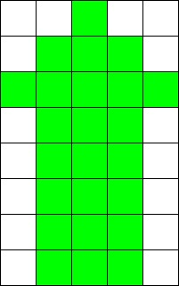
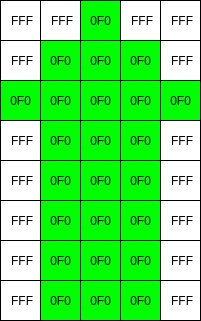
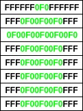
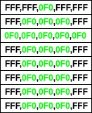

# Ejemplo de uso de memorias #

Supongase que se desea implementar en pantalla el siguiente dibujo.



Cada cuadro del dibujo anterior representa un pixel, el cual tendrá asociado un color determinado de acuerdo a la combinacion de colores definida en el formato **RGB**. 

Teniendo en cuenta que hay 4 bits por color, la combinación bit por bit **RBG** será dada por: **R3R2R1R0 G3G2G1G0 B3B2B1B0** 

La representación RGB para cada uno de los colores del dibujo (Blanco o Verde) se obtienen de la siguiente forma: 

* **Blanco**: 
```bash  
R3R2R1R0 G3G2G1G0 B3B2B1B0 = 1111 1111 1111 = FFF
```

* **Verde**: 

```bash  
R3R2R1R0 G3G2G1G0 B3B2B1B0 = 0000 1111 0000 = 0F0
```

El valor asociado al color para cada pixel de memoria se mostraria a continuacion:

 

Este patrón de valores puede ser almacenado en una memoria y ser leida en tiempo de ejecución. Se puede implementar varias opciones para el manejo de esta memoria.

### Forma 1 ###

Para este caso, la forma como se almacenarían los datos en la memoria sería así: 

 

Teniendo en cuenta que:
* bitsPerData = 12
* columns = 5
* rows = 8

La definición en VDHL de la figura anterior estaria dada por el siguiente array:

```vhdl
type vector_array is array (0 to rows - 1) of std_logic_vector (bitsPerData*columns -1 downto 0);
CONSTANT memory: vector_array := ( 
	X"FFFFFF0F0FFFFFF",
	X"FFF0F00F00F0FFF",
	X"0F00F00F00F00F0",
	X"FFF0F00F00F0FFF", 
	X"FFF0F00F00F0FFF",
	X"FFF0F00F00F0FFF",
	X"FFF0F00F00F0FFF",
	X"FFF0F00F00F0FFF");
```

Para acceder a un pixel en particular se tiene que obtener la fila completa y a partir de esta fila se debe extraer el pixel que se desee. A continuación se muestra cómo se haría este proceso: 

```vhdl
rowData <= memory(row); --Se obtiene toda la fila que contiene 5 pixeles
data <= rowData(((columns - pixel)*bitsPerData) - 1  downto ((columns - 1) - pixel)*bitsPerData);
```

### Forma 2 ###

La idea es almacenar los datos de la imagen siguiendo el siguiente patron, y formar una matriz para acceder al RGB de cada pixel con la forma memoria(FILA)(COLUMNA):

 

Teniendo en cuenta que:
* bitsPerData = 12
* columns = 5
* rows = 8
  
La definición en VHDL asociada al patron anterior se muestra a continuación:

```vhdl
type vector_row is array (0 to columns - 1) of std_logic_vector (bitsPerData - 1 downto 0); --Array que define una fila
type matrix_mem is array (0 to rows - 1) of vector_row; --Arreglo de vectores = MATRIZ

CONSTANT my_memory: matrix_mem := ( 
	(X"FFF",X"FFF",X"0F0",X"FFF",X"FFF"),
	(X"FFF",X"0F0",X"0F0",X"0F0",X"FFF"),
	(X"0F0",X"0F0",X"0F0",X"0F0",X"0F0"),
	(X"FFF",X"0F0",X"0F0",X"0FF",X"FFF"),
	(X"FFF",X"0F0",X"0F0",X"0F0",X"FFF"),
	(X"FFF",X"0F0",X"0F0",X"0F0",X"FFF"),
	(X"FFF",X"0F0",X"0F0",X"0F0",X"FFF"),
	(X"FFF",X"0F0",X"0F0",X"0F0",X"FFF"));
```

A diferencia del anterior caso, la forma de acceder a un pixel es mucho más fácil. A continuación se muestra cómo se hace:

```vhd
data <= my_memory(row)(column);
```

