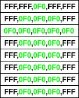
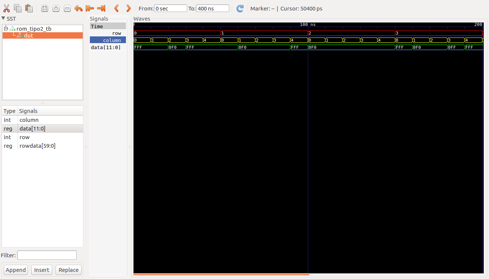

# ROM definida empleando la forma tipo 2 #

## Forma como los datos son almacenados en ROM ##



## Codigos ##
* **ROM**: [rom_tipo2.vhd](rom_tipo2.vhd)
* **testbendh**:  [rom_tipo2_tb.vhd](rom_tipo2_tb.vhd)

## Comandos de aplicados ##

```bash
ghdl -a rom_tipo2.vhd
ghdl -a --ieee=synopsys -fexplicit rom_tipo1_tb.vhd
ghdl -r --ieee=synopsys -fexplicit rom_tipo1_tb --vcd=rom_tipo1_tb_results.vcd
gtkwave rom_tipo1_tb_results.vcd
```

## Salida de la simulación ##

