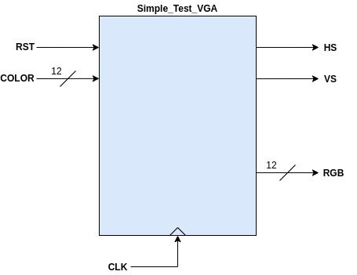
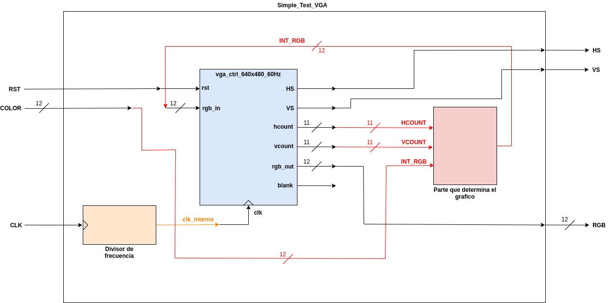

# DEMO1


## Funcionamiento ##

El código mostrado a continuación permite modificar el color del rectangulo y su borde por medio de los switches de la Basys. Para este caso, el color del rectangulo interno sera la combinación del valor de 12 de los swtches asociados al color de entrada (RGB a 12 bits) y el color del marco, será el color inverso del color del rectangulo interno.

## Codido ##

1. [Simple_Test_VGA.vhd](Simple_Test_VGA.vhd): Este define la entidad encargada de implementar el diseño que se pide. A continuación se muestra el diagrama de bloques asociado:



La arquitectura interna del modulo **Simple_Test_VGA** se muestra en la siguiente figura:



2. [vga_ctrl_640x480_60Hz.vhd](vga_ctrl_640x480_60Hz.vhd): Driver VGA


3. [Basys3_Master_VGA-Rectangulo.xdc](Basys3_Master_VGA-Rectangulo.xdc): Configuración de pines para mapear el diseño en la basys.


## Anotaciones ##

Del archivo [Simple_Test_VGA.vhd](Simple_Test_VGA.vhd) gran parte de la clave para comprender el codigo se encuentra en:

```vhdl
-- Dibuja el cuadro y asigna colores
   INT_RGB <= COLOR when ((VCOUNT>=150) AND (VCOUNT<=330) AND (HCOUNT>=230) AND (HCOUNT<=410)) else
			     not COLOR;

```

Gracias a este codigo es como se genera el rectangulo y su borde como se muestra a continuación:


## Actividades ##

1. Dibuje el diagrama de bloques del código suministrado
2. Modifique el tamaño del elemento desplegado en pantalla, y la posición del mismo.
3. Despliegue en pantalla un rectangulo tipo marco. La siguiente figura le puede ser de utilidad para entender lo que se pide:

