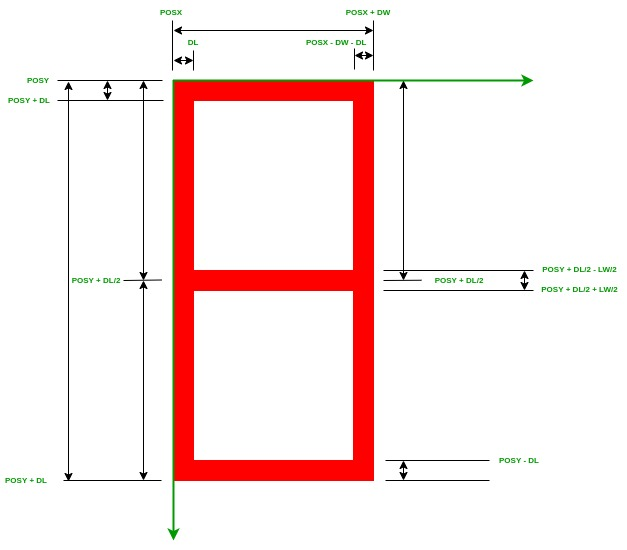
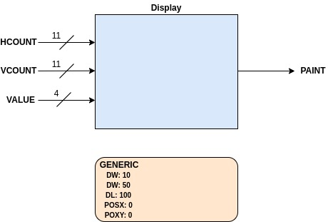
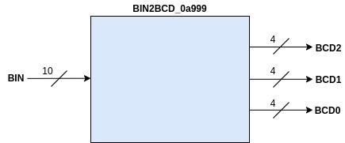
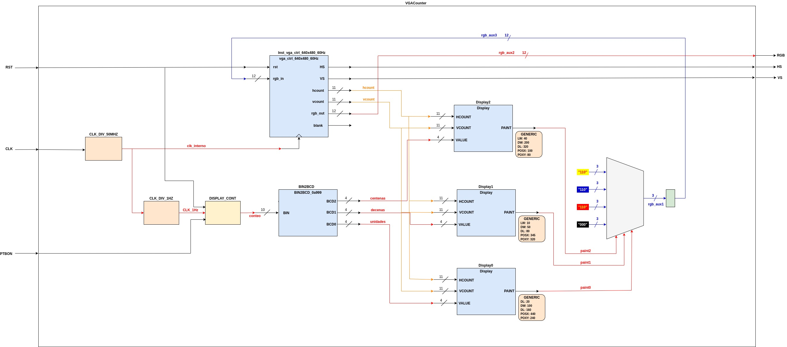

# DEMO1

## Funcionalidad ##
Hacer un contador que permita vaya contando en pantalla desde 0 a 999 cada segundo. El contador tendra como entradas un reset y un enable. 

## Código ##

1. **[vga_ctrl_640x480_60Hz.vhd](vga_ctrl_640x480_60Hz.vhd)**: Driver VGA.

2. **[Display.vhd](Display.vhd)**: Modulo para dibujar digitos en pantalla. El digito dibujado sigue el siguiente patron:

Y el diagrama de bloques asociado a este se muestra en la siguiente figura:

3. **[BIN2BCD_0a999.vhd](BIN2BCD_0a999.vhd)**: Modulo que convierte un numero binario de 10 bits a 3 digitos BCD; uno para las centenas, otro para las descenas y otro para las unidades. A continuación se muestra el diagrama de bloques asociado a este modulo:

4. **[VGACounter.vhd](VGACounter.vhd)**: Entidad top que implementa el contador que será desplegado en pantalla. En la siguiente figura se muestra el diagrama de bloques (interno) de este modulo:

5. **[Basys3_Master.VGACounter.xdc](Basys3_Master.VGACounter.xdc)**: Archivo de mapeo de pines.

## Actividades ##

1. Dibuje el diagrama de bloques del código suministrado
2. Modifique los tamaños, la ubicación y los colores de los displays suministrados.
3. Modifique la ubicación de los dígitos en los displays suministrados.

