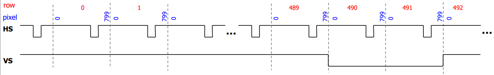

# VGA DRIVER


## Descripción de la entidad 

```vhdl
entity vga_ctrl_640x480_60Hz is
port(
   rst         : in std_logic;
   clk         : in std_logic;
   rgb_in      : in std_logic_vector(11 downto 0);
	
   HS          : out std_logic;
   VS          : out std_logic;
   hcount      : out std_logic_vector(10 downto 0);
   vcount      : out std_logic_vector(10 downto 0);
   rgb_out     : out std_logic_vector(11 downto 0); --R3R2R1R0GR3GR3GR3GR3B3B2B1B0
   blank       : out std_logic
);
end vga_ctrl_640x480_60Hz;
```

**Codigo VHDL**: [vga_ctrl_640x480_60Hz.vhdl](vga_ctrl_640x480_60Hz.vhdl)

## Diagrama de la entidad


## Apuntes importantes sobre el driver ##

### VGA display timming ###

#### VGA timing ####

Require control fino de las señales HS y VS. Para el caso de un frame de  640 columnas por 480 filas (640x48) y una frecuencia de actualización de pantalla de 60 Hz, un monitor tipico tendrá las siguientes caracteristicas:
* **Resolution (pixels)**: 640x480.
* **Refresh Rate (Hz)**: 60.
* **Pixel Clock (MHz)**: 25.175.
* **Horizontal (pixel clocks)**:
  * **Display**: 640
  * **Front Porch**: 16	
  * **Sync Pulse**: 96	
  * **Back Porch**: 48
* **Vertical (rows)**:
  * **Display**: 480
  * **Front Porch**: 10	
  * **Sync Pulse**: 2	
  * **Back Porch**: 32


La siguiente figura muestra las caracteristicas basicas de una pantalla VGA:


Segun las caracteristicas para la pantalla tomadas de la lista anterior se tiene que:
1. 60 Hz = 60 pantallazo/s
2. 1 pantalla = 480 + 10  + 2 + 32 = 480  + 45 = 522 lineas.
3. 1 linea = 640 + 16 + 96 + 48 = 640 + 160 = 800 pixeles.

Luego el pixel clock (tasa a la cyal cada pixel puede ser escrito) es:

```
(60 pantallazo / 1s) * (522 lineas / 1 pantallazo)  * (800 pixeles / 1 linea) = 25 MHz
```

Luego el tiempo por pixel es:

```
T_pixel = 1/f_pixel = 1/25 MHz = 40 ns
```

En conclusión se llego a los siguientes datos de importancia:
1. Frecuencia de actualizacion de pantalla: 60 Hz.
2. Frecuencia de actualizacion de pixel: 25 MHz.
3. Periodo de actualización de pixel: 40 ns.

#### Timing for HS ####
HS esta relacionado con los pixeles escritos en una fila. Para una fila de 800 pixeles, estos son enumerados de la siguiente manera:
1. Display interval (0 to 639).
2. Right border (640 to 655).
3. Retrace (656 to 751).
4. Left border (752 to 799)


La siguiente figura detalla esto:


 
#### Timing for HV ####
VS esta relacionado con la fila en la que nos encontramos, asi se tiene que el Row time: 800 pixeles * 40 ns = 32 us. En lo que respecta a la enumeración de las 525 filas asociadas a un frame se tiene:
1. Display interval (0 to 479)
2. Bottom border (480 to 489)
3. Retrace (490 to 491)
4. Top border (492 to 524)
   

	
La siguiente figura muestra el timming para HS y VS. Note como VS es 0 en las filas 490 a 491. Ademas el intervalo de despliegue se encuentra en rango de HS perteneciente a [0, 639] y VS perteneciente a [0, 479]. **Importante**: Fuera del intervalo de despliegue se deben fijar los valores RGB a 0.



### Señales hcount y vcount ###

Permiten conocer la posición. La siguiente figura muestra esto: 


## Notas ##
La información teorica fue tomada, traducida y adaptada de los enlaces colocados en la sección de referencias. Numeros del codigo que se proporciona puede variar un poco respecto a los valores que se tomaron en la explicación sin embargo la base en si es la misma.

## Referencias ##
1. [Tutorial: VHDL Coding for FPGAs – VGA Controller](http://www.secs.oakland.edu/~llamocca/Tutorials/VHDLFPGA/ISE/Unit_7/VGA_control.pdf)
2. [Lab 4 : Video Graphics Array and Image Buffer](http://www.cs.ucr.edu/~jtarango/cs122a_lab4.html)

