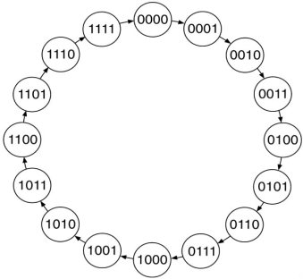
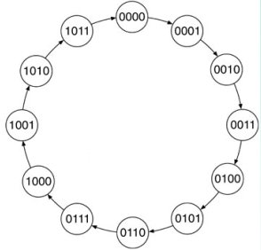

# Contadores digitales #

## ¿Que es un contador? ##

Un **contador** es un circuito secuencial que cuenta pulsos.E s muy usado para tareas como:
1. Contar eventos.
2. Implementar divisores de frecuencia.
3. Realizar medidas de tiempo (timing).
4. Realizar operaciones de control.

Un contador se caracteriza por que sus salidas siguen un un patrón repetitivo predecible conocido como **secuencia de conteo**.

## Conceptos importantes sobre los contadores##

### Modulo ###

Número de estados por los que pasa el contador cada ciclo completo, antes de que se reinicie y vuelva a su estado inicial; así un contador **MOD n** tendrá **n** posibles estados; por ejemplo, un contador **MOD 16** tiene **16** posibles estados (desde **0000** hasta **1111**). En otras palabras, el módulo es el número de estados a través de los cuales se mueve el contador.

### Dirección del contador ###

La dirección, establece cómo se realizará el movimiento a traves de los estados. Puede ser:
* **UP**: Cuando el conteo se hace de abajo hacia arriba (LSB to MSB).
* **DOWN**: Cuando el conteo se hace de arriba hacia abajo (MSB to LSB).

Por ejemplo si se tuviese un contador **MOD 12** se tendrian 12 posibles estados (desde **0000** hasta **1011**). Si el contador fuera ascendente (**UP**), el movimiento seria desde el estado **0000** hacia el estado **1011**. Por otro lado se el contador fuera descendente (**DOWN**) el movimiento a traves de los estados sería en sentido contrario (de **1011** a **0000**).

### Diagrama de estados ###

Un diagrama de estados muestra la secuencia de estados de un circuito secuencial. La progresión de un estado a otro se muestra mediante flechas (**0000** → **0001** → **0010**) donde cada paso a traves de la progresión es causado por un pulso en el reloj que va al circuito secuencial. La siguiente figura muestra el diagrama de estados de un contador modulo 12 (**MOD 12**):

### Algunos tipos de contadores ###

#### Full sequence counter ####

Contador de **n bits** que cuenta hasta el número máximo del módulo (**2^n**) es llamado **Full sequence counter** (**contador completo**). Dentro de estos podemos citar a los contadores: **MOD 2**, **MOD 4**, **MOD 8**, **MOD 16**, etc. A continuación se muestra el diagrama de estados para un contador **MOD 16**:

#### Truncated Counters ####

Un contador de **n-bits** cuyo módulo es menor que el máximo posible es llamado **truncated sequence counter** (**contador truncado**). Por ejemplo: **MOD 3 (n = 2)**, **MOD 12 (n = 4)**. Ejemplos:
* **MOD 12 (n = 4)**: Contador truncador de 4 bits MOD 12 es un contador que cuenta desde 0000 a 1101.

* **MOD 16 (n = 4)**: Full-sequence counter que cuenta de de 0000 hasta 16. También se puede nombrar como MOD 16.

### Tipos de señales ###

#### Sincronas ####
Dependen de la señal de reloj por lo tanto para que se refleje su efecto es necesario a que se de una transicion en la señal de reloj. Ver [ejemplo 1](./ejemplo1/README.md)

#### Asincronas ####
No dependen de la señal de reloj. Esto hace que su efecto sea inmediato sin importar si hay o no señal de reloj. Ver [ejemplo 2](./ejemplo2/README.md)

### Implementación de con VHDL ###

Los contadores secuenciales usan una instrucción process para controlar las transiciones al siguiente estado de conteo.
El atributo usado para identificar una señal como señal de reloj es EVENT. Este combinado combinado con una comparación hecha sobre la señal define si la transición se da en flanco de subida o de bajada. Suponiendo que la señal definida como reloj se llamara clk, entonces según lo anterior se tiene:
* **Caso flanco de subida**: (clk’EVENT AND clk=‘1).
* **Caso flanco de bajada**: (clk’EVENT AND clk=‘1).

## Ejemplos ##
A continuación se muestran diferentes formas de hacer la implementación de contadores usando VHDL:
1. [Ejemplo 1](./ejemplo1/README.md)
2. [Ejemplo 2](./ejemplo2/README.md)
3. [Ejemplo 3](./ejemplo3/README.md)
4. [Ejemplo 4](./ejemplo4/README.md)
5. [Ejemplo 5](./ejemplo5/README.md)
6. [Ejemplo 6](./ejemplo6/README.md)
7. [Ejemplo 7](./ejemplo7/README.md)
8. [Ejemplo 8](./ejemplo8/README.md)