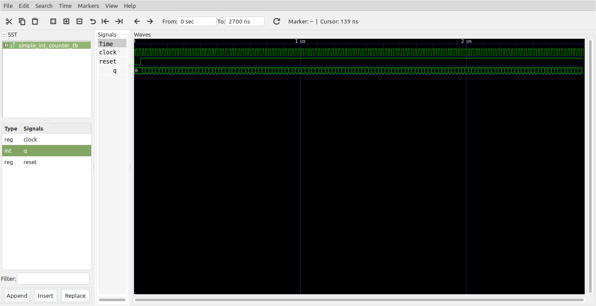
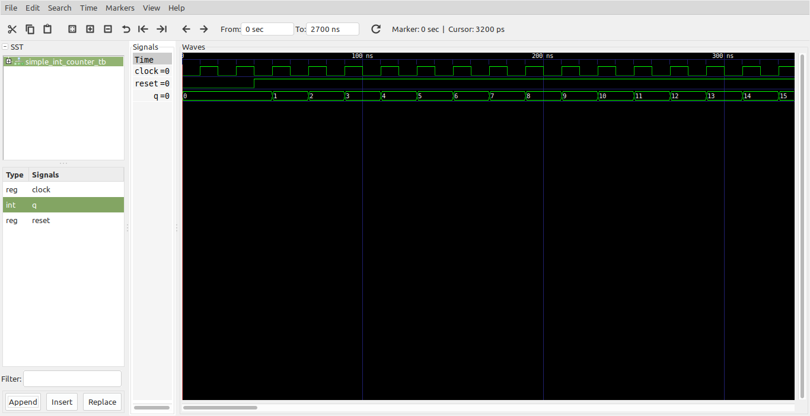
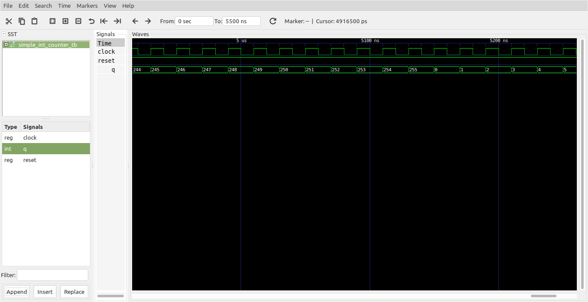

# Contador simple con reset asincrono #

El codigo mostrado a continuación muestra un contador con reset asincrono. ¿Que significa esto?

## Archivos ##

**Módulo**: [simple_int_counter.vhd](simple_int_counter.vhd)

```vhdl
-- Counters in VHDL Using the Type UNSIGNED --
library ieee;
use ieee.std_logic_1164.all;
use ieee.numeric_std.all;

ENTITY simple_int_counter IS
	PORT(
		clock : IN STD_LOGIC;
		reset : IN STD_LOGIC;
		q 	  : OUT INTEGER RANGE 0 TO 255
	);
END simple_int_counter;


ARCHITECTURE counter OF simple_int_counter IS

BEGIN
	PROCESS (clock, reset)
		VARIABLE count : INTEGER RANGE 0 to 255;
	BEGIN
		IF (reset = '0') THEN
			count := 0;
		ELSE
			IF (clock'EVENT AND clock = '1') THEN				
				IF (count = 255) THEN
					count := 0;
				ELSE
					count := count + 1;
				END IF;
			END IF;
		END IF;
		q <= count;
	END PROCESS;
END counter;
```

**Test bench**: [simple_int_counter_tb.vhd](simple_int_counter_tb.vhd)

```vhdl
library ieee;
use ieee.std_logic_1164.all;
use ieee.numeric_std.all;

entity simple_int_counter_tb is
end simple_int_counter_tb;

architecture test_arch of simple_int_counter_tb is
    
    -- Declaracion de componentes

    component simple_int_counter is
	      port(
		          clock : IN STD_LOGIC;
		          reset : IN STD_LOGIC;
		          q : OUT INTEGER RANGE 0 TO 255
	      );
    end component;
    
    -- Señales empleadas

    signal clock, reset: std_logic;   
    signal q: integer range 0 to 255;   

begin

  DUT: simple_int_counter
	Port map (
        clock => clock,
        reset => reset,
        q => q
  );
  
  clock_gen_signal: process
  begin
    clock <= '0';
    wait for 10 ns;
    clock <= '1';
    wait for 10 ns;
  end process;

  clear_gen_signal: process
  begin
    reset <= '0';
    wait for 40 ns;     -- 40 ns
    reset <= '1';
    wait;
  end process;

end test_arch;
```

## Resultados de las simulaciones ##

### Formas de onda sin detallar ###



### Formas de onda donde se detalla el efecto del reset asincrono ###



### Forma de onda donde se resalta lo que sucede cuando el contador llega a su valor maximo ###



## Comandos aplicados ##

```
ghdl -a --ieee=synopsys -fexplicit simple_int_counter.vhd 
ghdl -a --ieee=synopsys -fexplicit simple_int_counter_tb.vhd
ghdl -r --ieee=synopsys -fexplicit  simple_int_counter_tb --stop-time=5500ns --vcd=simple_int_counter_results.vcd
gtkwave simple_int_counter_results.vcd
```