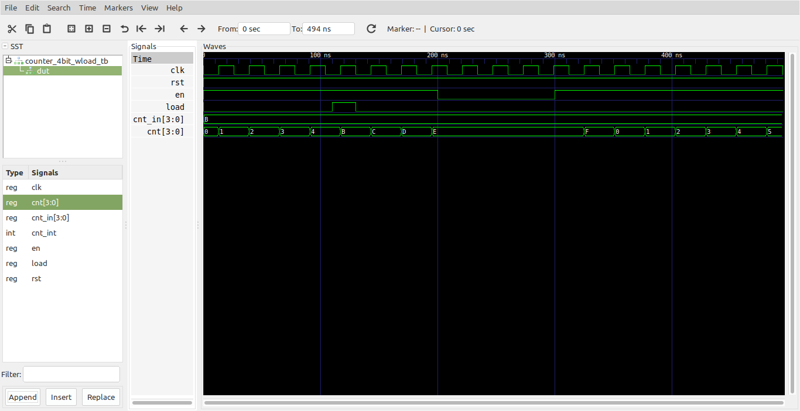

# Contador de 4 bits con Enable y carga paralela # 

A continuación se muestra un contador con enable y carga paralela sincronos.

## Archivos ##

**Módulo**: [Counter_4bit_wLoad.vhd](Counter_4bit_wLoad.vhd)

```vhdl
-- Counters with Enables in VHDL --
library ieee;
use ieee.std_logic_1164.all;
use ieee.numeric_std.all;


entity Counter_4bit_wLoad is
	port(
		clk , rst: in std_logic;
		en: in std_logic;
		load: in std_logic;
		cnt_in : in std_logic_vector(3 downto 0);
		cnt : out std_logic_vector(3 downto 0)
	);
end entity Counter_4bit_wLoad;

architecture Counter_4bit_wLoad_arch of Counter_4bit_wLoad is

	signal cnt_int : integer range 0 to 15;
	
begin
	
	COUNTER: process(clk, rst)
	begin
		if (rst = '0') then
			cnt_int <= 0;
		elsif (clk'event and clk = '1') then
			if (load = '1') then 
				cnt_int <= to_integer(unsigned(cnt_in));
			else
				if (en = '1') then
					if (cnt_int = 15) then
						cnt_int <= 0; 
					else
						cnt_int <= cnt_int + 1;
					end if;
				end if;	
			end if;
		end if;			
	end process; 
	
	cnt <= std_logic_vector(to_unsigned(cnt_int,4));

end architecture;
```

**Test bench**: [Counter_4bit_wLoad_tb.vhd](Counter_4bit_wLoad_tb.vhd)

```vhdl
library ieee;
use ieee.std_logic_1164.all;
use ieee.numeric_std.all;

entity Counter_4bit_wLoad_tb is
end Counter_4bit_wLoad_tb;

architecture Behavioral of Counter_4bit_wLoad_tb is
    
    -- Declaracion de componentes
 
    component Counter_4bit_wLoad is
      port(
        clk , rst: in std_logic;
        en: in std_logic;
        load: in std_logic;
        cnt_in : in std_logic_vector(3 downto 0);
        cnt : out std_logic_vector(3 downto 0)
      );
    end component;
    -- Señales empleadas

    signal clk_sig: std_logic; 
    signal rst_sig: std_logic := '1'; 
    signal en_sig: std_logic; 
    signal load_sig: std_logic;  
    signal cnt_in_sig: std_logic_vector(3 downto 0) := "1011";   
    signal cnt_sig: std_logic_vector(3 downto 0);   

begin

  DUT: Counter_4bit_wLoad
	Port map (
        clk => clk_sig,
        rst => rst_sig,
        en => en_sig,
        load => load_sig,
        cnt_in => cnt_in_sig,
        cnt => cnt_sig
  );
  
  clk_gen_signal: process
  begin
    clk_sig <= '0';
    wait for 13 ns;
    clk_sig <= '1';
    wait for 13 ns;
  end process;

  en_gen_signal: process
  begin
    en_sig <= '1';
    wait for 200 ns;
    en_sig <= '0';
    wait for 100 ns;
    en_sig <= '1';
    wait;
  end process;

  load_gen_signal: process
  begin
    load_sig <= '0';
    wait for 110 ns;
    load_sig <= '1';
    wait for 20 ns;
    load_sig <= '0';
    wait;
  end process;

end Behavioral;
```

## Resultados de las simulaciones ##

### Formas de onda ###



## Comandos aplicados ##

```
ghdl -a --ieee=synopsys -fexplicit Counter_4bit_wLoad.vhd 
ghdl -a --ieee=synopsys -fexplicit Counter_4bit_wLoad_tb.vhd
ghdl -r --ieee=synopsys -fexplicit  Counter_4bit_wLoad_tb --stop-time=500ns --vcd=Counter_4bit_wLoad_results.vcd
gtkwave Counter_4bit_wLoad_results.vcd
```