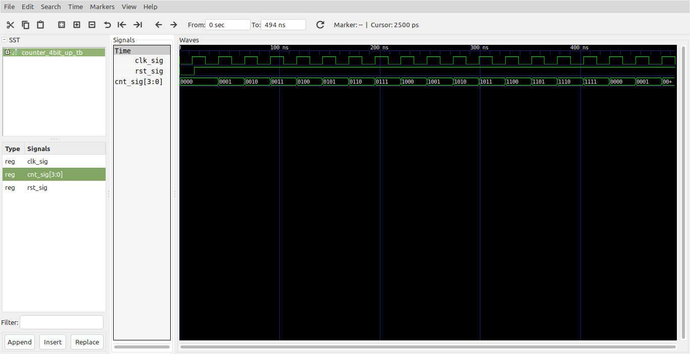

# Contador de 4 bits #

A continuación se muestra un contador implementado usando UNSIGNED.

## Archivos ##

**Módulo**: [Counter_4bit_Up.vhd](Counter_4bit_Up.vhd)

```vhdl
- Counters in VHDL Using the Type UNSIGNED --
library ieee;
use ieee.std_logic_1164.all;
use ieee.numeric_std.all;

entity Counter_4bit_Up is
	port(
		clk , rst: in std_logic;
		cnt : out unsigned(3 downto 0)
	);
end entity Counter_4bit_Up;

architecture Counter_4bit_Up_arch of Counter_4bit_Up is

	signal cnt_tmp : unsigned(3 downto 0);
	
begin
	
	COUNTER: process(clk, rst)
	begin
		if (rst = '0') then
			cnt_tmp <= "0000";		
		elsif (clk'event and clk = '1') then
			cnt_tmp <= cnt_tmp + 1;		
		end if;			
	end process; 
	
	cnt <= cnt_tmp;

end architecture;
```

**Test bench**: [Counter_4bit_Up_tb.vhd](Counter_4bit_Up_tb.vhd)

```vhdl
library ieee;
use ieee.std_logic_1164.all;
use ieee.numeric_std.all;

entity Counter_4bit_Up_tb is
end Counter_4bit_Up_tb;

architecture Behavioral of Counter_4bit_Up_tb is
    
    -- Declaracion de componentes

    component Counter_4bit_Up is
        port(
            clk , rst: in std_logic;
            cnt : out unsigned(3 downto 0)
        );
    end component;
    
    -- Señales empleadas

    signal clk_sig, rst_sig: std_logic;   
    signal cnt_sig: unsigned(3 downto 0);   

begin

  DUT: Counter_4bit_Up
	Port map (
        clk => clk_sig,
        rst => rst_sig,
        cnt => cnt_sig
  );
  
  clk_gen_signal: process
  begin
    clk_sig <= '0';
    wait for 13 ns;
    clk_sig <= '1';
    wait for 13 ns;
  end process;

  rst_gen_signal: process
  begin
    rst_sig <= '0';
    wait for 15 ns;     -- 15 ns
    rst_sig <= '1';
    wait;
  end process;

end Behavioral;
```

## Resultados de las simulaciones ##

### Formas de onda donde se detalla el efecto del reset sincrono ###



## Comandos aplicados ##

```
ghdl -a --ieee=synopsys -fexplicit Counter_4bit_Up.vhd 
ghdl -a --ieee=synopsys -fexplicit Counter_4bit_Up_tb.vhd
ghdl -r --ieee=synopsys -fexplicit  Counter_4bit_Up_tb --stop-time=500ns --vcd=Counter_4bit_Up_results.vcd
gtkwave Counter_4bit_Up_results.vcd
```