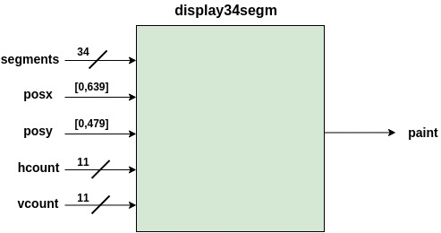
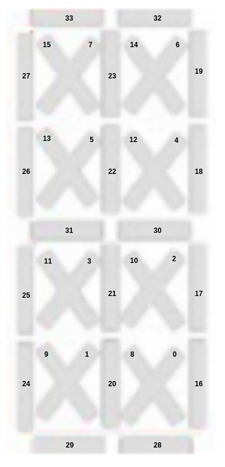
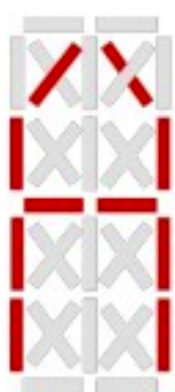
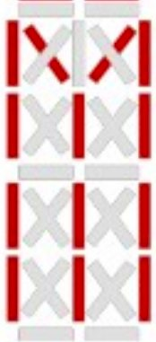
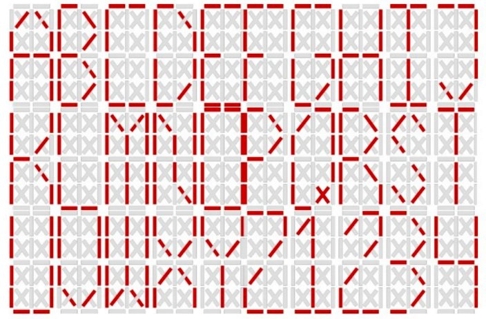
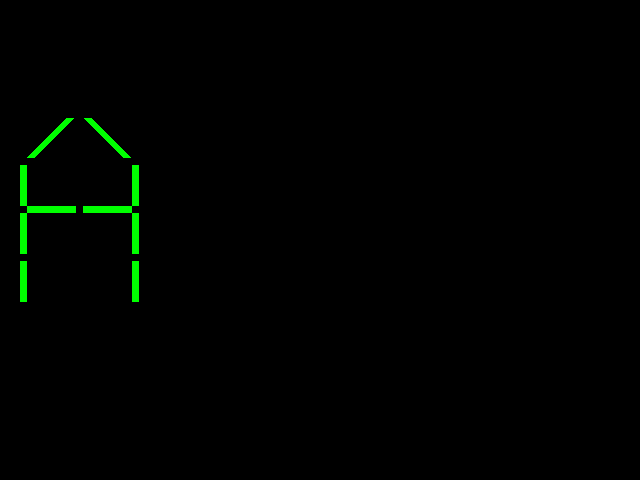
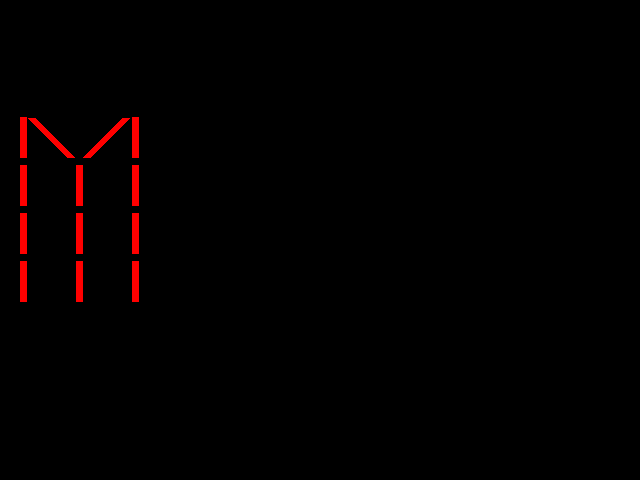

# DEMO2: Display 34 segmentos


## Funcionalidad ##
Hacer una aplicación que haciendo uso del modulo [display34segm.vhd](display34segm.vhd) que permita mostrar en pantalla dos letras **A** y **M**. La elección de la letra que se despliega y su color. El archivo asociado a este modulo es [test_34seg_disp.vhd](test_34seg_disp.vhd).

## Codigos ##

1. **[display34segm.vhd](display34segm.vhd)**: Modulo que genera el caracter alfanumerico:



El codigo asociado a la entidad anterior se muestra a continuación:

```vhdl
entity display34segm is
       generic(SG_WD : integer range 0 to 31 := 5; --Segment width
               DL    : integer range 0 to 511 := 100 --DYSPLAY_LENGTH              
        );  
        port(segments : in STD_LOGIC_VECTOR (33 downto 0);
             posx :     in integer range 0 to 639;   --disp_posx 
             posy :     in integer range 0 to 479;   --disp_posy
             hcount :   in  STD_LOGIC_VECTOR (10 downto 0);
             vcount :   in  STD_LOGIC_VECTOR (10 downto 0);
             paint :    out  STD_LOGIC
        );
end display34segm;
```

2. **[test_34seg_disp.vhd](test_34seg_disp.vhd)**: Modulo 

```vhdl
entity test_34seg_disp is
    Port ( CLK : in  STD_LOGIC;                        -- Clk 50 MHz para propositos de simulación
           RST : in  STD_LOGIC;                        -- Reset
	   MSG_SEL: in STD_LOGIC;                      -- Selección de la letra
           RGB : out  STD_LOGIC_VECTOR (11 downto 0);  -- RGB de salida a la pantalla
           HS : out  STD_LOGIC;                        -- Señal de sincronizacion horizontal
           VS : out  STD_LOGIC);                       -- Señal de sincronizacion vertical
end test_34seg_disp;
```

3. **[vga_ctrl_640x480_60Hz.vhd](vga_ctrl_640x480_60Hz.vhd)**: Driver VGA


4. **[test_34seg_disp_tb.vgd](test_34seg_disp_tb.vhd)**: Archivo de test bench del modulo [test_34seg_disp.vhd](test_34seg_disp.vhd)

## display34segm ##

### Sobre la señal *segments* 

Sirve para definir cada uno de los segmentos del display(Similar al display 7 segmentos). 
A continuación se muestra la relación entre los bits de la señal *segments* y los segmentos del display:



La visualización del caracter alfa-numérico deseado dependerá de activar o desactivar los respectivos segmentos mediante la señal *segments*. Veamos:

* **Letra A**: La siguiente secuencia permite desplegar la letra A.

```vhdl
segment = "0011000111000001110100000010000000"
```




* **Letra M**: La siguiente secuencia permite desplegar la letra M.

```vhdl
segment = "0000001111011111111000000001000000"
```




El mapa de caracteres se muestra en la siguiente figura:



## Actividades ##

1. Dibuje la entidad **TOP** sin describir los módulos internos pero si resaltando las conexiones entre estos dentro de la entidad, es decir dibuje el diagrama de bloques del código suministrado en el archivo [test_34seg_disp.vhd](test_34seg_disp.vhd).
2. Realizar la simulación online con los archivos proporsionados, esto generará dos imagenes similares a las que se muestran a continuación:

**Caso 1**: Despliegue de la A.



**Caso 2**: Despliegue de la M.



