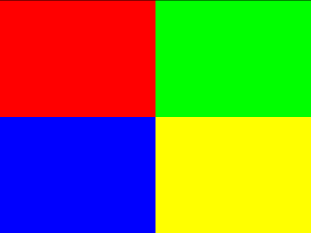
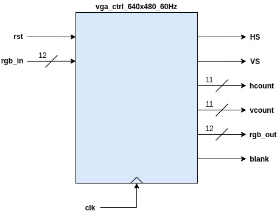
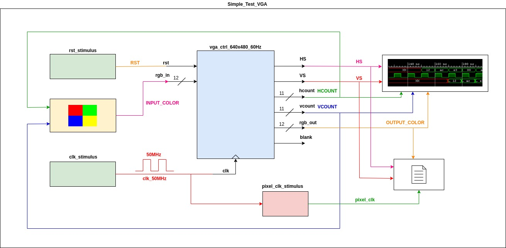

# DEMO 0

## Funcionamiento ##

Esta aplicación permite hace un test bench del modulo VGA ([vga_ctrl_640x480_60Hz](vga_ctrl_640x480_60Hz.vhd)) dividiendo la pantalla en 4 regiones con diferentes colores de fondo tal y como se muestra en la siguiente figura:



## Codido ##

A continuación se muestran los diferetentes modulos vhdl de la aplicacion:
1. **[vga_ctrl_640x480_60Hz.vhd](vga_ctrl_640x480_60Hz.vhd)**: Driver VGA:



2. **[Simple_Test_VGA.vhd](Simple_Test_VGA.vhd)**: Archivo de test bench del modulo **vga_ctrl_640x480_60Hz**. 



En este archivo es donde se genera el fondo con el que se hace el test, a continuación se muestra el fragmento de código que hace esto:

```vhdl
   -- Dibuja el cuadro y asigna colores
   --
	--               |
	--     Rojo      |    Verde
	--               |
	-- -----------------------------
	--               | 
	--     Azul      |   Amarillo
	--               |
	--

	INPUT_COLOR <= "111100000000" when (((VCOUNT>=0) AND (VCOUNT<=239) AND (HCOUNT>=0) AND (HCOUNT<=319))) else 
				   "000011110000" when (((VCOUNT>=0) AND (VCOUNT<=239) AND (HCOUNT>319) AND (HCOUNT<640))) else
				   "000000001111" when (((VCOUNT>239) AND (VCOUNT<480) AND (HCOUNT>=0) AND (HCOUNT<=319))) else
				   "111111110000" when (((VCOUNT>239) AND (VCOUNT<480) AND (HCOUNT>319) AND (HCOUNT<640)));
```


## Actividades ##

1. Simule en su computador la aplicacion
