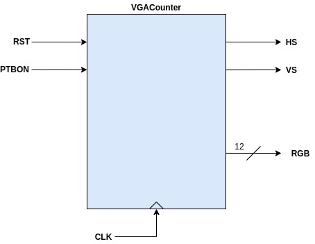

# DEMO1

## Funcionalidad ##
Hacer un contador que permita vaya contando en pantalla desde 0 a 999 cada segundo. El contador tendra como entradas un reset y un enable. 

* **Nota**: En la simulación no se pudo realizar el test cada segundo pues esto resultaba impractico. Para tratar con esto lo que se hizo fue modificar el tiempo de actualización del contador de modo que este no se actualizara cada segundo sino que lo hiciese aproximadamente cada cambio de pantalla (16.67ms); el valor elegido, sin ser el mas exacto para esto fue de **16.8 ms** como tiempo de actualizacion del contador. Mas adelante se mostrará la modificación que se hizo para esto.

## Código ##

1. **[vga_ctrl_640x480_60Hz.vhd](vga_ctrl_640x480_60Hz.vhd)**: Driver VGA.


2. **[Display.vhd](Display.vhd)**: Modulo para dibujar digitos en pantalla. El digito dibujado sigue el siguiente patron:


Y el diagrama de bloques asociado a este se muestra en la siguiente figura:


3. **[BIN2BCD_0a999.vhd](BIN2BCD_0a999.vhd)**: Modulo que convierte un numero binario de 10 bits a 3 digitos BCD; uno para las centenas, otro para las descenas y otro para las unidades. A continuación se muestra el diagrama de bloques asociado a este modulo:


4. **[VGACounter.vhd](VGACounter.vhd)**: Entidad top que implementa el contador que será desplegado en pantalla. 
      

   
En la siguiente figura se muestra la arquitectura de este modulo:


Con el fin de que el cambio en el valor del contador no fuera cada segundo, lo que se hizo fue modificar el codigo de este modulo de manera que en el proceso que realiza la actualización para el despliegue del conteo **DYSPLAY_CONT**. 

El siguiente fragmento de codigo tomado del archivo original (el que se monta en la base) muestra el codigo de este proceso que actualiza el display cada segundo:

```vhdl
	DYSPLAY_CONT: process(CLK_1Hz,RST)
	begin
		if (RST='1') then
			conteo <= (others=>'0');
		elsif (CLK_1Hz'event and CLK_1Hz='1') then
			if(PBTON='1') then
				if (conteo=999) then
					conteo <= (others=>'0');
				else
					conteo <= conteo + 1;
				end if;
			else
				conteo <= conteo;
			end if;
		end if;
	end process;
```

Ahora, para hacer practica este modulo para simular, se modifico la actulización del contador (**conteo**) cada vez que la variable **cnt_pixeles** alcanza el valor de **420000**. Ahora teniendo en cuenta lo anterior, si cada pixel se actualiza cada **40 ns** entonces la variable **conteo** se estará modificando cada **16.8ms (40ns*420000)** lo cual hace que la actualización del contador sea la apropiada para ser desplegada en el simulador.

```vhdl
	DYSPLAY_CONT: process(clk_interno,RST)

	begin
		if (RST='1') then
			conteo <= (others=>'0');
		elsif (clk_interno'event and clk_interno='1') then	-- elsif (CLK_1Hz'event and CLK_1Hz='1') then
			if(PBTON='1') then                 
                if cnt_pixeles = 420000 then 
              		if (conteo=999) then
				    	conteo <= (others=>'0');
				    else
					    conteo <= conteo + 1;
                    end if;
                    cnt_pixeles <= 0;
                else
                    cnt_pixeles <= cnt_pixeles + 1;
				end if;              
			else
				conteo <= conteo;
			end if;
		end if;
	end process;
```

5. **[VGACounter_tb.vhd](VGACounter_tb.vhd)**: Archivo en el cual se hace el test bench del modulo **VGACounter**.


## Actividades ##

1. Dibuje el diagrama de bloques del código suministrado
2. Modifique los tamaños, la ubicación y los colores de los displays suministrados.
3. Modifique la ubicación de los dígitos en los displays suministrados.

