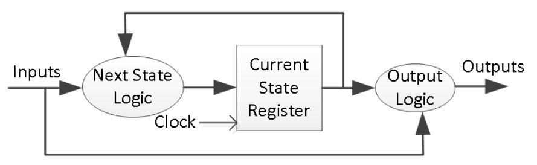

# Laboratorio 5 - Maquinas de estado #

## Metodos de diseño en VHDL ##

Los métodos de diseño serán mostrados a traves de ejemplos; sin embargo, a continuación se da un breve introducción de estos.

### Maquinas de estado Moore en VHDL ###

A continuación se muestra el diagrama que resume la estructura de diseño de una maquina Moore en VHDL empleando 3 bloques.

### Maquinas de estado Mealy en VHDL ###

En lo que respecta a las maquina Mealy hay dos formas de realizar el diseño; a tres bloques y a dos bloques tal y como se muestra a continuación.

#### Maquinas de estado Mealy en VHDL empleando tres bloques ####

A continuación se muestra el diagrama que resume la estructura de diseño de una maquina Mealy en VHDL empleando 3 bloques.

#### Maquinas de estado Mealy en VHDL empleando dos bloques ####

A continuación se muestra el diagrama que resume la estructura de diseño de una maquina Mealy en VHDL empleando 3 bloques.

## Enunciados ##

1. Un circuito secuencial tiene dos entradas **X1**, **X2** y una salida **Z**. Se desea detectar la secuencia **01-10-11-01-10-11** a partir de un estado inicial 00. Cuando se presenta esa secuencia, la salida Z valdrá uno en coincidencia con la última combinación de la secuencia. En cualquier otro caso la salida valdrá cero.
2. Un circuito está compuesto por una línea de entrada, una de salida y una de sincronismo, tal que la salida valga cero, salvo si llegan cuatro ceros o cuatro unos consecutivos, en cuyo caso aparecerá un uno en la salida, coincidente con el cuarto pulso.
3. Obtener un circuito secuencial de dos entradas **X1**, **X2** y una salida **Z** tal que la salida permanezca en cero, salvo cuando se han producido tres o más coincidencias sucesivas de las entradas, es decir que **X1 = X2** tres veces seguidas. Se toma como estado inicial (con el que se inicializa el sistema cuando se aplica el reset) aquel para el cual **X1 = 1** y **X2 = 0**.
4. Diseñar un circuito secuencial que detecte números binarios capicúa de tres bits de longitud. El sistema tendrá una entrada y una salida. La salida valdrá uno, sólo cuando detecte un capicúa y valdrá cero en los demás casos.
5. Diseñar un dispensador de máquina de gaseosas con las siguientes caracteristicas. Cada gaseosa vale 25 centavos y la máquina acepta monedas de  5 centavos, 10 centavos y 25 centavos de modo que cuando se ha insertado el dinero suficiente, se entrega el refresco y se retorna la devuelta correspondiente. Diseñe un sistema para controlar la máquina de refrescos cuya entrada este asociada a la moneda insertada. Asumir que se inserta una moneda cada ciclo. En lo que respecta a las salidas estas serán la gaseosa y la devuelta.

### Asignación de los ejercicios ###

La siguiente tabla muestra el pico y cedula por equipo para definir el ejercicio que le corresponde:

|Ejercicio | Cedulas|Tipo de FSM|
|-|-|
| 1 | Cedulas que terminan en numeros pares | Libre elección (Moore o Mealy)|
| 2 | Todos |Libre elección (Moore o Mealy)|
| 3 | Cedulas terminadas en numeros pares |Libre elección (Moore o Mealy)|
| 4 | Todos |Libre elección (Moore o Mealy)|
| 5 | Todos |Ambas formas (Moore y Mealy)|

**Notas importantes**: 
1. Si los integrantes del equipo tienen cedulas pares e impares. Pueden escoger hacer los ejercicios pares o los impares. 
2. Al simular recuerde **no hacer cambios de la señales de entrada** en el flanco que hace que se paso de un estado a otro.

## Ejemplos con máquinas de estado ##

En el siguiente repositorio se muestran algunos ejemplos donde se implementan máquinas de estado tipo Mealy y tipo Moore empleando VHDL. Los enlaces de los ejemplos se encuentran en:
1. Dibuje el diagrama de estados y la tabla de transición de estados de un circuito secuencial el cual da una salida Z = 1 solamente cuando la entrada X es igual 1 durante 3 o más intervalos consecutivos de reloj. [Enlace ejemplo 1](./example1/)
2. Dibuje el diagrama de estados y la tabla de transición de estados de un circuito secuencial el cual da una salida Z = 1 cuando por una entrada X a ingresado la secuencia de bits 1101. El solapamiento es permitido. [Enlace ejemplo 2](./example2/)
3. Aqui hay dos ejemplos:
   
   **Ejemplo 3.1**: Design a sequence detector implementing a Mealy state machine using three always blocks. The Mealy state machine has one input (ain) and one output (yout). The output yout is 1 if and only if the total number of 1s received is divisible by 3 (**hint**: 0 is inclusive, however, reset cycle(s) do not count as 0- see in simulation waveform time=200). Develop a testbench and verify the model through a behavioral simulation. Use SW0 as the clock input, SW1 as the ain input, the BTNU button as reset input to the circuit, number of 1s count on LED7:LED4, and LED0 as the yout output. Go through the design flow, generate the bitstream, and download it into the Nexys3 board. Verify the functionality.[Enlace ejemplo 3](./example3/)
   
   **Ejemplo 3.2**: Design a sequence detector implementing a Moore state machine using three always blocks. The Moore state machine has two inputs (ain[1:0]) and one output (yout). The output yout begins as 0 and remains a constant value unless one of the following input sequences occurs:
   * The input sequence ain[1:0] = 01, 00 causes the output to become 0.
   * The input sequence ain[1:0] = 11, 00 causes the output to become 1.
   * The input sequence ain[1:0] = 10, 00 causes the output to toggle.

   Develop a testbench (similar to the waveform shown below and verify the model through a behavioral simulation. Use SW0 as the clock input, SW2-SW1 as the ain[1:0] input, the BTNU button as reset input to the circuit, and LED0 as the yout output. Go through the design flow, generate the bitstream, and download it into the Nexys3 board. Verify the functionality.
4. Un detector de paridad es un circuito logico que cuenta el némero de 1's en una entrada serial (bit-serial input stream). Si el circuito hace que su salida sea 1 cuando la entrada contiene un numero impares de 1, si el circuito es llamado un detector de paridad impar (odd parity checker). Por otro lado, Si la salida es llevada a 1 cuando la entrada tiene un numero par de 1's, es un detector de paridad par (even parity checker). [Enlace ejemplo 4](./example4/)
5. Implementar un shift register que tenga una entrada y que a la salida tenga un bus de 3 bits para el envio del bit ingresado a la entrada. [Enlace ejemplo 5](./example5/)
6. Diseñar un circuito secuencial que cumpla con los siguientes requerimientos:
   * El circuito tendra una entrada (w) y una salida (z).
   * Los cambios ocurren en el flanco positivo de la señal de reloj.
   * La señal z es igual a 1 si durante los dos ciclos de reloj inmediatamente enteriores a la entrada w son 1. Por otro lado el valor de la salida z es 0.
  
   En resumen, el circuito detecta si dos o mas 1's concecutivos ocurren en un patron de datos a la entrada.[Enlace ejemplo 6](./example6/)
7. Un controlador una de ventana (controller window) enviara las señales de control apropiadas para abrir o cerrar un motor siempre que un push button sea presionado. 
   
   

   [Enlace ejemplo 7](./example7/)
8. Desarrolle un controlador para un semáforo en la intersección concurrida de un campus. A continuación la razón que motivó el diseño del sistema:
   
   > Los estudiantes de ingeniería están ocupados leyendo sobre FSM en su libro de texto favorito y no están mirando hacia donde van. Los jugadores de fútbol se apresuran entre campos de atletismo y el comedor en Bravado Boulevard tirando la pelota de un lado a otro y tampoco miran hacia dónde van. Ya se han producido varias lesiones graves en la intersección de estos dos caminos, y el decano de estudiantes le pide a usted instalar un semáforo antes de que haya accidentes más graves.
   
   Para resolver el problema usted decide instalar dos sensores de tráfico, TA y TB en Academic Ave. y Bravado Blvd. Cada sensor indica verdadero si los estudiantes están presentes y falso si la calle está vacía. También, instala dos semáforos, LA y LB para controlar el tráfico. Cada uno de los semáforos puede desplegar tres tipos de luces (rojo, amarillo o verde). La intersección y sensores son mostrados en la siguiente figura.

   

   Usted proporciona un reloj con periodo de 5 segundos. En cada tick de reloj (flanco de subida), las luces pueden cambiar basadas en los sensores de tráfico. Tambien, proporsiona un reset demanera que los tecnicos puedan poner el controlador a un estado inicial conocido una vez realizan la instalación de este. La siguiente figura muestra el diagrama de caja negra del sistema.

   

   [Enlace ejemplo 8](./example8/)

<!---
http://www.estadofinito.com/contador-en-vhdl/
http://www.profesores.frc.utn.edu.ar/electronica/tecnicasdigitalesi/pub/file/cursoCavallero/J_002-CONTADORES.pdf
https://es.wikibooks.org/wiki/Programaci%C3%B3n_en_VHDL/Ejemplos/Contador
http://inst.eecs.berkeley.edu/~cs61c/resources/pnh.stg.mgmt.pdf
https://vhdlguide.readthedocs.io/en/latest/index.html
https://electrovolt.ir/wp-content/uploads/2017/07/Finite-State-Machines-in-Hardware-Volnei-A.-Pedroni-ElectroVolt.ir_.pdf

https://www.studocu.com/es/document/universidad-rey-juan-carlos/estructura-de-computadores/ejercicios-obligatorios/tema08-ejercicios-sistemas-secuenciales/3398505/view

http://repositorio.upct.es/bitstream/handle/10317/124/Descarga.pdf?sequence=1&isAllowed=y

https://www.dte.us.es/docencia/etsii/gii-is/circuitos-electronicos-digitales/grupo-5/Tema6-CircuitosSecuencialesSincronos.pdf

http://courses.cs.tamu.edu/rabi/cpsc617/Assignments/Assignments%202013/Tutorial%20Three%20Cycle%20High%20Timer.pdf

https://stackoverflow.com/questions/22058953/vhdl-state-machine-testbench

http://www.csit-sun.pub.ro/courses/Masterat/Xilinx%20Synthesis%20Technology/toolbox.xilinx.com/docsan/xilinx4/data/docs/xst/hdlcode15.html

https://docs.google.com/a/udea.edu.co/viewer?a=v&pid=sites&srcid=ZGVmYXVsdGRvbWFpbnxlbGVjdHJvbmljYWRpZ2l0YWwxMTd8Z3g6YmJlYWQ0NDRkOWUxNDMz

https://docs.google.com/a/udea.edu.co/viewer?a=v&pid=sites&srcid=ZGVmYXVsdGRvbWFpbnxlbGVjdHJvbmljYWRpZ2l0YWwxMTd8Z3g6MWI3Y2MwMzYwNzZkZWU0Mw

----

https://www.studocu.com/es/document/universidad-rey-juan-carlos/estructura-de-computadores/ejercicios-obligatorios/tema08-ejercicios-sistemas-secuenciales/3398505/view

http://repositorio.upct.es/bitstream/handle/10317/124/Descarga.pdf?sequence=1&isAllowed=y

https://www.dte.us.es/docencia/etsii/gii-is/circuitos-electronicos-digitales/grupo-5/Tema6-CircuitosSecuencialesSincronos.pdf

http://courses.cs.tamu.edu/rabi/cpsc617/Assignments/Assignments%202013/Tutorial%20Three%20Cycle%20High%20Timer.pdf

https://stackoverflow.com/questions/22058953/vhdl-state-machine-testbench

http://www.csit-sun.pub.ro/courses/Masterat/Xilinx%20Synthesis%20Technology/toolbox.xilinx.com/docsan/xilinx4/data/docs/xst/hdlcode15.html

-----

http://www.cse.usf.edu/~haozheng/teach/cda4253/slides/vhdl-4.pdf

http://www.cse.chalmers.se/~coquand/AUTOMATA/book.pdf

http://www.cse.chalmers.se/~coquand/AUTOMATA/

http://www.cse.usf.edu/~haozheng/teach/cda4253/slides/vhdl-testbench.pdf

http://www.cse.usf.edu/~haozheng/teach/cda4253/slides/vhdl-3.pdf

http://www.cse.usf.edu/~haozheng/teach/cda4253/slides/vhdl-2.pdf

http://www.cse.usf.edu/~haozheng/teach/cda4253/slides/vhdl-1.pdf

http://www.cse.usf.edu/~haozheng/teach/cda4253/slides/hls-vivado.pdf

http://www.cse.usf.edu/~haozheng/teach/cda4253/slides/hls-intro.pdf

https://pdfs.semanticscholar.org/719c/f41bae253349d30a3fd427038ba457933f14.pdf

https://vhdlguide.readthedocs.io/en/latest/vhdl/fsm.html
https://vhdlguide.readthedocs.io/en/latest/index.html

https://electrovolt.ir/wp-content/uploads/2017/07/Finite-State-Machines-in-Hardware-Volnei-A.-Pedroni-ElectroVolt.ir_.pdf

http://www.profesores.frc.utn.edu.ar/electronica/tecnicasdigitalesi/pub/file/cursoCavallero/J_002-CONTADORES.pdf

http://www.fdi.ucm.es/profesor/mendias/DASii/docs/tema3.pdf

http://www.estadofinito.com/contador-en-vhdl/

http://www.estadofinito.com/

-->
