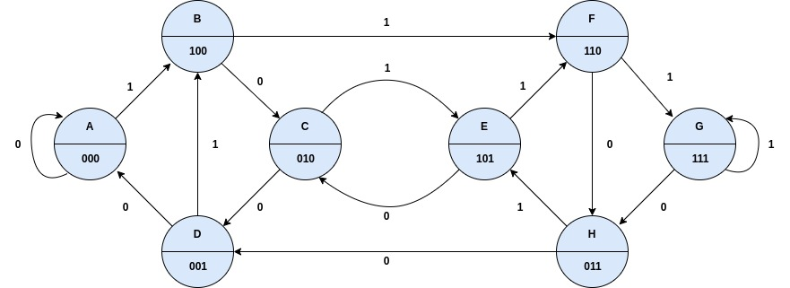
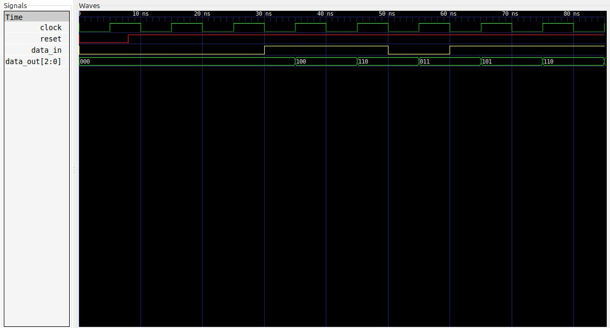

# Ejemplo 5 - Shith register #

## Enunciado ##

Implementar un shift register que tenga una entrada y que a la salida tenga un bus de 3 bits para el envio del bit ingresado a la entrada.

## Solución Moore ##

### Diagrama de estados ###



### Tabla de transición ###

| Current State | Inputs | Next State | 
|-|-|-|
| A | x = 0 | A |
| A | x = 1 | B |
| B | x = 0 | C |
| B | x = 1 | F |
| C | x = 0 | D |
| C | x = 1 | E |
| D | x = 0 | A |
| D | x = 1 | B |
| E | x = 0 | C |
| E | x = 1 | F |
| F | x = 0 | H |
| F | x = 1 | G |
| G | x = 0 | H |
| G | x = 1 | F |
| H | x = 0 | D |
| H | x = 1 | E |

## Codificación en VHDL ##

### Estructura de la maquina de estados ###

A continuación se muestra estructura de la maquina de estado Moore a 3 bloques:


#### Código de la maquina de estados en VHDL ####

A continuación se muestra el código VHDL de la maquina de estados [shift_register.vhd](shift_register.vhd)

```vhdl
library IEEE;
use IEEE.STD_LOGIC_1164.ALL;
use IEEE.NUMERIC_STD.ALL; 
use IEEE.STD_LOGIC_UNSIGNED.ALL;
use IEEE.STD_LOGIC_ARITH.ALL;

entity shift_register is
    Port ( clock : in STD_LOGIC;
           reset : in STD_LOGIC;           
           data_in : in STD_LOGIC;
           data_out : out STD_LOGIC_VECTOR(2 downto 0));
end shift_register;

architecture bahavioral of shift_register is

    type State_Type is (A, B, C, D, E, F, G, H);
    signal current_state, next_state : State_Type;

begin
    -------------------------------------------------------------------
    STATE_MEMORY: process(clock, reset)
    begin
        if reset = '0' then
          current_state <= A;        
        elsif clock'event and clock='1' then
          current_state <= next_state;            
        end if;
    end process;
    -------------------------------------------------------------------
    NEXT_STATE_LOGIC : process(current_state, data_in)
    begin
      case (current_state) is
        when A => 
          if (data_in = '1') then
            next_state <= B;         
          end if;
        when B => 
          if (data_in ='1') then
            next_state <= F;
          else
            next_state <= C;
          end if;
        when C => 
          if (data_in ='1') then
            next_state <= E;
          else
            next_state <= D;
          end if;
        when D => 
          if (data_in ='1') then
            next_state <= B;
          else
            next_state <= A;
          end if;
        when E => 
          if (data_in ='1') then
            next_state <= F;
          else
            next_state <= C;
          end if;
        when F => 
          if (data_in ='1') then
            next_state <= G;
          else
            next_state <= H;
          end if;
        when G => 
          if (data_in ='0') then
            next_state <= H;
          end if;
        when H => 
          if (data_in ='1') then
            next_state <= E;
          else
            next_state <= D;
          end if;
      end case;
    end process;
    -------------------------------------------------------------------
    OUTPUT_LOGIC : process (current_state)
    begin
      case (current_state) is
        when A => 
          data_out <= "000";
        when B => 
          data_out <= "100";
        when C => 
          data_out <= "010";
        when D => 
          data_out <= "001";
        when E => 
          data_out <= "101";
        when F => 
          data_out <= "110";
        when G => 
          data_out <= "111";
        when H => 
          data_out <= "011";       
      end case;
    end process;    
end architecture;
```

#### Código del test bench en VHDL ####

A continuación se muestra el código VHDL del test bench ([shift_register_tb.vhd](shift_register_tb.vhd)).

```vhdl
library IEEE;
use IEEE.STD_LOGIC_1164.ALL;
use IEEE.NUMERIC_STD.ALL; 
use IEEE.STD_LOGIC_UNSIGNED.ALL;
use IEEE.STD_LOGIC_ARITH.ALL;

entity shift_register_tb is
end shift_register_tb;

architecture behavioral of shift_register_tb is

    -- declaraciones modelo FSM

    signal clock, reset, data_in: STD_LOGIC;   
    signal data_out: STD_LOGIC_VECTOR(2 downto 0);   

    component shift_register is
      Port ( clock : in STD_LOGIC;
             reset : in STD_LOGIC;           
             data_in : in STD_LOGIC;
             data_out : out STD_LOGIC_VECTOR(2 downto 0));
    end component;

begin

  DUT: shift_register
	Port map (
    clock => clock,
    reset => reset,
    data_in => data_in,
    data_out => data_out
  );
  
  clock_stimulus: process
  begin
    clock <= '0';
    wait for 5 ns;
    clock <= '1';
    wait for 5 ns;
  end process;

  reset_stimulus: process
  begin
    reset <= '0';
    wait for 8 ns;     -- 8 ns
    reset <= '1';
    wait;   
  end  process;

  data_in_stimulus: process
  begin
    data_in <= '0';
    wait for 30 ns;     -- 30 ns    
    data_in <= '1';
    wait for 20 ns;     -- 50 ns    
    data_in <= '0';
    wait for 10 ns;     -- 60 ns    
    data_in <= '1';
    wait;
  end process;
   
end architecture;
```

La secuencia de test con la que se llevo a cabo el ensayo fue con:

```
x = 00011011
```

Como los cambios de estado se realizaron empleando el flanco positivo del reloj, los cambios de **0** a **1** y viceversa en la entrada x, se hicieron en el flanco de salida para evitar ambigüedades a la salida.

Si todo esta bien, la salida al simular debería mostrar el siguiente resultado:

```
z[2] = 00011011
z[1] = 00001101
z[0] = 00000110
```

Lo cual es lo mismo que:

```
z = 000, 000, 000 , 100, 110, 011, 101, 110
```

A continuación se muestra el diagrama de formas de onda que resulta de la simulación:




