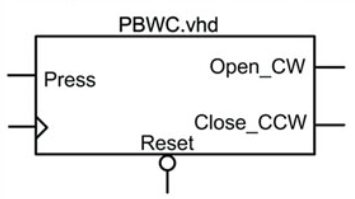
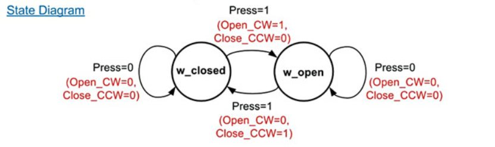
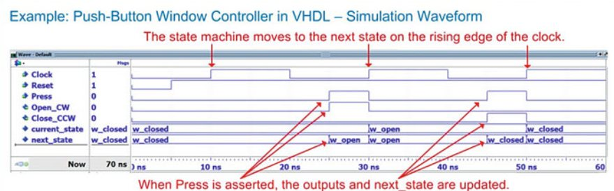
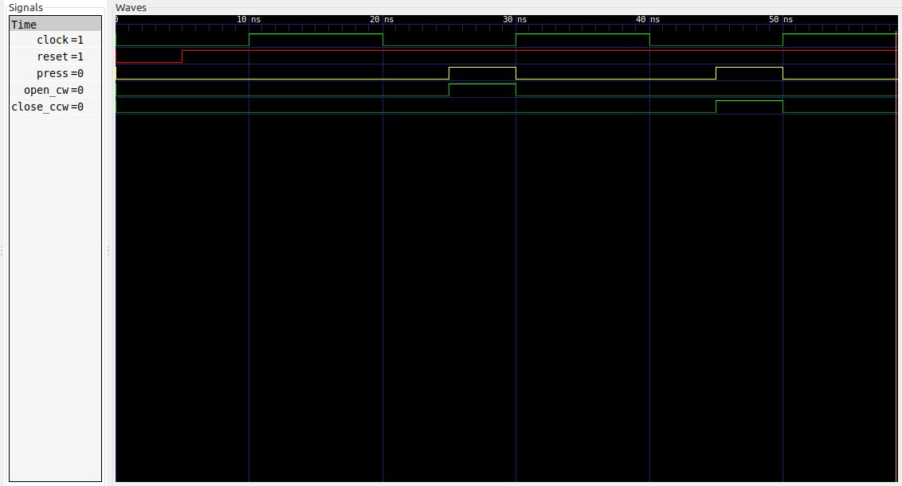

# Ejemplo 7 - Push button window Controller en VHDL #

## Enunciado ##

Un controlador una de ventana (controller window) enviara las señales de control apropiadas para abrir o cerrar un motor siempre que un push button sea presionado. 

El sistema debe recordar si la ventana esta abierta o esta cerrada para enviar la señal correcta, por lo tanto una maquina de estados es necesaria. El diagrama de bloques y el diagrama de estados para este sistema es mostrada abajo:


El sistema top de la figura anterior se muestra en la siguiente figura:



## Solución Mealy ##

### Diagrama de estados ###

A continuación se muestra el diagrama de estados del sistema:



### Tabla de transición ###

| Current State | Inputs | Next State | Salidas |
|-|-|-|-|
| w_closed | Press = 0 | w_closed | Open_CW = 0, Close_CCW = 0 |
| w_closed | Press = 1 | w_open | Open_CW = 1, Close_CCW = 0 |
| w_open | Press = 0 | w_open | Open_CW = 0, Close_CCW = 0 |
| w_open | Press = 1 | w_closed | Open_CW = 0, Close_CCW = 1 |

## Codificación en VHDL ##

### Estructura de la maquina de estados ###

A continuación se muestra estructura de la maquina de estado Moore a 3 bloques:


#### Código de la maquina de estados en VHDL ####

A continuación se muestra el código VHDL de la maquina de estados [PVWC.vhd](PVWC.vhd)

```vhdl
library IEEE;
use IEEE.STD_LOGIC_1164.ALL;
use IEEE.NUMERIC_STD.ALL; 
use IEEE.STD_LOGIC_UNSIGNED.ALL;
use IEEE.STD_LOGIC_ARITH.ALL;

entity PVWC is
    Port ( Clock : in STD_LOGIC;
           Reset : in STD_LOGIC;
           Press : in STD_LOGIC;
           Open_CW : out STD_LOGIC;
           Close_CCW : out STD_LOGIC);
end PVWC;

architecture PVWC_arch of PVWC is

    type State_Type is (w_closed, w_open);
    signal current_state, next_state : State_Type;

begin
    -------------------------------------------------------------------
    STATE_MEMORY: process(Clock, Reset)
    begin
        if Reset = '0' then
          current_state <= w_closed;        
        elsif Clock'event and Clock='1' then
          current_state <= next_state;            
        end if;
    end process;
    -------------------------------------------------------------------
    NEXT_STATE_LOGIC : process(current_state, Press)
    begin
      case (current_state) is
        when w_closed => 
          if (Press = '1') then
            next_state <= w_open;
          else
            next_state <= w_closed;
          end if;
        when w_open => 
          if (Press ='1') then
            next_state <= w_closed;
          else
            next_state <= w_open;
          end if;
        when others => next_state <= w_closed;
      end case;
    end process;
    -------------------------------------------------------------------
    OUTPUT_LOGIC : process (current_state, Press)
    begin
      case (current_state) is
        when w_closed => 
          if (Press = '1') then
            Open_CW <= '1'; 
            Close_CCW <= '0';
          else
            Open_CW <= '0'; 
            Close_CCW <= '0';
          end if;
        when w_open => 
          if (Press = '1') then
            Open_CW <= '0'; 
            Close_CCW <= '1';
          else
            Open_CW <= '0'; 
            Close_CCW <= '0';
          end if;
        when others => 
          Open_CW <= '0'; Close_CCW <= '0';
      end case;
    end process;    
  end architecture;
```

#### Código del test bench en VHDL ####

Teniendo en cuenta lo que se realizó anteriormente, se procederá a realizar el diagrama de tiempos tomando como base la siguiente figura:



Notese que para realizar el diagrama de tiempos, se manejaron cuidadosamente las exitación de modo que se evitaran glitches y que la salida de modo que la salida no fuera tan confusa.

A continuación se muestra el código VHDL del test bench ([PVWC_tb.vhd](PVWC_tb.vhd)).

```vhdl
library IEEE;
use IEEE.STD_LOGIC_1164.ALL;
use IEEE.NUMERIC_STD.ALL; 
use IEEE.STD_LOGIC_UNSIGNED.ALL;
use IEEE.STD_LOGIC_ARITH.ALL;

entity PVWC_TB is
end PVWC_TB;

architecture PVWC_TB_arch of PVWC_TB is

    -- declaraciones modelo FSM

    signal Clock, Reset, Press, Open_CW, Close_CCW: STD_LOGIC;   

    component PVWC is
      Port ( Clock : in STD_LOGIC;
             Reset : in STD_LOGIC;
             Press : in STD_LOGIC;
             Open_CW : out STD_LOGIC;
             Close_CCW : out STD_LOGIC);
    end component;

begin

  DUT: PVWC
	Port map (
    Clock => Clock,
    Reset => Reset,
    Press => Press,
    Open_CW => Open_CW,
    Close_CCW => Close_CCW
  );
  
  Clock_stimulus: process
  begin
    Clock <= '0';
    wait for 10 ns;
    Clock <= '1';
    wait for 10 ns;
  end process;

  Reset_stimulus: process
  begin
    Reset <= '0';
    wait for 5 ns;     -- 5 ns
    Reset <= '1';
    wait;   -- 200 ns  
  end  process;

  Press_stimulus: process
  begin
    Press <= '0';
    wait for 25 ns;     -- 25 ns    
    Press <= '1';
    wait for 5 ns;      -- 30 ns    
    Press <= '0';
    wait for 15 ns;     -- 45 ns    
    Press <= '1';
    wait for 5 ns;     -- 50 ns    
    Press <= '0';
    wait;
  end process;
   
end architecture;
```

A continuación se muestra el diagrama de formas de onda que resulta de la simulación:



Como se puede observar es consistente con la salida esperada.

