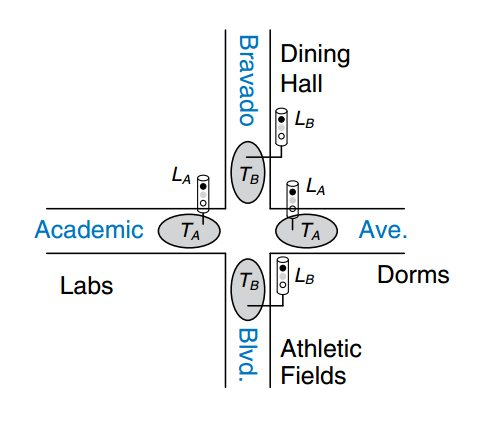
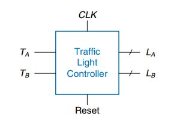
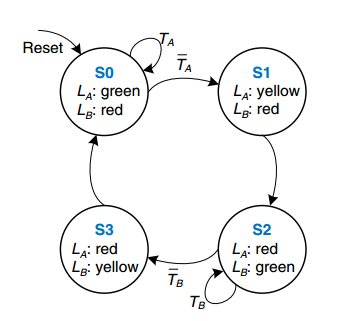
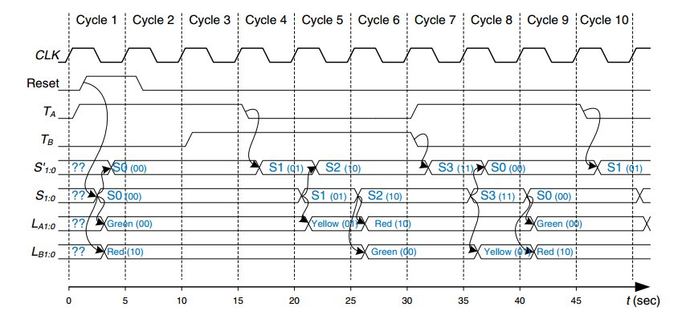
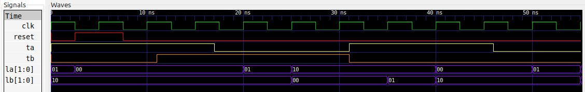

# Ejemplo 6 - Detector de secuencia #

## Enunciado ##

Desarrolle un controlador para un semáforo en la intersección concurrida de un campus. A continuación la razón que motivó el diseño del sistema:

> Los estudiantes de ingeniería están ocupados leyendo sobre FSM en su libro de texto favorito y no están mirando hacia donde van. Los jugadores de fútbol se apresuran entre
campos de atletismo y el comedor en Bravado Boulevard tirando la pelota de un lado a otro y tampoco miran hacia dónde van. Ya se han producido varias lesiones graves en la intersección de estos dos caminos, y el decano de estudiantes le pide a usted instalar un semáforo antes de que haya accidentes más graves.

Para resolver el problema usted decide instalar dos sensores de tráfico, TA y TB en Academic Ave. y Bravado Blvd. Cada sensor indica verdadero si los estudiantes están presentes y falso si la calle está vacía. También, instala dos semáforos, LA y LB para controlar el tráfico. Cada uno de los semáforos puede desplegar tres tipos de luces (rojo, amarillo o verde). La intersección y sensores son mostrados en la siguiente figura. 



Usted proporciona un reloj con periodo de 5 segundos. En cada tick de reloj (flanco de subida), las luces pueden cambiar basadas en los sensores de tráfico. Tambien, proporsiona un reset demanera que los tecnicos puedan poner el controlador a un estado inicial conocido una vez realizan la instalación de este. La siguiente figura muestra el diagrama de caja negra del sistema.



## Solución Moore ##

A continuación se muestra la solución al problema

### Diagrama de estados ###



Tal y como se muestra en figura la maquina de estados. Las entradas son TA y TB asociadas a los sensores, las salidas asociadas a los semaforos son LA y LB cada una de dos bits asociadas a las luces. Como cada semaforo tiene 3 luces (rojo, amarillo y verde), basta con 2 bits a la salida para representar estas posiblidades. 

La codificación para la salida se muestra a continuación:

| Salida | Bits |
|-|-|
| Rojo | 10 |
| Amarillo | 01 |
| Verde | 11 |

### Tabla de transición ###

| Current State | Inputs | Next State | 
|-|-|-|
| S0 | TA = 0, TB = x| S1 |
| S0 | TA = 1, TB = x| S0 |
| S1 | x | S2 |
| S2 | TB = 0, TA = x| S3 |
| S2 | TB = 1, TA = x| S2 |
| S3 | x | S0 |

## Codificación en VHDL ##

### Estructura de la maquina de estados ###

A continuación se muestra estructura de la maquina de estado Moore a 3 bloques:


#### Código de la maquina de estados en VHDL ####

A continuación se muestra el código VHDL de la maquina de estados [control_traffic.vhd](control_traffic.vhd)

```vhdl
library IEEE;
use IEEE.STD_LOGIC_1164.ALL;
use IEEE.NUMERIC_STD.ALL; 
use IEEE.STD_LOGIC_UNSIGNED.ALL;
use IEEE.STD_LOGIC_ARITH.ALL;

entity control_traffic is
    Port ( CLK : in STD_LOGIC;
           Reset : in STD_LOGIC;
           TA : in STD_LOGIC;
           TB : in STD_LOGIC;
           LA : out STD_LOGIC_VECTOR (1 downto 0);
           LB : out STD_LOGIC_VECTOR (1 downto 0));
end control_traffic;

architecture control_traffic_arch of control_traffic is

    type STATES is (S0, S1, S2, S3);
    signal current_state, next_state : STATES;
    constant GREEN: STD_LOGIC_VECTOR(1 downto 0) := "00";
    constant YELLOW: STD_LOGIC_VECTOR(1 downto 0) := "01";
    constant RED: STD_LOGIC_VECTOR(1 downto 0) := "10";

begin
    -------------------------------------------------------------------
    STATE_MEMORY: process(CLK, Reset)
    begin
        if Reset = '1' then
          current_state <= S0;        
        elsif CLK'event and CLK='1' then
          current_state <= next_state;            
        end if;
    end process;
    -------------------------------------------------------------------
    NEXT_STATE_LOGIC : process(current_state, TA, TB)
    begin
      case (current_state) is
        when S0 => 
          if (TA = '1') then
            next_state <= S0;
          else
            next_state <= S1;
          end if;
        when S1 => 
          next_state <= S2;          
        when S2 => 
          if (TB = '1') then
            next_state <= S2;
          else
            next_state <= S3;
          end if;
        when S3 => 
          next_state <= S0;         
      end case;
    end process;
    -------------------------------------------------------------------
    OUTPUT_LOGIC : process (current_state)
    begin
      case (current_state) is
        when S0 => 
          LA <= GREEN;  -- Verde
          LB <= RED;  -- Rojo
        when S1 => 
          LA <= YELLOW;  -- Amarillo
          LB <= RED;  -- Rojo
        when S2 => 
          LA <= RED;  -- Rojo
          LB <= GREEN;  -- Verde
        when S3 => 
          LA <= RED;  -- Rojo
          LB <= YELLOW;  -- Amarillo        
      end case;
    end process;    
end architecture;
```

#### Código del test bench en VHDL ####

Teniendo en cuenta lo que se realizón anteriormente, se definió el siguiente diagrama de tiempos en la siguiente figura:



Si la salida del test bench es similar a la mostrada en el diagrama de tiempos anterior, es por que es coherente con el comportamiento esperado. 

A continuación se muestra el código VHDL del test bench ([control_traffic_tb.vhd](control_traffic_tb.vhd)). Tengase en cuenta que como se hacia impractico simular con un periodo de reloj de 5 s, se realizo la simulación con un reloj de 5 ns esperando un comportamiento similar. 

```vhdl
library IEEE;
use IEEE.STD_LOGIC_1164.ALL;
use IEEE.NUMERIC_STD.ALL; 
use IEEE.STD_LOGIC_UNSIGNED.ALL;
use IEEE.STD_LOGIC_ARITH.ALL;

entity control_traffic_tb is
end control_traffic_tb;

architecture behavioral of control_traffic_tb is

    -- declaraciones modelo FSM

    signal CLK, Reset, TA, TB: STD_LOGIC;
    signal LA, LB: STD_LOGIC_VECTOR(1 downto 0);   
    
    component control_traffic is
      Port ( CLK : in STD_LOGIC;
             Reset : in STD_LOGIC;
             TA : in STD_LOGIC;
             TB : in STD_LOGIC;
             LA : out STD_LOGIC_VECTOR (1 downto 0);
             LB : out STD_LOGIC_VECTOR (1 downto 0));
    end component;

begin

  DUT: control_traffic
	Port map (
    CLK => CLK,
    Reset => Reset,
    TA => TA,
    TB => TB,
    LA => LA,
    LB => LB
  );
  
  Clock_stimulus: process
  begin
    CLK <= '1';
    wait for 2.5 ns;
    CLK <= '0';
    wait for 2.5 ns;
  end process;

  Reset_stimulus: process
  begin
    Reset <= '0';
    wait for 2.5 ns;     -- 5 ns
    Reset <= '1';
    wait for 5 ns;     -- 7.5 ns
    Reset <= '0';
    wait; 
  end  process;

  Press_stimulus: process
  begin
    TA <= '1';
    TB <= '0';
    wait for 11 ns;     -- 11 ns    
    TB <= '1';
    wait for 6 ns;      -- 17 ns    
    TA <= '0';
    wait for 14 ns;     -- 31 ns    
    TA <= '1';
    TB <= '0';
    wait for 15 ns;     -- 46 ns    
    TA <= '0';
    wait;
  end process;
   
end architecture;
```

A continuación se muestra el diagrama de formas de onda que resulta de la simulación:




