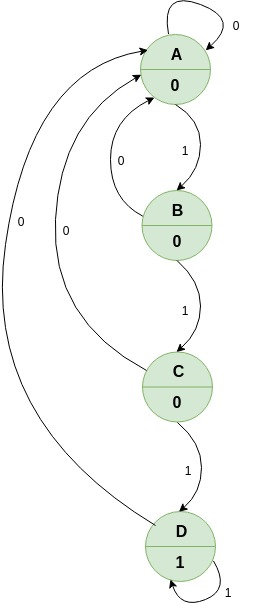

# Ejemplo 1 #

## Enunciado ##

Dibuje el diagrama de estados y la tabla de transición de estados de un circuito secuencial el cual da una salida Z = 1 solamente cuando la entrada X es igual 1 durante 3 o más intervalos consecutivos de reloj. 
1. Utilice un circuito tipo Moore 
2. Utilice un circuito tipo Mealy

## Diagramas de estados ##

### Tipo Moore ###

### Tipo Mealy ###

