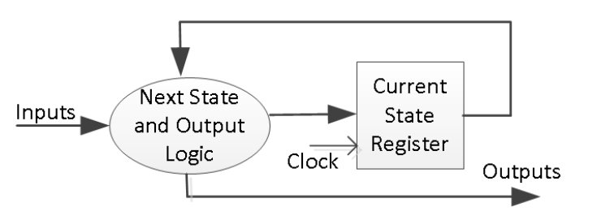
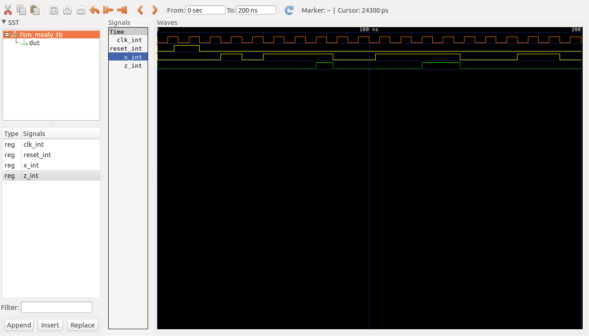

# Maquina Mealy ##

## Maquina Mealy 2 bloques ##



## Ejemplo ##

### Enunciado ##

Dibuje el diagrama de estados y la tabla de transición de estados de un circuito secuencial el cual da una salida Z = 1 solamente cuando la entrada X es igual 1 durante 3 o más intervalos consecutivos de reloj.

### Diagrama de estados de la solución ###


```vhdl
library IEEE;
use IEEE.STD_LOGIC_1164.ALL;
use IEEE.NUMERIC_STD.ALL; 
use IEEE.STD_LOGIC_UNSIGNED.ALL;
use IEEE.STD_LOGIC_ARITH.ALL;

entity FSM_MEALY is
    Port ( reset : in STD_LOGIC;
           clk : in STD_LOGIC;
           x : in STD_LOGIC;
           z : out STD_LOGIC);
end FSM_MEALY;

architecture Behavioral of FSM_MEALY is

    -- declaraciones modelo FSM
    type STATES is (A, B, C, D);
    signal state, next_state: STATES;

begin

    -- registro de estados
    SYNC_PROC: process(clk,reset)
    begin
        if reset = '1' then
          state <= A;        
        elsif clk'event and clk='1' then
            state <= next_state;            
         end if;
    end process;

    
    NEXT_STATE_DECODE : process(state, x)
    begin
        z <= '0';
        case(state) is            
            when A =>
              if (x = '1') then                
                next_state <= B;              
              end if;
            when B =>
              if (x = '1') then       
                next_state <= C;
              else 
                next_state <= A;
              end if;
            when C =>
              if (x = '1') then
                next_state <= D;                
              else 
                next_state <= A;
              end if; 
            when D =>
              if (x = '1') then
                z <= '1';
                next_state <= D;                
              else 
                next_state <= A;
              end if;           
        end case;
    end process;
end Behavioral;
```

### Comandos de compilación en ghdl ###


```bash 
ghdl -a --ieee=synopsys -fexplicit mealy1.vhd 
ghdl -a --ieee=synopsys -fexplicit mealy1_tb.vhd
ghdl -r --ieee=synopsys -fexplicit  FSM_MEALY_TB --stop-time=200ns --vcd=FSM_MEALY_TB_results.vcd
gtkwave FSM_MEALY_TB_results.vcd
```

### Resultados  ###

```vhdl
library IEEE;
use IEEE.STD_LOGIC_1164.ALL;
use IEEE.NUMERIC_STD.ALL; 
use IEEE.STD_LOGIC_UNSIGNED.ALL;
use IEEE.STD_LOGIC_ARITH.ALL;

entity FSM_MEALY_TB is
end FSM_MEALY_TB;

architecture Behavioral of FSM_MEALY_TB is

    -- declaraciones modelo FSM

    signal clk_int, reset_int, x_int, z_int: STD_LOGIC;   

    component FSM_MEALY is
      Port ( reset : in STD_LOGIC;
             clk : in STD_LOGIC;
             x : in STD_LOGIC;             
             z : out STD_LOGIC);
    end component;

begin

  DUT: FSM_MEALY
	Port map (
    reset => reset_int,
    clk => clk_int,
    x => x_int,
    z => z_int
  );
  

  clk_gen_proc: process
  begin
    clk_int <= '0';
    wait for 5 ns;
    clk_int <= '1';
    wait for 5 ns;
  end process clk_gen_proc;

  reset_gen_proc: process
  begin
    reset_int <= '0';
    wait for 8 ns;     -- 8 ns
    reset_int <= '1';
    wait for 12 ns;    -- 20 ns
    reset_int <= '0';
    wait for 180 ns;   -- 200 ns  
  end  process reset_gen_proc;

  data_gen_proc: process
  begin    
    x_int <= '0'; 
    wait for 30 ns;    -- 30 ns
    x_int <= '1';
    wait for 10 ns;    -- 40 ns
    x_int <= '0';
    wait for 10 ns;    -- 50 ns
    x_int <= '1';
    wait for 33 ns;    -- 83 ns
    x_int <= '0';
    wait for 20 ns;    -- 103 ns
    x_int <= '1';
    wait for 40 ns;    -- 143 ns
    x_int <= '0';
    wait for 27 ns;    -- 170 ns
    x_int <= '1';
    wait for 20 ns;    -- 190 ns
    x_int <= '0';
    wait for 10 ns;    -- 200 ns    
  end process data_gen_proc;
   
end Behavioral;
```

