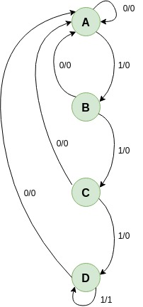

# Ejemplo 1 - Solución tipo Meaaly en VHDL #

## Problema ##
Dibuje el diagrama de estados y la tabla de transición de estados de un circuito secuencial el cual da una salida Z = 1 solamente cuando la entrada X es igual 1 durante 3 o más intervalos consecutivos de reloj. 

## Diagrama de estados ##

## Codificación en VHDL ## 

A continuación de muestra las dos formas de codificar la solución en VHDL:
1. Forma 1: [three blocks Mealy machine](./1)
2. Forma 2: [The two blocks Mealy machine](./2) 