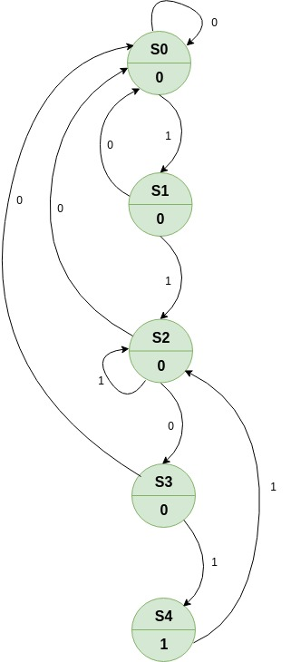
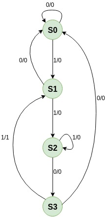

# Ejemplo 2 #

## Enunciado ##

Dibuje el diagrama de estados y la tabla de transición de estados de un circuito secuencial el cual da una salida Z = 1 cuando por una entrada X a ingresado la secuencia de bits 1101. El solapamiento es permitido. Para un circuito secuencial tipo:
1. Moore.
2. Mealy.

## Diagramas de estados ##

### Tipo Moore ###

### Tipo Mealy ###

