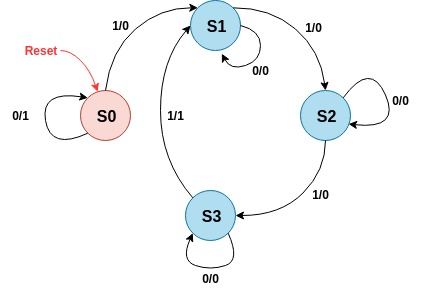
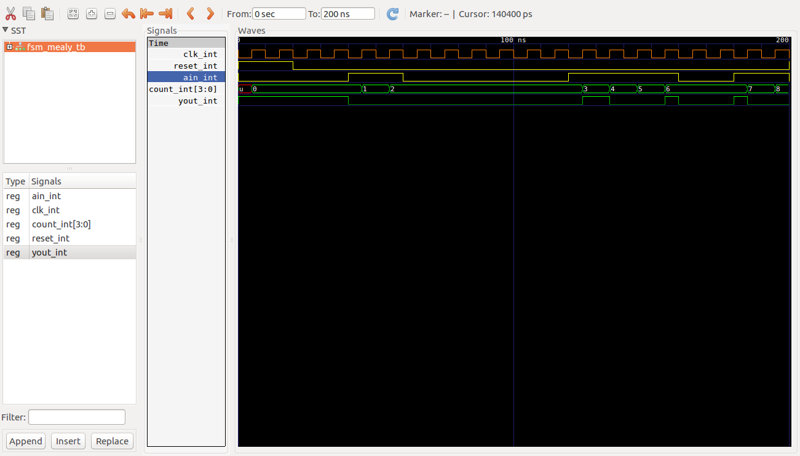

# Maquina Mealy ##

## Maquina Mealy 2 bloques ##


## Ejemplo ##

### Enunciado ###

Design a sequence detector implementing a Mealy state machine using three always blocks. The Mealy state machine has one input (ain) and one output (yout). The output yout is 1 if and only if the total number of 1s received is divisible by 3 (hint: 0 is inclusive, however, reset cycle(s) do not count as 0- see in simulation waveform time=200). Develop a testbench and verify the model through a behavioral simulation. Use SW0 as the clock input, SW1 as the ain input, the BTNU button as reset input to the circuit, number of 1s count on LED7:LED4, and LED0 as the yout output. Go through the design flow, generate the bitstream, and download it into the Nexys3 board. Verify the functionality.


### Diagrama de estados de la solución ###



```vhdl
library IEEE;
use IEEE.STD_LOGIC_1164.ALL;
use IEEE.NUMERIC_STD.ALL; 
use IEEE.STD_LOGIC_UNSIGNED.ALL;
use IEEE.STD_LOGIC_ARITH.ALL;

entity FSM_MEALY is
    Port ( reset : in STD_LOGIC;
           clk : in STD_LOGIC;
           ain : in STD_LOGIC;
           count : out STD_LOGIC_VECTOR(3 DOWNTO 0);
           yout : out STD_LOGIC);
end FSM_MEALY;

architecture Behavioral of FSM_MEALY is

    -- declaraciones modelo FSM
    type STATES is (S0, S1, S2, S3);
    signal state, next_state: STATES;
    signal count_signal: STD_LOGIC_VECTOR(3 DOWNTO 0);-- := "0000";

begin

    SYNC_PROC: process(clk)
    begin
        if clk'event and clk='1' then
            if reset='1' then 
                state <= S0;
                count_signal <= "0000";
            else 
                state <= next_state;
                if ain = '1' then
                  count_signal <= count_signal + 1;
                  
                end if;
            end if;
         end if;
    end process;

    count <= count_signal;

    NEXT_STATE_DECODE : process(state, ain)
    begin
        yout <= '0';
        case(state) is            
            when S0 =>
              if (ain = '1') then                
                next_state <= S1;
              else 
                yout <= '1';
                next_state <= S0;
              end if;
            when S1 =>
              if (ain = '1') then       
                next_state <= S2;
              else 
                next_state <= S1;
              end if;
            when S2 =>
              if (ain = '1') then
                next_state <= S3;
              else 
                next_state <= S2;
              end if;
            when S3 =>
              if (ain = '1') then
                yout <= '1';
                next_state <= S1;
              else 
                next_state <= S3;
              end if;
            end case;
        end process;
end Behavioral;
```

### Comandos de compilación en ghdl ###

```bash
ghdl -a --ieee=synopsys -fexplicit mealy1.vhd 
ghdl -a --ieee=synopsys -fexplicit mealy1_tb.vhd
ghdl -r --ieee=synopsys -fexplicit  FSM_MEALY_TB --stop-time=200ns --vcd=FSM_MEALY_TB_results.vcd
gtkwave FSM_MEALY_TB_results.vcd
```

### Resultados  ###

```vhdl
library IEEE;
use IEEE.STD_LOGIC_1164.ALL;
use IEEE.NUMERIC_STD.ALL; 
use IEEE.STD_LOGIC_UNSIGNED.ALL;
use IEEE.STD_LOGIC_ARITH.ALL;

entity FSM_MEALY_TB is
end FSM_MEALY_TB;

architecture Behavioral of FSM_MEALY_TB is

    -- declaraciones modelo FSM

    signal clk_int, reset_int, ain_int, yout_int: STD_LOGIC;
    signal count_int: STD_LOGIC_VECTOR(3 DOWNTO 0);

    component FSM_MEALY is
      Port ( reset : in STD_LOGIC;
             clk : in STD_LOGIC;
             ain : in STD_LOGIC;
             count : out STD_LOGIC_VECTOR(3 DOWNTO 0);
             yout : out STD_LOGIC);
    end component;

begin

  DUT: FSM_MEALY
	Port map (
    reset => reset_int,
    clk => clk_int,
    ain => ain_int,
    count => count_int,
    yout => yout_int
  );
  
  clk_gen_proc: process
  begin
    clk_int <= '0';
    wait for 5 ns;
    clk_int <= '1';
    wait for 5 ns;
  end process clk_gen_proc;

  data_gen_proc: process
  begin
    ain_int <= '0';    -- 0 ns
    reset_int <= '1';
    wait for 20 ns;    -- 20 ns
    reset_int <= '0';
    wait for 20 ns;    -- 40 ns
    ain_int <= '1';
    wait for 20 ns;    -- 60 ns
    ain_int <= '0';
    wait for 60 ns;    -- 120 ns
    ain_int <= '1';
    wait for 40 ns;    -- 160 ns
    ain_int <= '0';
    wait for 20 ns;    -- 180 ns
    ain_int <= '1';
    wait for 20 ns;    -- 200 ns
  end process data_gen_proc;
   
end Behavioral;
```




