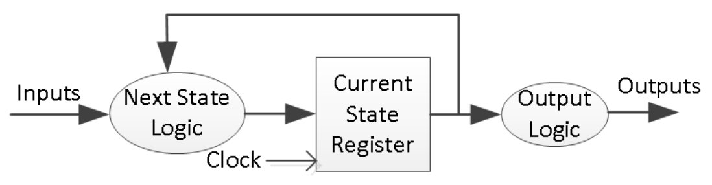
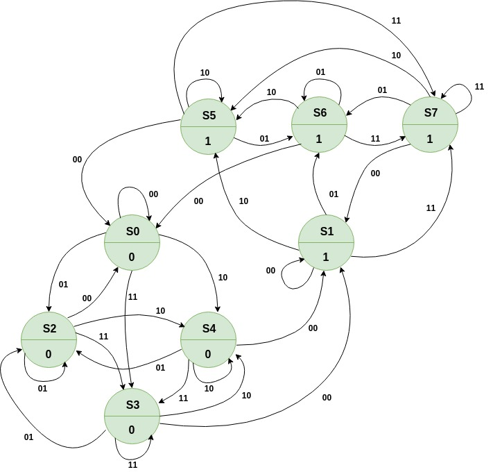
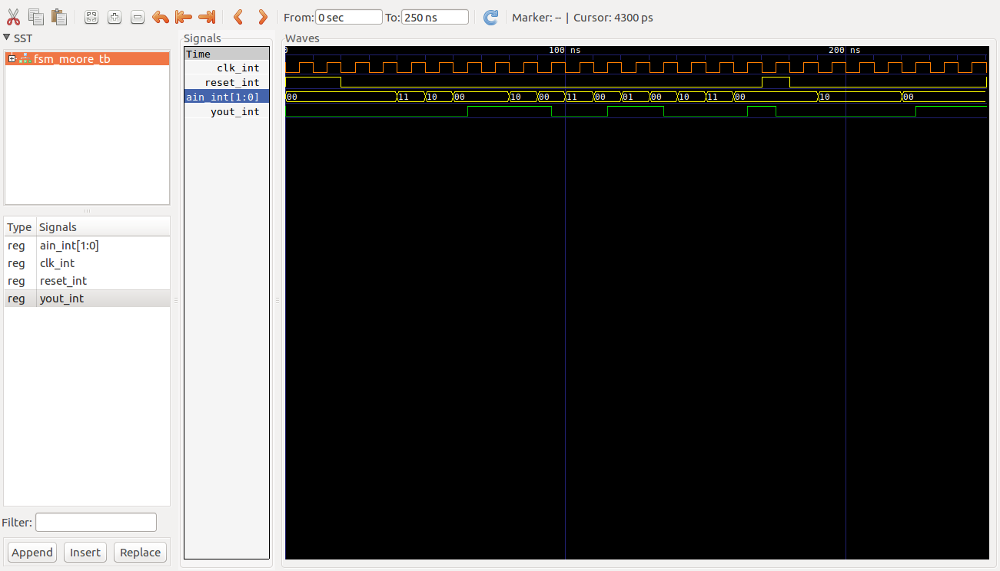

# Maquina Moore ##

## Maquina Moore 3 bloques ##



## Ejemplo ##

### Enunciado ###

Design a sequence detector implementing a Moore state machine using three always blocks. The Moore state machine has two inputs (ain[1:0]) and one output (yout). The output yout begins as 0 and remains a constant value unless one of the following input sequences occurs:
1. The input sequence ain[1:0] = 01, 00 causes the output to become 0.
2. The input sequence ain[1:0] = 11, 00 causes the output to become 1.
3. The input sequence ain[1:0] = 10, 00 causes the output to toggle.

Develop a testbench (similar to the waveform shown below and verify the model through a behavioral simulation. Use SW0 as the clock input, SW2-SW1 as the ain[1:0] input, the BTNU button as reset input to the circuit, and
LED0 as the yout output. Go through the design flow, generate the bitstream, and download it into the Nexys3 board. Verify the functionality.

### Diagrama de estados de la solución ###



```vhdl
library IEEE;
use IEEE.STD_LOGIC_1164.ALL;
use IEEE.NUMERIC_STD.ALL; 
use IEEE.STD_LOGIC_UNSIGNED.ALL;
use IEEE.STD_LOGIC_ARITH.ALL;

entity FSM_MOORE is
    Port ( reset : in STD_LOGIC;
           clk : in STD_LOGIC;
           ain : in STD_LOGIC_VECTOR(1 DOWNTO 0);
           yout : out STD_LOGIC);
end FSM_MOORE;

architecture Behavioral of FSM_MOORE is

    -- declaraciones modelo FSM
    type STATES is (S0, S1, S2, S3, S4, S5, S6, S7);
    signal state, next_state: STATES;

begin

    -- registro de estados
    SYNC_PROC: process(clk)    
    begin
        if clk'event and clk='1' then
            if reset='1' then 
                state <= S0;
            else 
                state <= next_state;
            end if;
         end if;
    end process;

    OUTPUT_DECODE : process (state)
    begin
      case (state) is 
         when S0 =>
           yout <= '0';
         when S1 =>
           yout <= '1';
         when S2 =>
           yout <= '0';
         when S3 =>
           yout <= '0';
         when S4 =>
           yout <= '0';
         when S5 =>
           yout <= '1';
         when S6 =>
           yout <= '1';
         when S7 =>
           yout <= '1';
         when others =>
           yout <= '0';
      end case;
    end process;


    -- Lógica de estado siguiente (circuito combinacional)

    NEXT_STATE_DECODE : process (state, ain)
    begin
      next_state <= S0;
      case (state) is
        -- S0 --
        when S0 =>                       
          if (ain = "00") then    -- 00
            next_state <= S0;
          elsif (ain = "01") then -- 01
            next_state <= S2;
          elsif (ain = "11") then -- 11
            next_state <= S3;
          else                    -- 10
            next_state <= S4;
          end if;
        -- S1 --
        when S1 =>                       
          if (ain = "00") then    -- 00
            next_state <= S1;
          elsif (ain = "01") then -- 01
            next_state <= S6;
          elsif (ain = "11") then -- 11
            next_state <= S7;
          else                    -- 10
            next_state <= S5;
          end if;
        -- S2 --
        when S2 =>                       
          if (ain = "00") then    -- 00
            next_state <= S0;
          elsif (ain = "01") then -- 01
            next_state <= S2;
          elsif (ain = "11") then -- 11
            next_state <= S3;
          else                    -- 10
            next_state <= S4;
          end if;
        -- S3 --
        when S3 =>                       
          if (ain = "00") then    -- 00
            next_state <= S1;
          elsif (ain = "01") then -- 01
            next_state <= S2;
          elsif (ain = "11") then -- 11
            next_state <= S3;
          else                    -- 10
            next_state <= S4;
          end if;
        -- S4 --
        when S4 =>                       
          if (ain = "00") then    -- 00
            next_state <= S1;
          elsif (ain = "01") then -- 01
            next_state <= S2;
          elsif (ain = "11") then -- 11
            next_state <= S3;
          else                    -- 10
            next_state <= S4;
          end if;
        -- S5 --
        when S5 =>                       
          if (ain = "00") then    -- 00
            next_state <= S0;
          elsif (ain = "01") then -- 01
            next_state <= S6;
          elsif (ain = "11") then -- 11
            next_state <= S7;
          else                    -- 10
            next_state <= S5;
          end if;
        -- S6 --
        when S6 =>                       
          if (ain = "00") then    -- 00
            next_state <= S0;
          elsif (ain = "01") then -- 01
            next_state <= S6;
          elsif (ain = "11") then -- 11
            next_state <= S7;
          else                    -- 10
            next_state <= S5;
          end if;
        -- S7 --
        when S7 =>                       
          if (ain = "00") then    -- 00
            next_state <= S1;
          elsif (ain = "01") then -- 01
            next_state <= S6;
          elsif (ain = "11") then -- 11
            next_state <= S7;
          else                    -- 10
            next_state <= S5;
          end if;          
        end case;
    end process;
end Behavioral;
```

### Comandos de compilación en ghdl ###

```bash
ghdl -a --ieee=synopsys -fexplicit moore.vhd 
ghdl -a --ieee=synopsys -fexplicit moore_tb.vhd
ghdl -r --ieee=synopsys -fexplicit  FSM_MOORE_TB --stop-time=250ns --vcd=FSM_MOORE_TB_results.vcd
gtkwave FSM_MOORE_TB_results.vcd
```

### Resultados  ###

```vhdl
library IEEE;
use IEEE.STD_LOGIC_1164.ALL;
use IEEE.NUMERIC_STD.ALL; 
use IEEE.STD_LOGIC_UNSIGNED.ALL;
use IEEE.STD_LOGIC_ARITH.ALL;

entity FSM_MOORE_TB is
end FSM_MOORE_TB;

architecture Behavioral of FSM_MOORE_TB is

    -- declaraciones modelo FSM

    signal clk_int, reset_int, yout_int: STD_LOGIC;
    signal ain_int: STD_LOGIC_VECTOR(1 DOWNTO 0);
  
    component FSM_MOORE is
      Port ( reset : in STD_LOGIC;
             clk : in STD_LOGIC;
             ain : in STD_LOGIC_VECTOR(1 DOWNTO 0);            
             yout : out STD_LOGIC);
    end component;

begin

  DUT: FSM_MOORE
	Port map (
    reset => reset_int,
    clk => clk_int,
    ain => ain_int,
    yout => yout_int
  );
  

  clk_gen_proc: process
  begin
    clk_int <= '0';
    wait for 5 ns;
    clk_int <= '1';
    wait for 5 ns;
  end process clk_gen_proc;

  -- Nota: Se puede hacer un proceso a parte para el reset
  data_gen_proc: process
  begin
    ain_int <= "00";    -- 0 ns
    reset_int <= '1';
    wait for 20 ns;    -- 20 ns
    reset_int <= '0';
    wait for 20 ns;    -- 40 ns
    ain_int <= "11";
    wait for 10 ns;    -- 50 ns
    ain_int <= "10";
    wait for 10 ns;    -- 60 ns
    ain_int <= "00";
    wait for 20 ns;    -- 80 ns
    ain_int <= "10";
    wait for 10 ns;    -- 90 ns
    ain_int <= "00";
    wait for 10 ns;    -- 100 ns
    ain_int <= "11";
    wait for 10 ns;    -- 110 ns
    ain_int <= "00";
    wait for 10 ns;    -- 120 ns
    ain_int <= "01";
    wait for 10 ns;    -- 130 ns
    ain_int <= "00";
    wait for 10 ns;    -- 140 ns
    ain_int <= "10";
    wait for 10 ns;    -- 150 ns
    ain_int <= "11";
    wait for 10 ns;    -- 160 ns
    ain_int <= "00";
    wait for 10 ns;    -- 170 ns
    reset_int <= '1';
    wait for 10 ns;    -- 180 ns
    reset_int <= '0';
    wait for 10 ns;    -- 190 ns
    ain_int <= "10";
    wait for 30 ns;    -- 220 ns
    ain_int <= "00";
    wait for 30 ns;    -- 250 ns
  end process data_gen_proc;
   
end Behavioral;
```



