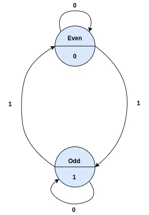
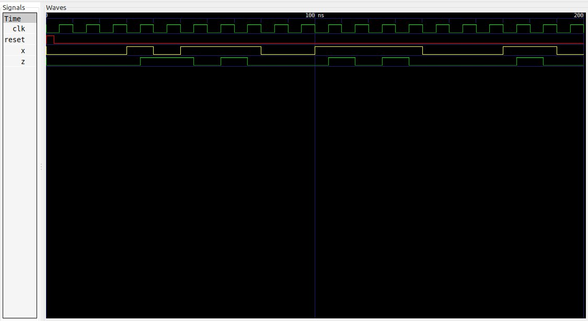

# Ejemplo 4 - Detector de paridad #

## Enunciado ##

Diseñar un **detector de paridad impar**

## Solución Moore ##

### Diagrama de estados ###



### Tabla de transición ###

| Current State | Inputs (x)| Next State | Outputs (z)|
|-|-|-|-|
| Even | 0 | Even |0|
| Even | 1 | Odd |1|
| Odd | 0 | Odd |1|
| Odd | 1 | Even |0|


## Codificación en VHDL ##

### Estructura de la maquina de estados ###

A continuación se muestra estructura de la maquina de estado Moore a 3 bloques:


#### Código de la maquina de estados en VHDL ####

A continuación se muestra el código VHDL de la maquina de estados [odd_fsm_moore.vhd](odd_fsm_moore.vhd)

```vhdl
library IEEE;
use IEEE.STD_LOGIC_1164.ALL;
use IEEE.NUMERIC_STD.ALL; 
use IEEE.STD_LOGIC_UNSIGNED.ALL;
use IEEE.STD_LOGIC_ARITH.ALL;

entity ODD_FSM_MOORE is
    Port ( reset : in STD_LOGIC;
           clk : in STD_LOGIC;
           x : in STD_LOGIC;
           z : out STD_LOGIC);
end ODD_FSM_MOORE;

architecture Behavioral of ODD_FSM_MOORE is

    -- declaraciones modelo FSM
    type STATES is (
                      even,     -- Estado que indica una cantidad par de 1's
                      odd       -- Estado que indica una cantidad impar de 1's
                   );
    signal state, next_state: STATES;

begin

    -------------------------------------------------------------------
    SYNC_PROC: process(clk,reset)
    begin
        if reset = '1' then
          state <= even;        
        elsif clk'event and clk='1' then
            state <= next_state;            
        end if;
    end process;

    -------------------------------------------------------------------
    OUTPUT_DECODE : process (state)
    begin
      case (state) is 
         when even =>
           z <= '0';
         when odd =>
           z <= '1';
         when others =>
           z <= '0';
      end case;
    end process;

    -------------------------------------------------------------------
    NEXT_STATE_DECODE : process(state, x)
    begin
        next_state <= even;
        case(state) is            
            when even =>
              if (x = '1') then                
                next_state <= odd;              
              end if;
            when odd =>
              if (x = '1') then       
                next_state <= even;
              else 
                next_state <= odd;
              end if;                     
        end case;
    end process;
end Behavioral;
```

#### Código del test bench en VHDL ####

A continuación se muestra el código VHDL del test bench ([odd_fsm_moore_tb.vhd](odd_fsm_moore_tb.vhd)).

```vhdl
library IEEE;
use IEEE.STD_LOGIC_1164.ALL;
use IEEE.NUMERIC_STD.ALL; 
use IEEE.STD_LOGIC_UNSIGNED.ALL;
use IEEE.STD_LOGIC_ARITH.ALL;

entity ODD_FSM_MOORE_TB is
end ODD_FSM_MOORE_TB;

architecture Behavioral of ODD_FSM_MOORE_TB is

    -- declaraciones modelo FSM

    signal clk_int, reset_int, x_int, z_int: STD_LOGIC;   

    component ODD_FSM_MOORE is
      Port ( reset : in STD_LOGIC;
             clk : in STD_LOGIC;
             x : in STD_LOGIC;             
             z : out STD_LOGIC);
    end component;

begin

  DUT: ODD_FSM_MOORE
	Port map (
    reset => reset_int,
    clk => clk_int,
    x => x_int,
    z => z_int
  );
  

  clk_gen_proc: process
  begin
    clk_int <= '0';
    wait for 5 ns;
    clk_int <= '1';
    wait for 5 ns;
  end process clk_gen_proc;

  reset_gen_proc: process
  begin
    reset_int <= '0';
    wait for 3 ns;     -- 3 ns
    reset_int <= '1';
    wait;
  end  process reset_gen_proc;

  data_gen_proc: process
  begin    
    x_int <= '0'; 
    wait for 30 ns;    -- 30 ns
    x_int <= '1';
    wait for 10 ns;    -- 40 ns
    x_int <= '0';
    wait for 10 ns;    -- 50 ns
    x_int <= '1';
    wait for 30 ns;    -- 80 ns
    x_int <= '0';
    wait for 20 ns;    -- 100 ns
    x_int <= '1';
    wait for 40 ns;    -- 140 ns
    x_int <= '0';
    wait for 30 ns;    -- 170 ns
    x_int <= '1';
    wait for 20 ns;    -- 190 ns
    x_int <= '0';
    wait;
  end process data_gen_proc;
   
end Behavioral;
```

La secuencia de test con la que se llevo a cabo el ensayo fue con:

```
x = 00010111001111000110
```

Como los cambios de estado se realizaron empleando el flanco positivo del reloj, los cambios de **0** a **1** y viceversa en la entrada x, se hicieron en el flanco de salida para evitar ambigüedades a la salida.

Si todo esta bien, la salida al simular debería mostrar el siguiente resultado:

```
z = 00011010001010000100
```

A continuación se muestra el diagrama de formas de onda que resulta de la simulación:




