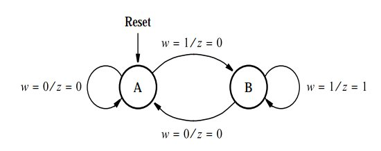
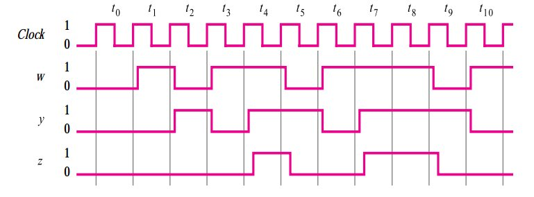
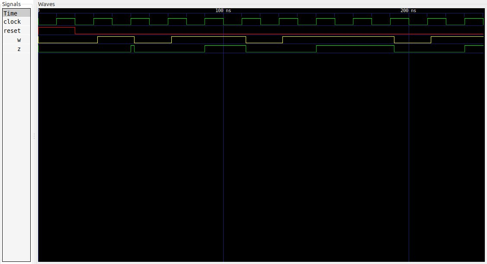

# Ejemplo 6 - Detector de secuencia #

## Enunciado ##

Diseñar un circuito secuencial que cumpla con los siguientes requerimientos:
1. El circuito tendra una entrada (**w**) y una salida (**z**).
2. Los cambios ocurren en el flanco positivo de la señal de reloj.
3. La señal **z** es igual a **1** si durante los dos ciclos de reloj inmediatamente enteriores a la entrada **w** son **1**. Por otro lado el valor de la salida **z** es **0**.

En resumen, el circuito detecta si dos o mas **1's** concecutivos ocurren en un patron de datos a la entrada.

## Solución Mealy ##

### Diagrama de estados ###



### Tabla de transición ###

| Current State | Inputs | Next State | Outputs|
|-|-|-|
| A | w = 0 | A | z = 0|
| A | w = 1 | B | z = 0|
| B | w = 0 | A | z = 1|
| B | w = 1 | C | z = 0|

## Codificación en VHDL ##

### Estructura de la maquina de estados ###

A continuación se muestra estructura de la maquina de estado Moore a 3 bloques:


#### Código de la maquina de estados en VHDL ####

A continuación se muestra el código VHDL de la maquina de estados [seq_detector.vhd](seq_detector.vhd)

```vhdl
library IEEE;
use IEEE.STD_LOGIC_1164.ALL;
use IEEE.NUMERIC_STD.ALL; 
use IEEE.STD_LOGIC_UNSIGNED.ALL;
use IEEE.STD_LOGIC_ARITH.ALL;

entity seq_detector is
    Port ( Clock : in STD_LOGIC;
           Reset : in STD_LOGIC;
           w : in STD_LOGIC;
           z : out STD_LOGIC);
end seq_detector;

architecture seq_detector_arch of seq_detector is

    type STATES is (A, B);
    signal current_state, next_state : STATES;

begin
    -------------------------------------------------------------------
    STATE_MEMORY: process(Clock, Reset)
    begin
        if Reset = '1' then
          current_state <= A;        
        elsif Clock'event and Clock='1' then
          current_state <= next_state;            
        end if;
    end process;
    -------------------------------------------------------------------
    NEXT_STATE_LOGIC : process(current_state, w)
    begin
      case (current_state) is
        when A => 
          if (w = '1') then
            next_state <= B;
          else
            next_state <= A;
          end if;
        when B => 
          if (w ='1') then
            next_state <= B;
          else
            next_state <= A;
          end if;        
      end case;
    end process;
    -------------------------------------------------------------------
    OUTPUT_LOGIC : process (current_state, w)
    begin
      case (current_state) is
        when A => 
          if (w ='1') then
            z <= '0';
          else
            z <= '0';
          end if;
        when B => 
          if (w ='1') then
            z <= '1';
          else
            z <= '0';
        end if;
      end case;
    end process;    
end architecture;
```

#### Código del test bench en VHDL ####

Para llevar a cabo la verificación del circuito secuencial definido anteriormente, se van realizar la prueba con la siguiente entrada:

```
w = 001011011101
```
Si todo esta bien, la salida al simular debería mostrar el siguiente resultado:

```
z = 000001001100
```

Teniendo en cuenta lo que se realizón anteriormente, se definió el siguiente diagrama de tiempos en la siguiente figura:



Si la salida del test bench es similar a la mostrada en el diagrama de tiempos anterior, es por que es coherente con el comportamiento esperado.

A continuación se muestra el código VHDL del test bench ([seq_detector_tb.vhd](seq_detector_tb.vhd)).

```vhdl
library IEEE;
use IEEE.STD_LOGIC_1164.ALL;
use IEEE.NUMERIC_STD.ALL; 
use IEEE.STD_LOGIC_UNSIGNED.ALL;
use IEEE.STD_LOGIC_ARITH.ALL;

entity seq_detector_tb is
end seq_detector_tb;

architecture behavioral of seq_detector_tb is

    -- declaraciones modelo FSM

    signal Clock, Reset, w, z: STD_LOGIC;   

    component seq_detector is
      Port ( Clock : in STD_LOGIC;
             Reset : in STD_LOGIC;
             w : in STD_LOGIC;
             z : out STD_LOGIC);
    end component;

begin

  DUT: seq_detector
	Port map (
    Clock => Clock,
    Reset => Reset,
    w => w,
    z => z
  );
  
  Clock_stimulus: process
  begin
    Clock <= '0';
    wait for 10 ns;
    Clock <= '1';
    wait for 10 ns;
  end process;

  Reset_stimulus: process
  begin
    Reset <= '1';
    wait for 20 ns;     -- 20 ns
    Reset <= '0';
    wait;  
  end  process;

  Press_stimulus: process
  begin
    w <= '0';
    wait for 32 ns;     -- 32 ns    
    w <= '1';
    wait for 20 ns;     -- 52 ns    
    w <= '0';
    wait for 20 ns;     -- 72 ns    
    w <= '1';
    wait for 40 ns;     -- 112 ns    
    w <= '0';
    wait for 20 ns;     -- 132 ns    
    w <= '1';
    wait for 60 ns;     -- 192 ns  
    w <= '0';
    wait for 20 ns;     -- 212 ns   
    w <= '1';
    wait;
  end process;
   
end architecture;
```

La secuencia de test con la que se llevo a cabo el ensayo fue con:

```
w = 01011011101
```
Si todo esta bien, la salida al simular debería mostrar el siguiente resultado:

```
z = 00000100110
```

A continuación se muestra el diagrama de formas de onda que resulta de la simulación:




