## Archivos asociados ##

Los siguientes archivos son usados para implementar una aplicacion determina el caracter ascii asociado a una tecla presionada e un teclado PS/2. El codigo fuente para el **PS/2 keyboard to ASCII converter** consiste de los siguientes 3 archivos:
* [ps2_keyboard_to_ascii.vhd](ps2_keyboard_to_ascii.vhd)
* [ps2_keyboard.vhd](ps2_keyboard.vhd)
* [debounce.vhd](debounce.vhd)

### PS/2 Keyboard Interface (VHDL) ###

#### Resumen ####

Este componente recibe las transacciones desde un teclado PS/2 y obtiene los codigos make code (key press) y break code (key release) a una salida paralela.

#### Codigo asociado ####

El codigo asociado se encuentra en el archivo [ps2_keyboard.vhd](ps2_keyboard.vhd)

#### Diagrama de bloques ####

A continuación se muestra entidad asociada al codigo vhd:

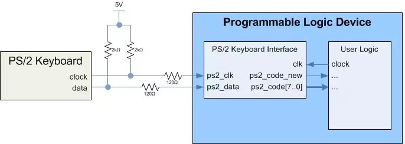

La información de las entradas y las salidas se muestran a continuación:

|Port|Width|Mode|Data Type|Interface|Description|
|----|-----|----|---------|---------|-----------|
|ascii_code|7|out|standard logic vector|user logic|Codigo ASCII de 7 bits obtenido desde el teclado PS/2|
|ps2_clk|1|in|standard logic|PS/2 keyboard|Señal de reloj proveniente del teclado PS/2|
|ps2_data|1|in|standard logic|PS/2 keyboard|Señal de datos proveniente del teclado PS/2|
|ascii_new|1|out|standard logic|user logic|New code available flag. Esta flag se mantiene en bajo durante las coversiones de PS/2 a ASCCI. Una transición de bajo a alto indica que un nuevo codigo ASCII esta disponible en el bus ascci_code|
|clk|1|in|standard logic|user logic|Reloj del sistema|

La siguiente figura muestra la arquitectura del circuito digital implementado en el codigo anterior:

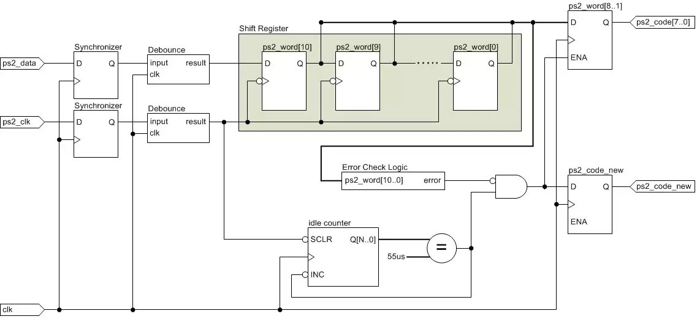

La siguiente figura muestra los scan codes que se asociados a las diferentes teclas:

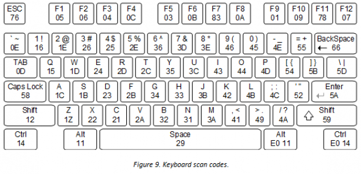

Para los break codes se antepone una F0 al scan code de la tecla asociada. Asi si se observa la figura anterior el break code para la tecla **A** (cuyo scan code asociado es **1C**) es **0F,1C**

Para entender un poco mas lo anterior, supongamos que un usuario presiona la tecla **a** (minúscula). Tal y como se muestra en la tabla [ASCII Character Set]:

El ascii asociado a la letra **a** es la secuencia de bits **1100001 = 0x97**.

#### Entendiendo un poco mas las señales la PS/2 Keyboard Interface ###

**PS/2** (IBM Personal System/2) es una interfaz de teclados y ratones para PC a través de un conector Mini-DIN de 6 pines. La siguiente figura describe cada uno de los pines:

Para el caso, las lineas de reloj y datos van separadas y siguen el formato de transimisión mostrado a continuación:

La figura anterior se puede analizar en los siguientes pasos:
1. Inicialmente tanto la señal **Clock** como **Data** estan en nivel alto cuando no hay actividad. La señal de reloj (**Clock**) es proporsionada por el teclado y esta entre 10 kHz y 16.7 kHz (es decir, maneja periodos entre 60-100us).
2. Cuando se van a transmitir datos se dan los siguientes eventos:
   * La transmisión de los datos empieza con un **bit de start** colocando la linea **Data** en **0** (Nivel logico bajo).
   * Despues del bit de start se envia un byte de datos, donde el bit LSB es enviado primero.
   * A continuación se encia un bit de paridad (**parity**)
   * Finalmente se envia el bit de **stop** (que emplea logica high) el cual indica que la transacción finalizo. 
   * Una vez se completa la transmision tanto **Clock** como **Data** retornan al nivel logico alto.
3. La lectura de cada uno de los bits se hacen en el flanco de bajada de la señal de reloj.

**Ejemplo de una transacción**

La siguiente figura muestra el diagrama de tiempos para el caso en el cual el usuario presiona la tecla **A** cuyo **scan code set 2** es **1C** (ver el Appendix:  Scan Code Set 2 del siguiente [enlace](https://www.digikey.com/eewiki/pages/viewpage.action?pageId=28278929)).

Como se puede ver de la grafica tenemos los siguientes bits en el bus de datos durante la transmision:
* **start**: 0
* **Data**:
  * **D0**: 0
  * **D1**: 0
  * **D2**: 1
  * **D3**: 1
  * **D4**: 1
  * **D5**: 0
  * **D6**: 0
  * **D7**: 0
* **parity**: 0
* **stop**: 1

Notese además que, la captura se hace en los flancos de bajada de la señal **ps2_clk**. Tambien, se puede ver que cuando empieza la transmisión, la señal **ps2_code_new** baja a 0 y permanece allí mientras la transacción este en proceso. Cuando la transacción se completa, la señal **ps2_clk** sube a 1 indicando que un nuevo codigo PS2 ha sido recibido y esta disponible en el bus **ps2_code**. En este caso, se recibio la secuencia **D0-D1-D2-D3-D4-D5-D6-D7 = 00111000** en la linea **Data**, sin embargo como **D0** es el bit LSB, entonces en **ps2_code** el byte recuperado una vez que la transmisión culmina será **D7-D6-D5-D4-D3-D2-D1-D0 = 00011100 = 0x1C**.

### Debounce Logic Circuit  (VHDL) ###

El uso de switches mecanicos para interfaz de usuario es una practica común. Sin embargo, cuando estos switches son presionados sus contactos, a menudo rebotan (bounce) una y otra vez antes de alcanzar un estado estable. 

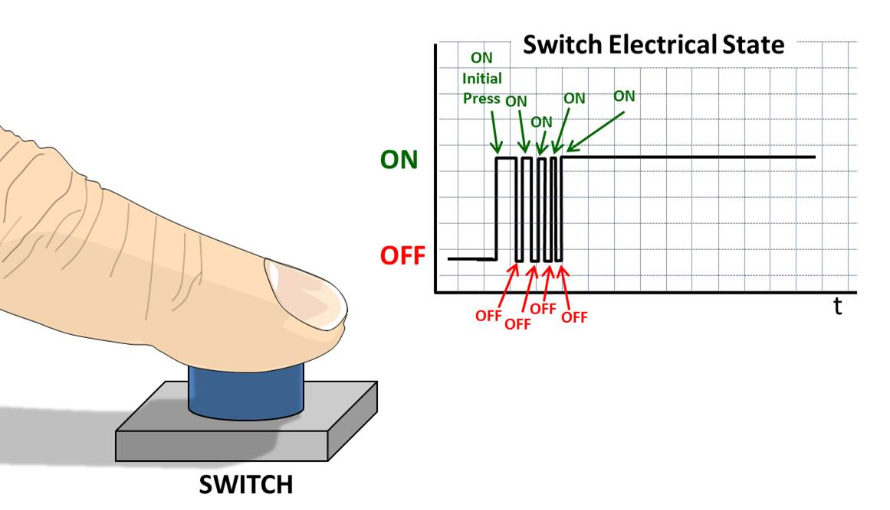

Un modulo anti-debounce es un sistema diseñado digital para corregir este problema. A continuación se muestra la implementación asociada.

#### Codigo asociado ####

El codigo asociado se encuentra en el archivo [debounce.vhd](debounce.vhd)

#### Diagrama de bloques ####

A continuación se muestra entidad asociada al codigo vhd:

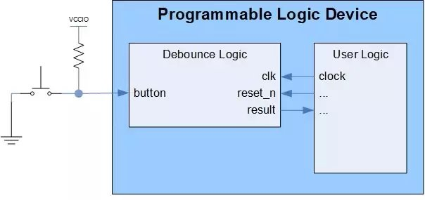

La información de las entradas y las salidas se muestran a continuación:

|Port|Width|Mode|Data Type|Interface|Description|
|----|-----|----|---------|---------|-----------|
|clk|1|in|standard logic|user logic|Reloj del sistema|
|reset_n|1|in|standard logic|user logic|Reset asincrono activado en bajo|
|button|1|in|standard logic|button or switch|Señal de entrada previa al debounce|
|result|1|out|standard logic|user logic|debounced signal|

El codigo vhdl describe el siguiente circuito digital:

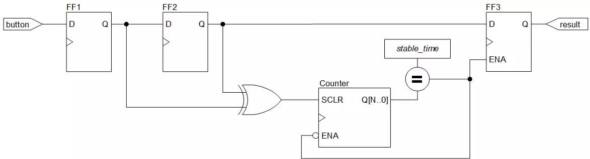

Para este ejemplo, el debounce es usado dentro del modulo 
ps2_keyboard.vhd para propositos de sincronización

### PS/2 to ASCII Conversion (VHDL) ###

Esta parte esta relacionada con el archivo VHDL top el cual instancia la componente asociada al teclado PS/2 (ps2_keyboard.vhd) y usa los codigos entregados por esta para controlar la maquina de estados asociada al conversor.

#### Codigo asociado ####

El codigo asociado se encuentra en el archivo [ps2_keyboard_to_ascii.vhd](ps2_keyboard_to_ascii.vhd)

#### Diagrama de bloques ####

El diagrama de bloques de asociado a este módulo se muestra en la siguiente figura:

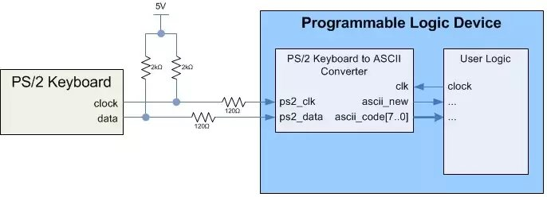

A continuación se muestra la maquina de estados implementada en el codigo anterior:

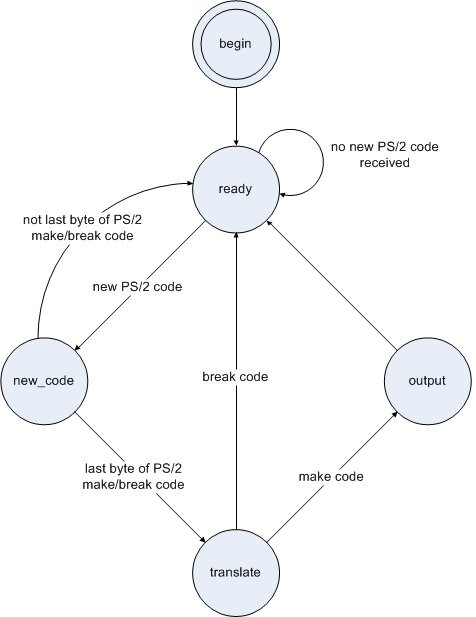

#### Ejemplo de una transacción ####

TRabajando

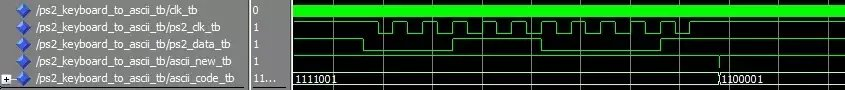

## Demostración ##

Empleando Vivado, monte la siguiente aplicación para cuyo caso se dan los siguientes archivos:
* [ps2_keyboard_to_ascii.vhd](ps2_keyboard_to_ascii.vhd)
* [ps2_keyboard.vhd](ps2_keyboard.vhd)
* [debounce.vhd](debounce.vhd)
* [Basys3_Master_demo0KeyBoard.xdc](Basys3_Master_demo0KeyBoard.xdc)

La siguientes imagenes evidencian el funcionamiento de la aplicación para los casos en los que se precionan la A y la Z. ¿Cual es el significado de la salida que se quiere expresar empleando los leds?

**Letra A**

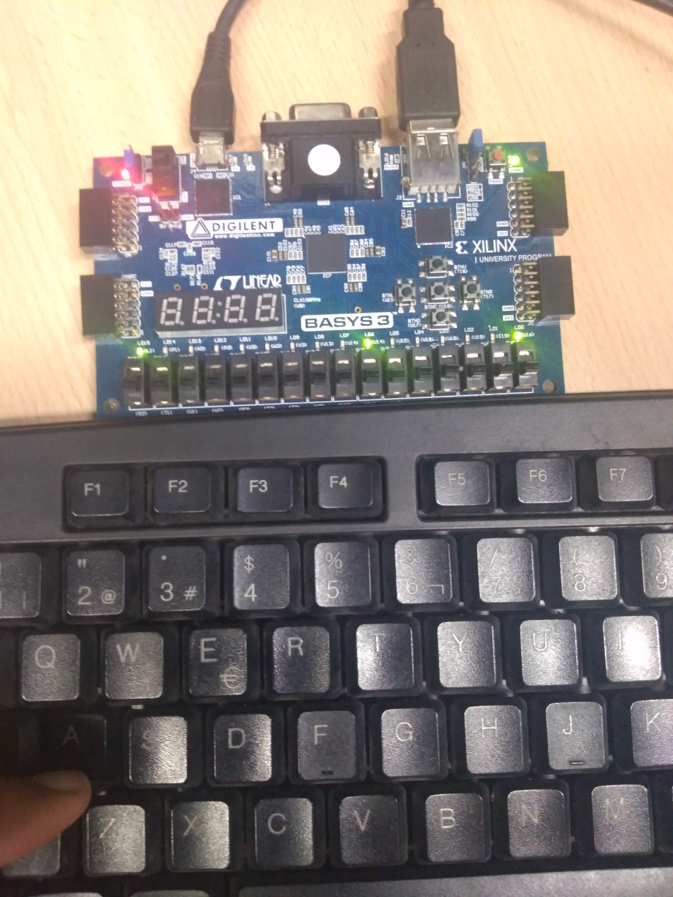

**Letra Z**

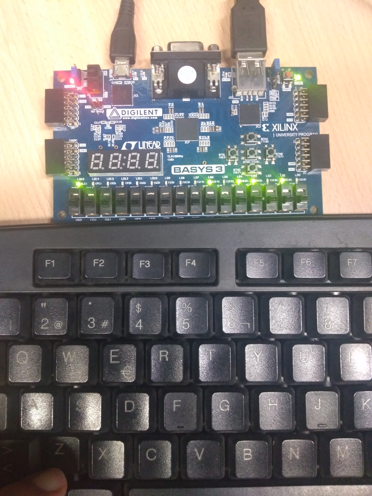

## Notas adicionales ##
Para mas informacion puede consultar el enlace [PS/2 Keyboard to ASCII Converter (VHDL)](https://www.digikey.com/eewiki/pages/viewpage.action?pageId=28279002)

## Enlaces ##

1. [PS/2 Keyboard Interface (VHDL)](https://www.digikey.com/eewiki/pages/viewpage.action?pageId=28278929)
2. [PS/2 Keyboard to ASCII Converter (VHDL)](https://www.digikey.com/eewiki/pages/viewpage.action?pageId=28279002)
3. [Debounce Logic Circuit (with VHDL example)](https://www.digikey.com/eewiki/pages/viewpage.action?pageId=4980758)
4. [Basys 3 Keyboard Demo](https://reference.digilentinc.com/learn/programmable-logic/tutorials/basys-3-keyboard-demo/start)
5. [Diligent Courses](https://reference.digilentinc.com/learn/courses/start)
6. [Diligent Fundamentals](https://reference.digilentinc.com/learn/fundamentals/start)

<!---
http://www.secs.oakland.edu/~llamocca/Tutorials/VHDLFPGA/
http://www.secs.oakland.edu/~llamocca/Tutorials/VHDLFPGA/Outline.pdf
http://www.secs.oakland.edu/~llamocca/Tutorials/VHDLFPGA/Vivado/

http://ece-research.unm.edu/jimp/vhdl_fpgas/slides/VGA.pdf
http://ece-research.unm.edu/jimp/vhdl_fpgas/
https://academic.csuohio.edu/chu_p/rtl/rtl_hardware.html
https://academic.csuohio.edu/chu_p/rtl/chu_rtL_book/rtl_chap10_fsm.pdf
https://academic.csuohio.edu/chu_p/rtl/fpga_vhdl.html
http://ece-research.unm.edu/jimp/vhdl_fpgas/slides/UART.pdf
http://ece-research.unm.edu/jimp/vhdl_fpgas/modules/divider/divider.vhd
http://ece-research.unm.edu/jimp/vhdl_fpgas/slides/FSM.pdf
http://ece-research.unm.edu/jimp/vhdl_fpgas/slides/sequential_design.pdf
http://ece-research.unm.edu/jimp/vhdl_fpgas/slides/sequential_principle.pdf

https://ece.gmu.edu/coursewebpages/ECE/ECE448/S13/
http://ebook.pldworld.com/_eBook/FPGA%EF%BC%8FHDL/

-->